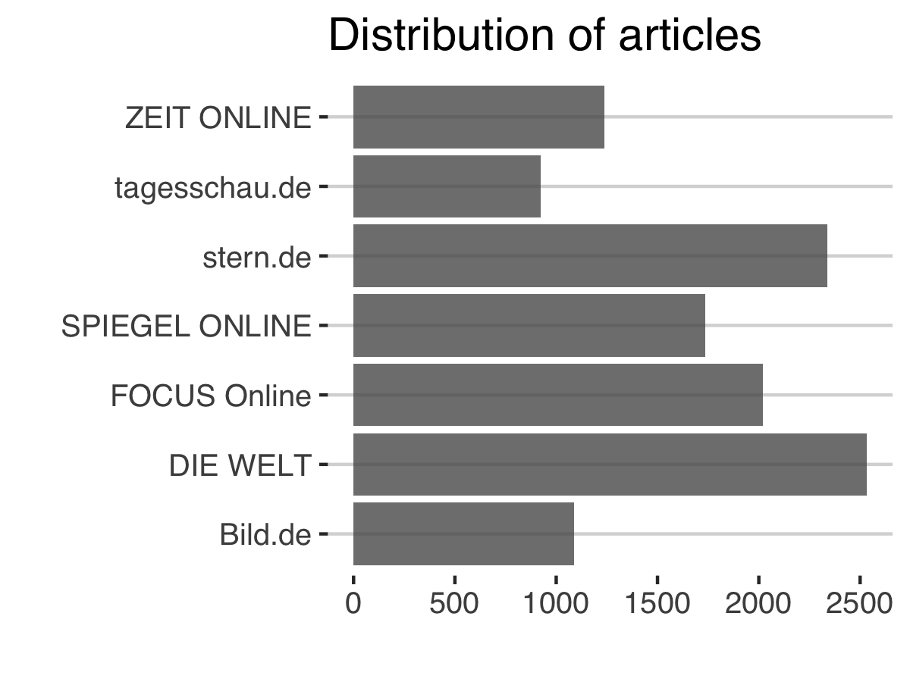

```{r include=FALSE}
knitr::opts_chunk$set(eval=FALSE, include=FALSE)
```

```{r, include=FALSE}
# load the packages
libs <- c("readr","lubridate","tidyverse","data.table","stringr","scales","ggthemes","xtable")
lapply(libs, library, character.only = TRUE)

rm(list=ls())
#source("func/functions.R")

# Load Dataframes
visits <- read.csv("../data/visits", stringsAsFactors = FALSE) # visits
load("../output/data_step2.Rda")
```

# Visits

News sources used for the analysis including their respective number of articles and readers measured as Visits. As no advertising is permitted on the Tagesschau.de website in accordance with the Interstate Broadcasting Treaty, public data is difficult to find or compare. 

```{r}
visits %>%
  mutate(visits = visits/1000000) %>%
  ggplot(aes(reorder(medium, visits), visits)) +
  geom_col(alpha = 0.8) +
  theme_hc() +
  scale_fill_hc()+
  coord_flip() +
  labs(x="", y="Visits in million",
       title = "Users of mobile and/or stationary services",
       subtitle = "September 2017",
       caption="Source: AGOF daily digital facts\nINFOnline (tagesschau.de)")

ggsave(filename = "../figs/visits.png", width = 6, height = 5)
```


# Articles

## Summary

Overview of news sources used for the analysis including...
  
  - Number of all articles, 
  - Share of articles about domestic politics within all articles during the period
  - Visits: Defined as the number of sessions within a given time period. 

```{r}
btw %>%
  group_by(medium) %>%
  summarize(num_articles = n()) -> politics
  
df_summary <- df %>%
  group_by(medium) %>%
  summarize(total_articles = n()) %>%
  left_join(., politics, by="medium") %>%
  mutate(share = num_articles/total_articles) %>%
  
  # combine with visits df
  left_join(., visits, by="medium") %>%
  select(medium, total_articles,share, visits)
```

```{r}
# Print out the summary dataframe to a latex table 
print(xtable(df_summary, 
             type="latex",
             caption ="News sources used for the analysis"
             ), include.rownames = F,
      file="../writing/tables/data_summary.tex" )
```

```{r}
btw %>%
  group_by(medium, date) %>%
  tally() %>%
  ggplot(aes(date, n,color = medium)) +
  geom_line() +
  # G20 Summit
  geom_vline(xintercept = as.POSIXct("2017-07-07"), linetype=2) +
  annotate(geom="text", x=as.POSIXct("2017-06-15"), 
           y=45, label="G20 Summit") +
  # Election
  geom_vline(xintercept = as.POSIXct("2017-09-24"), linetype=2) +
  annotate(geom="text", x=as.POSIXct("2017-10-15"), 
           y=45, label="Election Date") +
  theme_hc() +
  scale_color_hc(name = NULL) +
  labs(x="",y="")

ggsave(filename = "../figs/article_timeline.png", width = 7, height = 4)
```


```{r}
btw %>%
  ggplot(aes(medium)) +
  geom_bar(show.legend = F, alpha = 0.8) +
  theme_hc() +
  coord_flip() +
  labs(title = "Distribution of articles", x="",y="")

ggsave(filename = "../figs/article_distribution.png", width = 4, height = 3)
```


