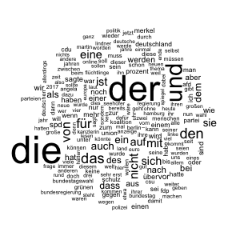

```{r include=FALSE}
knitr::opts_chunk$set(echo=FALSE, message=FALSE, warning=FALSE)
```

```{r include=FALSE}
# load the packages
libs <- c("readr","lubridate","tidyverse","data.table","stringr","scales","ggthemes","xtable","viridis")
lapply(libs, library, character.only = TRUE)

rm(list=ls())
color <- "#b7b7b7"
color1 <- "#778899"
color2 <- "#808080"
color3 <- "#000000"
source("func/functions.R")

# Load Dataframes

# source: https://www.ivw.eu/
visits <- read_delim("../data/agof/download_201801.csv", ";", escape_double = FALSE, locale = locale(encoding = "ISO-8859-1"),  trim_ws = TRUE)
# source: http://www.ard.de/home/die-ard/fakten/ard-mediendaten/ARD_Reichweitendaten/409224/index.html
tagesschau <- data_frame(medium = "tagesschau.de",
                         visits = 283200000,
                         insample = "Yes")

load("../output/data_step2.Rda")
```

# Visits

News sources used for the analysis including their respective number of articles and readers measured as Visits. As no advertising is permitted on the Tagesschau.de website in accordance with the Interstate Broadcasting Treaty, public data is difficult to find or compare. 

```{r}
media <- c("Bild.de", "SPIEGEL ONLINE", "FOCUS ONLINE", "WELT", "ZEIT ONLINE", "stern.de")

visits %>%
  dplyr::transmute(
    medium = Angebote,
    visits = str_replace(`Visits gesamt`, "\\.", ""),
    visits = str_replace(visits, "\\.", ""),
    visits = as.numeric(visits),
    insample = ifelse(medium %in% media, "Yes", "No")
  ) %>%
  rbind(tagesschau) -> visits.df
```

```{r}
cols <- c("Yes"=color1, "No"=color)

visits.df %>%
  dplyr::arrange(desc(visits)) %>%
  top_n(30, visits) %>%
  ggplot(aes(reorder(medium, visits), visits/1000000, fill = insample)) +
  geom_col() +
  theme_hc() +
  coord_flip() +
  scale_fill_manual(values = cols, name ="in sample") +
  theme(legend.position = "right") +
  labs(x = NULL, y= NULL, caption = "Data source: AGOF daily digital facts\nINFOnline (tagesschau.de)")

ggsave(filename = "../figs/visits.png", width = 8, height = 8)
```

# Article content

## Number of articles by medium

```{r fig.align="center"}
btw %>%
  group_by(medium) %>%
  tally() %>%
  ggplot(aes(reorder(medium,n), n, label = n)) +
  geom_col(fill = color1) +
  geom_text(color = "white", hjust=1) +
  coord_flip() +
  theme_hc() +
  labs(x=NULL, y=NULL)

ggsave(filename = "../figs/article_sum.png",width = 6, height = 4)
```

## Number of articles by medium and month

```{r fig.height=6, fig.width=9}
btw %>%
  group_by(medium, date) %>%
  tally() %>%
  ggplot(aes(date, n,color = medium)) +
  geom_line(show.legend = F) +
  # Election
  geom_vline(xintercept = as.POSIXct("2017-09-24"), linetype=2) +
  annotate(geom="text", x=as.POSIXct("2017-09-01"), 
           y=45, label="Election Date") +
  
  # failure of the Jamaica coalition talks
  geom_vline(xintercept = as.POSIXct("2017-11-19"), linetype=2) +
  
  annotate(geom="text", x=as.POSIXct("2017-11-25"), 
           y=45, label="Failure of Jamaica") +
  theme_hc() +
  scale_color_viridis_d(name = NULL) +
  #scale_color_hc(name = NULL) +
  labs(x="",y="")

ggsave(filename = "../figs/article_timeline.png", width = 8, height = 6)
```

## Number of words (article length)

```{r fig.align="center"}
maxval <- 9500
dd <- btw %>% filter(text_length > maxval) %>% 
  group_by(medium) %>% 
  summarise(outlier_txt=paste(text_length ,collapse=","))

btw %>%
  filter(text_length < maxval) %>%
  ggplot(aes(x=medium, y=text_length)) +
  geom_boxplot() +
  theme_hc() +
  geom_text(data=dd,aes(y=maxval,label= outlier_txt),
            size=3, vjust=1.5, hjust=-0.1) +
  geom_segment(data=dd, 
               aes(y=maxval*0.95,yend=maxval,xend=medium),
               color = "red", arrow = arrow(length = unit(0.1,"cm"))) +
  #stat_summary(fun.y=mean, geom="point", shape=20, size=3, color="red", fill="red") +
  labs(x=NULL,  y="# of words")
  
ggsave("../figs/news_releases_textlength.png", width = 10, height = 6)
```

## Wordclouds 

### Before pre-processing:
```{r eval=FALSE, include=FALSE}
png('../figs/wordcloud.png')
  
wordcloud::wordcloud(btw$title_text, max.words = 500)
  
dev.off()
```



### Pre-processed Data:

```{r eval=FALSE, include=FALSE}
png('wordcloud_cleaned.png')
  
wordcloud::wordcloud(btw$text_cleaned1, max.words = 500)
  
dev.off()
```


```{r eval=FALSE, include=FALSE}
medium <- unique(btw$medium)

for (i in medium) {
  png(paste0(i,'.png'))
  
  wordcloud::wordcloud(btw$text_cleaned1[btw$medium == i], min.freq = 00)
  
  dev.off()
  
}
```

## Visibility

In order to get a deeper understanding of the extent to which the newspapers report about parties, the mention of the individual parties in the articles can be considered. Indeed, the visibility of an entity is a commonly used measure in communication literature [Eberl, 2017](https://journals.sagepub.com/doi/abs/10.1177/0093650215614364).

The visibility of a party $p$ in a newspaper $s$ is defined as the number of news articles published by the newspaper on that party (e.g. articles that mention the name of the party), normalised on the total amount of articles by that newspaper in the corpus. A party is treated as visible in an article if the party itself is mentioned in an article (if an article contains the word "SPD", "CDU"/"CSU/Union","FDP","Grüne","AfD" or "Linke")

```{r claculate total amount of articles by newspaper}
btw <- btw %>% 
  dplyr::mutate(
    year = lubridate::year(date),
    month = lubridate::month(date)) %>%
  group_by(medium,year,month) %>%
  dplyr::mutate(articles_s = n()) %>%
  ungroup()
```

```{r Apply function to all parties}
parties <- c("SPD",paste("CDU","CSU","Union",sep = "|"),"FDP","Grüne","AfD","Linke")

rm(vis)
for (party in parties) {
  
    tempdf <- btw %>% 
      # filter all articles that contain the party as a word
      filter(grepl(party,text, ignore.case = T)) %>%
      # calculate the number of articles by each newspaper
      group_by(medium, year, month) %>%
      dplyr::summarise(
        # pass the total amount of articles to the grouped df
        articles_s = mean(articles_s),
        # calculate the number of articles about a party in a newsletter
        articles_p_s = n()) %>% ungroup() %>%
      mutate(
        party = party,
        # calculate relative amount
        visibility_p_s = articles_p_s/articles_s)
    
  if (exists('vis')) {
   vis <- bind_rows(vis, tempdf) 
  } else {
    vis <- tempdf
  }
}

vis <- vis %>%
  mutate(party = ifelse(grepl("CDU",party), "Union",party),
    date = as.Date(paste0(year,"/",month,"/1")))

save(vis, file = "../output/visibility.Rda")
```

```{r}
radar <- vis %>%
  group_by(party, medium) %>%
  summarize(vis = mean(visibility_p_s, na.rm = T)) %>%
  spread(key = party, value = vis)

# Print out the dataframe to a latex table 
xt <- xtable(radar,
             type="latex",
             caption ="Visibility")

print(xt, include.rownames = F, file="../writing/tables/visibility.tex" )
```

```{r}
ggiraphExtra::ggRadar(radar, 
                      aes(color = medium),
                      alpha = 0,
                      rescale = F) + 
  theme_hc() +
  scale_color_viridis_d() +
  theme(legend.position = "none",
        legend.title = element_blank()) +
   guides(col = guide_legend(ncol = 1)) 

ggsave("../figs/radar_vis.png", width = 5, height = 5, dpi = 200)
```

### Rescaled

```{r}
radar_rescaled <- as_tibble(sapply(radar[,-1], function(x) normalize_data2(x) ) ) %>%
  mutate(medium = radar$medium)

# Print out the dataframe to a latex table 
xt <- xtable(radar_rescaled,
             type="latex",
             caption ="Visibility (rescaled)")

print(xt, include.rownames = F, file="../writing/tables/visibility_rescaled.tex" )
```

```{r}
ggiraphExtra::ggRadar(radar_rescaled, 
                      aes(color = medium),
                      rescale = F,
                      alpha = 0) + 
  theme_hc() +
  scale_color_viridis_d() +
  theme(legend.position = "right",
        legend.title = element_blank()) +
   guides(col = guide_legend(ncol = 1))

ggsave("../figs/radar_vis_rescaled.png", width = 6, height = 5, dpi = 200)
```


