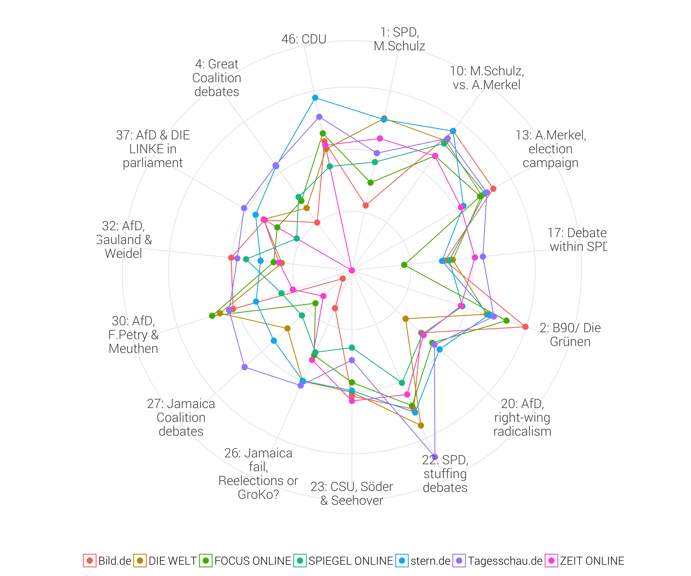
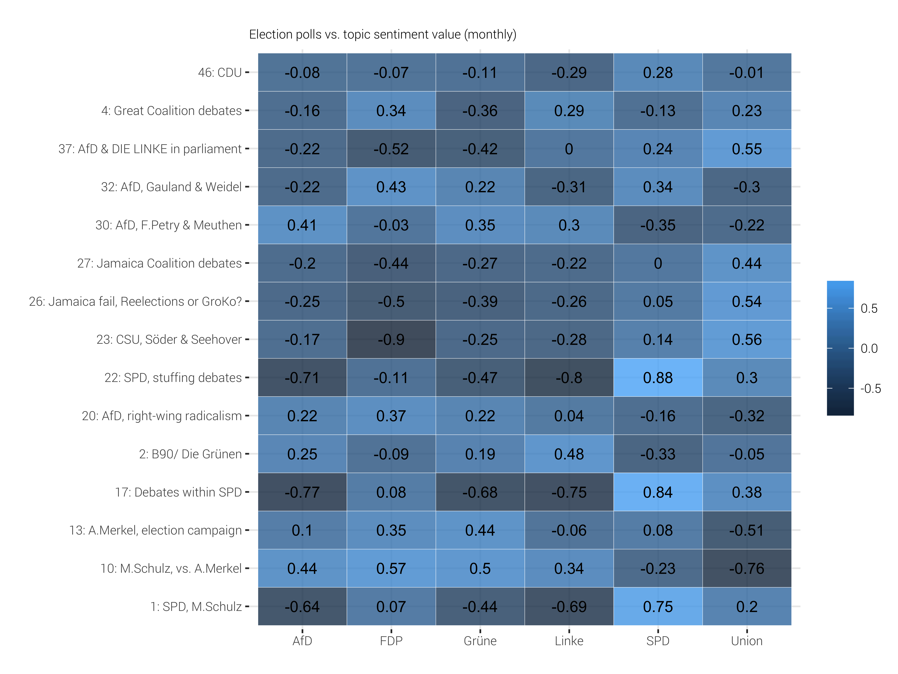

```{r include=FALSE}
library(ggplot2)     # Static data visualization
library(dplyr)       # Data manipulation
library(stringr)     # String manipulation
library(lubridate)   # Date and time manipulation
library(tidyr)       # Reshaping
library(readr)       # Importing data
library(data.table)
library(readxl)
library(xtable)
library(stm)
library(ggridges)
library(igraph)
library(patchwork)
library(RColorBrewer) 
library(ggrepel)
library(scales)      # Scales

library(tidytext)    # Tidy text mining

# Theming
quartzFonts(
  Roboto =
    c("Roboto-Light",
      "Roboto-Bold",
      "Roboto-Regular",
      "Roboto-Thin")
)

theme_set(
  theme_bw(base_family = "Roboto", base_size = 10) +
    theme(
      axis.title = element_text(size = 12),
      plot.title = element_text(size = 14,
                                margin = margin(0, 0, 4, 0, "pt")),
      plot.subtitle = element_text(size = 8),
      plot.caption = element_text(size = 6),
      panel.border = element_blank()
    )
)

rm(list=ls())
col <- RColorBrewer::brewer.pal(12, 'Dark2')
source("func/functions.R")
```

```{r caching, echo = FALSE}
load("../output/btw_out2.Rda")

btw <- btw %>%
  mutate(site = ifelse(site == "welt.de", "DIE WELT", site),
         site = ifelse(site == "zeit.de", "ZEIT ONLINE", site),
         site = ifelse(site == "focus.de", "FOCUS ONLINE", site),
         site = ifelse(site == "spiegel.de", "SPIEGEL ONLINE", site),
         site = ifelse(site == "tagesschau.de", "Tagesschau.de", site))
```

# Data Exploratory Analysis 

## Distribution of articles

```{r message=FALSE, warning=FALSE}
btw %>%
  ggplot(aes(site)) +
  geom_bar(fill=col[3], alpha = 0.8) +
  labs(x="", y="Number of articles") +
    coord_flip() +
  theme(
    axis.text.y = element_text(size = 12),
      legend.position   = "none"
    )
```

```{r message=FALSE, warning=FALSE}
btw %>%
  group_by(date) %>%
  dplyr::summarise(obs = n()) %>%
  ggplot(aes(date, obs)) +
  geom_line(color=col[3]) +
  geom_vline(aes(xintercept=as.Date("2017-09-24")),
             linetype = 2, color=col[5]) +
  geom_vline(aes(xintercept=as.Date("2017-11-19")),
             linetype = 2, color=col[5]) +
  scale_color_manual(values = col) +
  labs(x="", y="Number of Articles",color="") +
  scale_x_date(breaks = date_breaks("1 month"), labels=date_format("%b\n%y", tz="CET")) +
  theme(
      legend.position   = "none",
      axis.title.x      = element_blank(),
      axis.text       = element_text(size = 10)
    )
```

# Select Model
```{r}
load("../output/models/newsSelect.Rda")
print(newsSelect)
```

```{r fig.height=6, fig.width=8}
plot(newsSelect)
```


# Model Results

```{r echo = FALSE}
load("../output/models/modelresult_40.Rda")
k <- stmOut$settings$dim$K
sagelabs <- sageLabels(stmOut, 15)
```

## 1. Topic

### 1.1 Understanding topics through words

To explore the words associated with each topic we can use the **labelTopics** function.

```{r}
labelTopics(stmOut)
```

### 1.2. Label topics

In order to improve readability and traceability, I assign a shorter name to the topics based on the most common words.

```{r}
topics <- matrix(c(
					1, "SPD, M.Schulz", 
					2, "B90/ Die Grünen", 
					3, "Turkey, Erdogan", 
					4, "Great Coalition debates", 
					5, "Diesel scandal, driving ban",
					6, "H.Kohl", 
					7, "Federal Election results", 
					8, "European Union, Macron", 
					9, "Election forecast", 
					10, "M.Schulz, vs. A.Merkel", 
					11, "politics & democracy in GER", 
					12, "Refugees in GER, statistics", 
					13, "A.Merkel, election campaign", 
					14, "Text processing fail", 
					15, "Israel, antisemitism", 
					16, "Refugees in GER", 
					17, "Votes within SPD (GroKo)", 
					18, "Social benefits (e.g. child support)", 
					19, "Political talkshows", 
					20, "politics in social media", 
					21, "German armed forces, v.d.Leyen", 
					22, "Personnel debates SPD", 
					23, "CSU, Söder & Seehover", 
					24, "Debates in the Bundestag (parliament)", 
					25, "Election polls",
					26, "Jamaica fail, Reelections or GroKo?", 
					27, "Jamaica Coalition debates", 
					28, "G20 in Hamburg", 
					29, "Federal Constitutional Court, NSU", 
					30, "AfD, F.Petry & Meuthen", 
					31, "D.Trump, W.Putin", 
					32, "AfD, Gauland & Weidel", 
					33, "Federal statistics, german industry", 
					34, "Federal statistics, education system", 
					35, "police reports, A.Amri", 
					36, "Islam & religion in GER", 
					37, "AfD & DIE LINKE in parliament", 
					38, "EU policies (e.g. refugees, glyphosat)",
					39, "Mix: Terror attacks", 
					40, "Sexual abusement"
					), ncol=2, byrow=T)

topics.df <- as.data.frame(topics) %>%
  transmute(topic_name = paste(V1, V2, sep=": "),
         topic = 1:k) 
```

### 1.3. Posterior distribution of topic prevalence

The theta Matrix is a DxK Matrix that gives us a probability for each topic (K) and each document (D) 

```{r Extract wtp and dtp}
# Document-topic probabilities
theta <- stmOut %>% tidy("theta")
head(theta)
```

In the next step I create a Dataframe that contains the expected frequency of each topic on the whole corpus
```{r}
# StmOut$theta is a Matrix that contains the topic-probability distribution for each document (14936x50)
# By taking the mean value of each column, we get the expected probability for each topic within the whole corpus.

overall_freq <- as.data.frame(colMeans(stmOut$theta)) %>%
  transmute(
    topic = as.numeric(topics[,1]),
    frequency = colMeans(stmOut$theta)
         ) %>%
    arrange(desc(frequency))%>%
  mutate(order = row_number()) %>%
  left_join(., topics.df, by = "topic") 

head(overall_freq)
```

#### Next, we can plot the expected proportion of topic use in the overall corpus.

```{r fig.height=8, fig.width=8, message=FALSE, warning=TRUE}
overall_freq %>%
  ggplot(aes(reorder(topic_name, -order), frequency)) +
  geom_col(alpha = 0.7, fill = col[3]) +
  coord_flip() +
  theme(
          axis.text.y = element_text(size=11),
          axis.title = element_text(size=10)) +
    labs(x=NULL, y=NULL, title="Expected Frequency of Topics") 

ggsave(filename = "../figs/expected_freq.png", height = 8)
```

We will conduct our further analysis on 13 selected topics which relate to political parties.

```{r}
keep <- c(1,2,4,10,13,17,22,23,26,27,30,32,37)
```

### 1.4. Estimating the relationship between metadata and topics

ince we included news source as a covariate in estimat- ing topical prevalence part within the model, we can estimate the differences in frequency, or how much each of the news sources discussed each topic.

The conditional expectation of topic prevalence for given document characteristics can be estimated by using a linear model, where the documents are observations, the dependent variable is the posterior probability of a topic and the covariates are the metadata of documents. The function we use (**estimateEffect()**) uses the method of composition to incorporate uncertainty in the dependent variable, drawing a set of topic proportions from the variational posterior repeated times and compute the coefficients as the average over all results. 

```{r}
effect <- estimateEffect(c(1:k) ~site, stmOut, 
                         metadata = out$meta, uncertainty = "Global")
```

#### Mean prevalence of each topic within each news source corpus
```{r eval=FALSE, fig.height=16, fig.width=12, include=FALSE}
par(mfrow = c(8,5))

labels <- c("DIE WELT","stern.de", "ZEIT ONLINE", "FOCUS ONLINE","Bild.de", "SPIEGEL ONLINE", "Tagesschau.de")
#topic <- 1

for (i in 1:k) {
  plot(effect, covariate = "site", topics = i,
     method = "pointestimate", model = stmOut,
     main = topics.df$topic_name[i],
     xlim = c(-.02,.08),
    labeltype = "custom",
    custom.labels = labels
  )
}
```

```{r fig.height=12, fig.width=12}
labels <- c("DIE WELT","stern.de", "ZEIT ONLINE", "FOCUS ONLINE","Bild.de", "SPIEGEL ONLINE", "Tagesschau.de")
#topic <- 1

png("../figs/topic_proportions.png", width = 1000, height = 1000)
par(mfrow = c(4,4))

for (i in keep) {
  plot(effect, covariate = "site", topics = i,
     method = "pointestimate", model = stmOut,
     main = topics.df$topic_name[i],
     xlim = c(-.02,.08),
    labeltype = "custom",
    custom.labels = labels
  )
}
dev.off()
```


### 1.5 Topic Correlation
```{r}
## Create Dataframe with correlations
cor <- cor(stmOut$theta[stmOut$settings$covariates$betaindex==1,])
colnames(cor) <- 1:k
  
df <- as.data.frame(cor) %>% 
  mutate(topic = 1:k) %>%
  melt(., id="topic", value.name="corr") 
```

```{r}
df <- df %>% 
  left_join(.,topics.df, by = "topic") %>%
  mutate(topic1 = topic,
         topic_name1 = topic_name,
         topic = as.numeric(variable)) %>%
  select(-topic_name) %>%
  left_join(., topics.df, by="topic")
```

```{r fig.height=7, fig.width=6}
p1 <- df %>%
  filter(topic %in% keep) %>%
    filter(topic1 %in% keep) %>%
  filter(corr < 1) %>%
  ggplot(aes(reorder(topic_name1,topic1), topic_name, 
             fill=corr)) +
  geom_tile() +
  #scale_fill_distiller(palette = "Spectral", trans = "reverse") + 
  labs(x="", y="", fill="correlation") +
  theme_bw(base_family = "Roboto", base_size = 10) +
  theme(axis.text.x = element_text(angle=90),
        #plot.background = element_rect(fill = 'transparent', colour = 'transparent'),
        strip.background = element_rect(fill = 'transparent', colour = 'transparent'),
        axis.ticks = element_line(colour = 'transparent'))

p1

# ggsave(plot = p1, filename = "../figs/topic_correlation.png", device = "png",width = 9, height = 5,
# dpi = 600)
```

### 2.2. Sentiment analysis


#### 2.2.2. Apply the dictionary on the artciles. 

To carry out the sentiment analysis we filter some documents from the corpus:

  1. Articles that have been assigned a topic with a probability of over 30% (gamma > 0.3).
  2. Articles assigned to one of the above mentioned topics.
  3. Some manual cleanups

After applying these filters, we still have about 2500 articles left to conduct the sentiment analysis. We now take each word in each article and assign a sentiment value for that word. 

```{r}
top_topics <- theta %>% 
  group_by(document) %>%
  mutate(therank = rank(-gamma)) %>%
  filter(therank == 1) %>%
  select(- therank)

head(top_topics)
```

```{r}
btw.2 <- btw %>%
  mutate(document = articleID) %>%
  left_join(.,top_topics, by="document") %>%
  ## Combine with Topic label
  merge(., topics.df, by="topic") %>%
  mutate(allocation = 1) 

head(btw.2)
```

```{r, message=FALSE, warning=FALSE, include=FALSE}
df <- btw.2 %>%
  distinct(title, .keep_all = T) %>%
  filter(topic %in% keep)
  # Filter documents about the death of H.Gei??ler
  #filter(!grepl("Gei??ler", title)) %>%
  # Filter outliner article (wrong topic assignment)
  #filter(!grepl("Thermilindner", title, ignore.case = T))

# Tokenize text
token <- df %>%
  unnest_tokens(word, text)

# Combine with sentiment values
sentDF <- left_join(token, sent, by="word") %>% 
  mutate(value = as.numeric(value)) %>% 
  #filter(!is.na(value)) %>%
  mutate(negative = ifelse(value < 0, value, NA),
         positive = ifelse(value > 0, value, NA),
         negative_d = ifelse(value < 0, 1, 0),
         positive_d = ifelse(value > 0, 1, 0)) 
```

#### 2.2.3. Check the analysis for a set of example documents. 

```{r}
sentDF %>% filter(document == unique(sentDF$document)[2]) %>%
  select(title, word, value, site) %>%
  htmlTable::htmlTable(align = "l")
```

#### 2.2.4. Calculate sentiment value by document

The sentiment score is calculated based on the weighted polarity values for a word, defined on an interval between -1 and 1. The score is then calculated from the sum of the words in a document (which can be assigned to a word from the dictionary) divided by the total number of words in that document. 
  
$$
\text{SentScore}_d = \frac{|\text{positive polarity score}_d| - |\text{negative polarity score}_d|}{\text{Total Words}_d}
$$
```{r message=FALSE, warning=FALSE}
sentDF.values <- sentDF %>%
  select(document, word, value, 
         negative, positive,
         negative_d, positive_d) %>%
  group_by(document) %>%
  
  # calculate sum of positive and negative values
  summarise(sum_positive = sum(positive, na.rm = T),
            sum_negative = sum(negative, na.rm = T),
            sum_positive_d = sum(positive_d, na.rm = T),
            sum_negative_d = sum(negative_d, na.rm = T)) %>%

  # calculate diff
  mutate(sent_diff = sum_positive + sum_negative,
         sent_diff_d = sum_positive_d - sum_negative_d) %>%
  
  # combine with dataframe
  left_join(., df, 
            by = "document") %>%
  # calculate sentiment
  mutate(sentiment_d = sent_diff_d / text_length,
         sentiment = sent_diff / text_length) %>%
  
  # generate month & week
  mutate(week = week(date),
         month = month(date),
         year = year(date),
         yearmonth = calculate_month(month,year),
         yearweek = calculate_week(week, year)) 
```


#### 2.2.5. Plot Sentiment Score
```{r}
btw.2 %>% 
  mutate(yearmonth = calculate_month(month(date), year(date))) %>%
  group_by(yearmonth) %>%
  summarise(total_obs = n()) -> tally_month

btw.2 %>%
  group_by(site) %>%
  summarise(total_obs = n()) -> tally_site

btw.2 %>% 
  mutate(yearmonth = calculate_month(month(date),year(date))) %>%
  group_by(yearmonth, site) %>%
  summarise(total_obs = n()) -> tally_month_site

```

The following table shows the results of the analysis for each topic on a monthly basis, aggregated on all newspaper. Each sentiment value is weighted by the relative share of the topic in the overall reporting of that month.

$$
\text{w} = \frac{\text{# of documents per month & topic}}{\text{# of documents per month}}
$$

$$
\text{weighted sentiment} = \text{sentiment} * \text{w}
$$

Some conclusions can be drawn from this illustration. First of all, it can be seen that, on average, all topics are discussed almost exclusively negatively. An exception is topic 27 concerning the Jaimiaca coalition negotiations, which shows a positive sentiment value for a short period of time (October 2017). In the following month (November 2017), after it became clear that there would be no coalition between the CDU/CSU, FDP and Die Gr??nen, the value of this topic as well as that of topic 26 drops rapidly. 

Concerning the issues that discuss the great coaltion between CDU/CSU and SPD, it is evident that the overall tone is in which this topic is discussed is generally decreasing from November 2017 to January 2018, but in the following February, the sentiment value of this topic rises. However, the sentiment score of topics that deal with the SPD alone (1, 17, 22) is diminishing in the course of time, with topic 17 recording the largest decline. The topic, which contains the CDU in isolation (46), is rather zigzagging, with a low peak in October 2017.

##### By Month & Topic
```{r eval=FALSE, include=FALSE}
p <- sentDF.values %>%
  group_by(yearmonth, topic_name, topic) %>%
  summarise(sentiment = mean(sentiment, na.rm=T),
            obs = n()) %>%
  left_join(., tally_month, by = "yearmonth") %>%
  mutate(w = obs / total_obs,
         sentiment_w = sentiment * w) %>%
  dplyr::arrange(topic) %>%
  select(yearmonth, topic_name, obs, sentiment_w) %>%
  ungroup()
```

```{r eval=FALSE, include=FALSE}
# save to latex files
num <- nrow(p)/2
num1 <- num+1

p.tab <- p %>%
  transmute(date = as.character(yearmonth),
             topic = topic_name,
             `Number of Obs.` = obs,
             `sentiment value * 1000` = sentiment_w*1000
             )

print(xtable(p.tab[1:num,], 
             type="latex"
             ), include.rownames = F,
      file="../writing/tables/sentscore_monthly1.tex" )

print(xtable(p.tab[num1:nrow(p.tab),], 
             type="latex"
             ), include.rownames = F,
      file="../writing/tables/sentscore_monthly2.tex" )

# add "\begin{adjustbox}{width=\textwidth}" and delete "\begin{table}" in latex document. 
```

```{r}
p %>%
  knitr::kable()
```

$$
\text{normalized_w} = \frac{w - \min{(W)}}{\max{(W)}-\min{(W)}}
$$

```{r eval=FALSE, include=FALSE}
p1 <- ggplot(p, 
       aes(yearmonth, normalize_data(sentiment_w), 
           group = topic_name,
           label = obs)) +
  facet_wrap(~topic_name, nrow = 5) +
  geom_col(fill = col[3], alpha = 0.8) +
  geom_line(color = col[5], size = 0.6) +
  geom_hline(yintercept = 0, linetype = 2,
             color = "black") +
  labs(x="", y="Sentiment Score",
        title = "",
       subtitle = "") +
  scale_x_date(breaks = date_breaks("1 month"), 
               labels = date_format("%b-%y", tz ="CET")) +
  theme(strip.text = element_text(size=14),
    axis.text.y = element_text(size=10),
    axis.title.y = element_text(size=12),
        axis.text.x = element_text(size = 12, angle = 90))

ggsave(filename = "../figs/sentscore_monthly.png", plot = p1,
       height = 12, width = 12)
```


##### By Site and Topic

The following figure shows the results of the analysis for each topic and each newspaper, aggregated over time. Each sentiment value is weighted by the relative share of the topic in the overall political news coverage of that online newspaper.


$$
\text{w} = \frac{\text{# of obs per newspaper & topic}}{\text{# of obs per newspaper}}
$$

$$
\text{weighted sentiment} = \text{sentiment} * \text{w}
$$

```{r eval=FALSE, include=FALSE}
p <- sentDF.values %>%
  group_by(site, topic_name, topic) %>%
  summarise(sentiment = mean(sentiment, na.rm=T),
            obs = n()) %>%
  left_join(., tally_site, by = "site") %>%
  mutate(w = obs/total_obs,
         sentiment_w = sentiment * w) %>%
  select(site, topic_name, obs, topic, sentiment_w) %>%
  ungroup()
```

```{r eval=FALSE, include=FALSE}
# save to latex files
num <- nrow(p)/2
num1 <- num+1

p.tab <- p %>%
  transmute(`News website` = site,
             topic = topic_name,
             `Number of Obs.` = obs,
             `sentiment value * 1000` = sentiment_w*1000
             )

print(xtable(p.tab[1:num,], 
             type="latex"), 
      include.rownames = F,
      file="../writing/tables/sentscore_site1.tex" )

print(xtable(p.tab[num1:nrow(p.tab),],
             type="latex"
             ), 
      include.rownames = F,
      file="../writing/tables/sentscore_site2.tex" )

# add "\begin{adjustbox}{width=\textwidth}" and delete "\begin{table}" in latex
```

```{r}
p %>%
  knitr::kable()
```


```{r eval=FALSE, include=FALSE}
p1 <- ggplot(p, 
       aes(reorder(topic_name, topic), 
           normalize_data(sentiment_w), 
           group = site,
           label = obs)) +
  geom_col(fill=col[3], alpha = 0.8) +
  #geom_line(color = col[2], size = 0.8) +
  #geom_text(size = 2) +
  geom_hline(yintercept = 0, linetype = 2,
             color = "black") +
  coord_flip() +
  facet_wrap(~site, ncol = 7) +
  labs(x="", y="Sentiment Score",
       title = "") +
  theme(strip.text = element_text(size = 11),
    axis.text.y = element_text(size = 14),
        axis.text.x = element_text(size=10, angle = 90),
        axis.title.x = element_text(size = 14))

ggsave(filename = "../figs/sentscore_site.png", plot = p1, 
       height = 8, width = 12)
```


##### Radar plot

```{r message=FALSE, warning=FALSE}
require(ggplot2)
require(ggiraph)
require(ggiraphExtra)
```

```{r eval=FALSE, fig.height=8, fig.width=10, include=FALSE}
sentDF.values %>%
mutate(topic_name = linebreak(topic_name)) %>%
  group_by(site, topic_name) %>%
  summarise(sentiment = mean(sentiment, na.rm=T),
            obs = n()) %>%
  left_join(., tally_site, by = "site") %>%
  mutate(w = obs/total_obs,
         sentiment_w = sentiment * w) %>%
  #mutate(sentiment_w = normalize_data(sentiment_w)) %>%
  select(site, topic_name, sentiment_w) %>%
  spread(key=topic_name, value=sentiment_w) -> radar
```

```{r eval=FALSE, include=FALSE}
p <- ggiraph::ggRadar(radar, aes(color=site),
          rescale = F,
          alpha = 0) +
  labs(title = "") +
  guides(col = guide_legend(ncol = 7)) +
  theme(legend.position = "bottom",
        legend.text = element_text(size=14),
        legend.title = element_text(size=0),
        axis.text.x = element_text(size = 16),
        axis.text.y = element_blank(),
        axis.ticks.y = element_blank())

ggsave(filename = "../figs/sentscore_radar.png", width = 12,
       height = 10,
       plot = p)
```



```{r eval=FALSE, include=FALSE}
for (i in unique(sentDF.values$month)) {
  
  sentDF.values %>%
  filter(month == i) %>%
  group_by(site, topic_name) %>%
  summarise(sentiment = mean(sentiment, na.rm=T)) %>%
  spread(key=topic_name, value=sentiment) -> radar

  p <-radar %>%
    ggRadar(aes(color=site), 
          rescale = F,
          alpha = 0, legend.position = "right") +
  labs(title = paste("Sentiment Score", i))
  
  ggsave(p, filename = paste0("../figs/radarchart_",i,".png"), 
         device = "png", dpi = 600)
  
}
```


## 3. Compare with polls

We use the data from the "Sonntagsumfrage" (Sunday survey) from [infratest dimap](https://www.infratest-dimap.de/umfragen-analysen/bundesweit/sonntagsfrage/). The institution regularly asks at least 1000 German citizens the question: "Which party would you choose if federal elections take place next Sunday?" The survey thus measures the current election tendencies and therefore reflects an intermediate state in the opinion-forming process of the electoral population.

```{r}
# Import and prepare survey data
load("../output/polls.Rda")

polls <- table_long %>%
  mutate(yearmonth = calculate_month(month(Datum),year(Datum)),
         yearweek = calculate_week(week(Datum), year(Datum))) 
```

```{r include=FALSE}
p <- polls %>%
  filter(yearmonth > as.Date("2017-01-01")) %>%
  filter(!party %in% c("Piraten", "Sonstige")) %>%
  ggplot(aes(Datum, value, 
             group = party,
             color = party)) +
  geom_line() +
  scale_color_manual(values =  c("deepskyblue", "gold", "limegreen", "deeppink", "red", "black")) +
  scale_x_date(breaks = date_breaks("1 month"), 
               labels=date_format("%b\n%y", tz="CET")) +
    geom_vline(xintercept = as.Date("2017-09-24"), 
             linetype = 2, color = col[3]) +
  labs(x="", y="", color="",
       title = "",
       caption = "source: infratest dimap") +
    guides(color = guide_legend(nrow = 1,
                                label.theme = element_text(size = 10,
                                                           angle=0))) +
  theme(axis.text = element_text(size=10),
        legend.position = "bottom")

ggsave(filename = "../figs/polls.png", plot = p, width = 6, height = 4, dpi = 600)
```


###### Normalization 
The comparison with the sentiment value of individual topics is intended to show whether there is a correlation between the current tendency to vote and the type of reporting. For this purpose, the monthly average of both time series is calculated and rescaled to an interval between 0 and 1.

The analysis in this section is done in two steps: First, the standardised time series are compared graphically. In the second step, the cross-correlation between two time series is calculated. 

$$
z_i = \frac{x_i-\text{min}(x)}{\text{max}(x)-\text{min}(x)}
$$
where $x = (x_1,...,x_n)$ and $z_i$ is the $i^{th}$ normalized data.

```{r}
polls_monthly <- polls %>%
  group_by(yearmonth,party) %>%
  summarise(mean_val = mean(value, na.rm=T)) %>%
  ungroup() %>%
  filter(!party %in% c("Piraten", "Sonstige")) %>%
  filter(mean_val != "NaN") %>%
  select(party, yearmonth, mean_val) %>%
  spread(party, mean_val) %>%
  filter(yearmonth > as.Date("2017-05-01")) %>%
  filter(yearmonth < as.Date("2018-03-01")) %>%
  mutate(AfD = normalize_data(AfD),
         FDP = normalize_data(FDP),
         Gr??ne = normalize_data(Gr??ne),
         Linke = normalize_data(Linke),
         SPD = normalize_data(SPD),
         Union = normalize_data(Union))
```

Normalize topic-sentiment value 

```{r}
### by time
group1 <- sentDF.values %>%
  group_by(yearmonth, topic_name, topic) %>%
  summarise(sentiment = mean(sentiment, na.rm=T),
            obs = n()) %>%
  ungroup() %>%
  left_join(., tally_month, by="yearmonth") %>%
  mutate(w = obs / total_obs,
         sentiment_w = sentiment * w) 
  
group1 <- group1 %>%
  select(yearmonth, topic, sentiment_w) %>%
  spread(topic, sentiment_w) %>%
  lapply(normalize_data) %>%
  as.data.frame() %>%
  gather(topic, sentiment_n, -yearmonth) %>%
  mutate(topic = as.numeric(gsub("X","", topic))) %>%
  merge(., group1, by = c("topic", "yearmonth"))

### by time and site
group2 <- sentDF.values %>%
  group_by(yearmonth, topic_name, topic, site) %>%
  summarise(sentiment = mean(sentiment, na.rm=T),
            obs = n()) %>%
  ungroup() %>%
  left_join(., tally_month_site, by=c("yearmonth","site")) %>%
  mutate(w = obs / total_obs,
         sentiment_w = sentiment * w)

group2 <- group2 %>%
  select(yearmonth, topic, site, sentiment_w) %>%
  spread(topic, sentiment_w) %>%
  lapply(normalize_data) %>%
  as.data.frame() %>%
  gather(topic, sentiment_n, -yearmonth, -site) %>%
  mutate(topic = as.numeric(gsub("X","", topic))) %>%
  merge(., group2, by = c("topic", "yearmonth","site"))
```


#### 3.1. Cross-Correlation

##### 3.1.1. Overall
```{r}
group1 %>%
  select(yearmonth, topic_name, sentiment_n) %>%
  spread(topic_name, sentiment_n) %>%
  select(- yearmonth) -> corr1

polls_monthly %>% select(- yearmonth) -> corr2
```

```{r}
# Create empty matrix
corr <- expand.grid(names(corr1), names(corr2))

corr$`-3` <- NA
corr$`-2` <- NA
corr$`-1` <- NA
corr$`0` <- NA
corr$`1` <- NA
corr$`2` <- NA
corr$`3` <- NA

x <- 1
  
for (corr1Id in 1:ncol(corr2)) {
  c1 = corr2[,corr1Id]
    
  for(corr2Id in 1:ncol(corr1)) {
    c2 = corr1[,corr2Id]
    correlation = ccf(c2, c1, lag.max = 3,
                      na.action = na.contiguous, plot=F)
      
    corr[x,"-3"] <- correlation$acf[1]
    corr[x,"-2"] <- correlation$acf[2]
    corr[x,"-1"] <- correlation$acf[3]
    corr[x,"0"] <- correlation$acf[4]
    corr[x,"1"] <- correlation$acf[5]
    corr[x,"2"] <- correlation$acf[6]
    corr[x,"3"] <- correlation$acf[7]

    x<- x+1
  }
}

corr <- corr %>%
  gather(lag, correlation, `-3`:`3`) %>%
  mutate(lag = as.numeric(lag))
```

The variance of the cross-correlation coefficient under the null hypothesis of zero correlation is approx $1/n$ where $n$ is the length of the series. The coefficients are also asymptotically normal. So approximate critical values (at the 5% level) are $\pm 2/\sqrt{n}$.

```{r}
critical_val <- 2/sqrt(nrow(corr1))
```

```{r fig.height=7, fig.width=14}
p <- ggplot(corr, aes(lag, correlation,
                 #fill = Var1,
                 group=Var2)) +
  geom_col(fill = col[3]) +
  #scale_x_continuous(breaks = c(-3:3)) +
  labs(x="Lag",y="Cross Correlation",
       caption = "The red dotted lines indicate the critical values at the 5% significance value\nThe black dotted lines indicate the lag 0 on the x-axis.") +
  geom_hline(yintercept = critical_val, linetype = 2, color = col[5]) +
  geom_hline(yintercept = -(critical_val), linetype = 2, color = col[5]) +
  geom_vline(xintercept = 0, linetype = 3, size=0.5) +
  facet_grid(Var2~Var1, labeller=labeller(Var1 = linebreak)) +
  theme(strip.text = element_text(size=13),
        axis.text = element_text(size = 12),
        axis.title = element_text(size=14),
        plot.caption = element_text(size = 10, hjust = 0))

ggsave(filename = "../figs/ccf2.png", plot = p,
       width = 18,
       height = 12,
       dpi = 600)
```


Cross correlation at lag 0
```{r}
# Table
corr %>% 
  filter(lag == 0) %>%
  select(-lag) %>% 
  spread(Var2, correlation) -> corr_tab

print(xtable(corr_tab, type="latex", digits=3,
             label = "t_ccf",
                   caption = "Cross Correlation at lag 0"),
      file="../writing/tables/corr.tex" )
```

```{r fig.height=6, fig.width=8}
# Figure
p <- corr %>%
  filter(lag == 0) %>%
  ggplot(aes(Var2, Var1,
                 fill = correlation,
                 label = round(correlation,2))) +
        geom_tile(color="white", alpha=0.8) +
        geom_text(size = 3.5) +
        #viridis::scale_fill_viridis(limits=c(-1, 1)) +
        labs(x="", y="", fill="",
             title = "",
             subtitle = "Election polls vs. topic sentiment value (monthly)")

ggsave(filename = "../figs/ccf.png", plot = p,
       height = 6, width = 8, dpi = 600)
```



```{r eval=FALSE, include=FALSE}
for (i in unique(group2$site)) {
  
  group2 %>%
  filter(site == i) %>%
  select(yearmonth, topic_name, sentiment_n) %>%
  spread(topic_name, sentiment_n) %>%
  select(- yearmonth) -> corr1
  
  p <- plot_ccf(corr1, corr2,
                show.legend = F,
                subtitle = paste(i)
                )
  
  ggsave(filename = paste0("../figs/corrplot_",i,".png"),
         height = 5)
}

```


```{r eval=FALSE, include=FALSE}
plot_Poll_Sent <- function(topics_number, party_str, color_str) {
  
  ### Plot 1  
  plot1 <- group1 %>%
    filter(topic %in% topic_number)
  
  p1 <- ggplot() +
    geom_col(data=plot1, aes(yearmonth, sentiment_n,
                             group = topic_name,
                             fill = topic_name),
             position = "dodge",
             alpha = 0.5) +
    scale_fill_manual(values = col) +
    
    geom_line(data=plot1, aes(yearmonth, 
                              sentiment_n,
                              group = topic_name,
                              color = topic_name),
              show.legend = F) +
    scale_color_manual(values = col) +
    guides(fill = guide_legend(ncol=3)) +
    
    # Add poll line
    geom_line(data = polls_monthly,
              aes_string("yearmonth", party_str),
              color = color_str,
                            size = 0.9,
              linetype = 2) +
    labs(y="", x="", fill="",
         title = "Sentiment & Poll Values",
         subtitle = party_str,
         caption = "Both scores are normalized") +
    scale_x_date(breaks = date_breaks("1 month"), 
                 labels=date_format("%B", tz="CET")) +
    theme(legend.position = "bottom") 
  
  ### Plot 2
  plot2 <- group2 %>%
    filter(topic %in% topic_number)
  
  p2 <- ggplot() +
    # geom_col(data = plot2,
    #          aes(yearmonth, sentiment_n, 
    #              group = topic_name,
    #              fill = topic_name),
    #          alpha = 0.5,
    #          position = "dodge") +
    # scale_fill_manual(values = col) +
    
    geom_line(data = plot2,
              aes(yearmonth, sentiment_n,
                  group = topic_name,
                  color = topic_name),
              show.legend = F) +
    facet_wrap(~site, ncol = 2) +
    scale_color_manual(values = col) +
    
    # Add poll line
    geom_line(data = polls_monthly, 
              aes_string("yearmonth", party_str),
              color = color_str,
              size = 0.9,
              linetype = 2) +
    labs(y="", x="", fill="") +
    scale_x_date(breaks = date_breaks("1 month"), 
                 labels=date_format("%B", tz="CET")) +
    theme(legend.position = "none",
        axis.text.x = element_text(angle = 90))
  
  p1 + p2 + plot_layout(ncol = 1, heights = c(1,4))
  
}
```


##### 3.2.1. CDU
```{r eval=FALSE, fig.height=12, fig.width=10, include=FALSE}
topic_number <- c(10,13,23,26)

### Plot 1  
plot_Poll_Sent(topic_number, "Union", "black")
```


#### SPD
```{r eval=FALSE, fig.height=12, fig.width=10, include=FALSE}
topic_number <- c(1,17,22)

plot_Poll_Sent(topic_number, "SPD", "black")
```

##### 3.2.3. AfD
```{r eval=FALSE, fig.height=12, fig.width=10, include=FALSE}
topic_number <- c(17,22, 30)

plot_Poll_Sent(topic_number, "AfD", "black")
```

#### FDP
```{r eval=FALSE, fig.height=12, fig.width=10, include=FALSE}
topic_number <- c(23,26,27)

plot_Poll_Sent(topic_number, "FDP", "black")
```

#### Gr??ne
```{r eval=FALSE, fig.height=12, fig.width=10, include=FALSE}
topic_number <- c(26,27,17)

plot_Poll_Sent(topic_number, "Gr??ne", "black")
```

#### DIE LINKE
```{r eval=FALSE, fig.height=12, fig.width=10, include=FALSE}
topic_number <- c(1,17,22)

plot_Poll_Sent(topic_number, "Linke", "black")
```