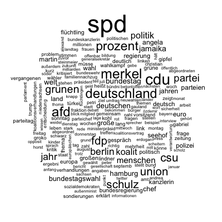
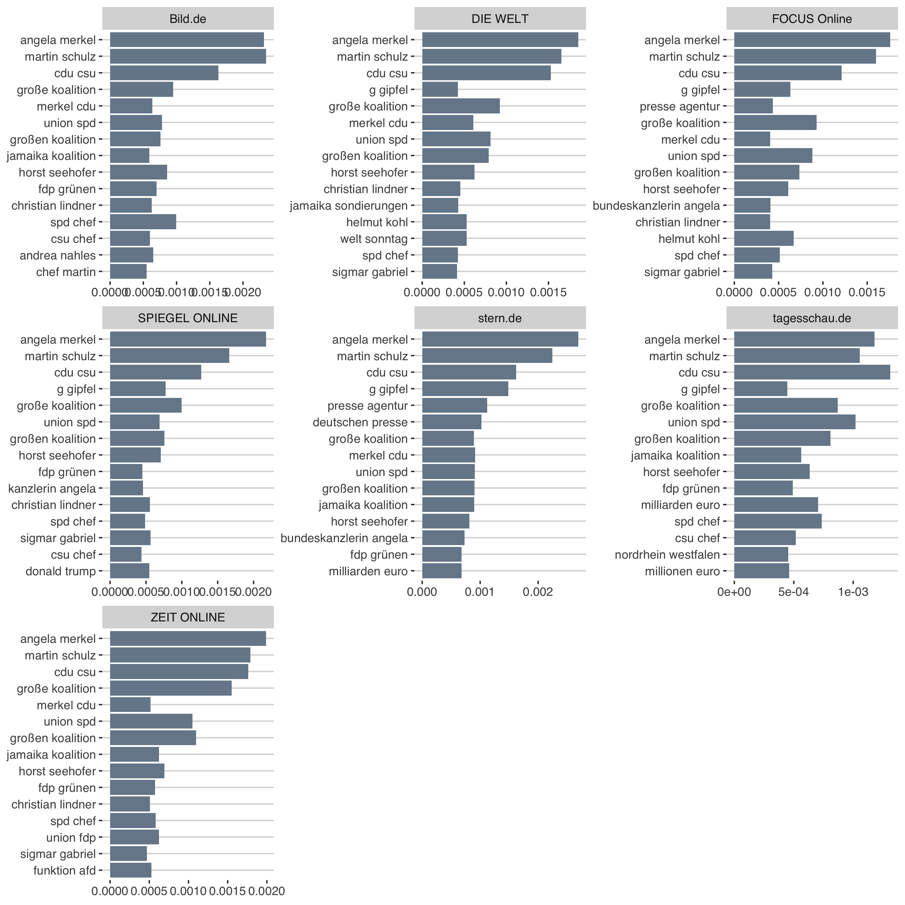
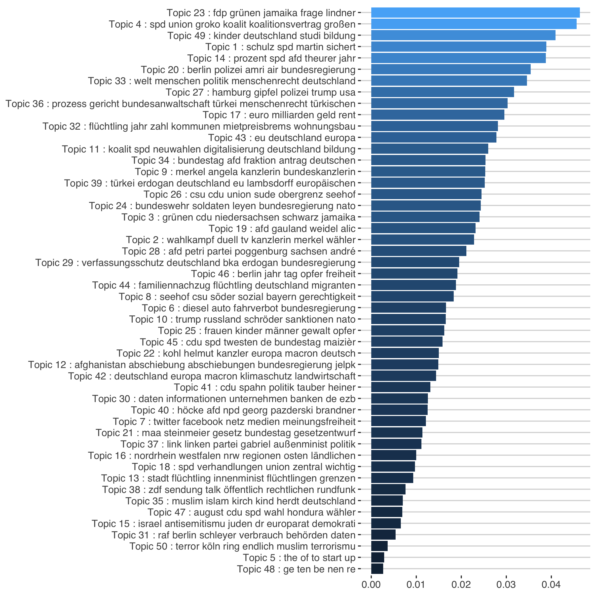

```{r include=FALSE}
knitr::opts_chunk$set(message=FALSE, warning=FALSE)
```

```{r eval=FALSE, include=FALSE}
set.seed(4556)

library(stm)
library(tidyverse)
library(dplyr)
library(ggthemes)
library(viridis)
library(tidytext)
library(patchwork)

rm(list = ls())

color1 <- "#778899"
color2 <- "#808080"
color3 <- "#000000"
load("../output/pressReleases.Rda")
load("../output/data_step2.Rda")

btw %>%
  mutate(date = as.Date(date),
         type = "news",
         source = medium 
         ) %>%
  bind_rows(.,pressReleases %>% 
              mutate(source = party)) -> model_df
```

# Inspect data

## Wordclouds 

Before pre-processing:
```{r eval=FALSE, include=FALSE}
png('../figs/wordcloud.png')
  
wordcloud::wordcloud(model_df$title_text, max.words = 200)
  
dev.off()
```


Pre-processed Data:

```{r eval=FALSE, include=FALSE}
png('../figs/wordcloud_cleaned.png')
  
wordcloud::wordcloud(model_df$text_cleaned1, max.words = 200)
  
dev.off()
```


```{r eval=FALSE, include=FALSE}
source <- unique(model_df$source)

for (i in source) {
  
  name <- gsub(paste("\\/",".de"," ",sep  = "|"),"",i)
  
  png(paste0('../figs/wordclouds/',name,'.png'))
  
  wordcloud::wordcloud(model_df$text_cleaned1[model_df$source == i], max.words = 300)
  
  dev.off()
  
}
```

## TF-IDF

The statistic tf-idf (term frequency - inverse document frequency) is intended to measure how important a word is to a document in a collection (or corpus) of documents. 

The inverse document frequency for any given term is defined as 

$$
idf\text{(term)}=\frac{n_{\text{documents}}}{n_{\text{documents containing term}}}
$$

```{r eval=FALSE, include=FALSE}
tokens <- model_df %>% unnest_tokens(word, text_cleaned)

tokens.news <- tokens %>%
  filter(type == "news") %>%
  count(source, word, sort = TRUE) %>%
  ungroup() %>%
  bind_tf_idf(word,source,n)

tokens.press <- tokens %>%
  filter(type == "press") %>%
  count(source, word, sort = TRUE) %>%
  ungroup() %>%
  bind_tf_idf(word,source,n)
```

```{r eval=FALSE, include=FALSE}
tokens.news %>% 
  select(source, word, tf) %>%
  mutate(word = factor(word, levels = rev(unique(word)))) %>% 
  group_by(source) %>% 
  top_n(10) %>%
  arrange(desc(tf)) %>%
  ungroup() %>%
  ggplot(aes(word, tf)) +
  geom_col(fill=color1, show.legend = FALSE) +
  theme_hc() +
  labs(x = NULL, y = NULL) +
  facet_wrap(~source, ncol = 3, scales = "free") +
  coord_flip()

ggsave("../figs/tf_news.png", width = 10, height = 10)
```


```{r eval=FALSE, include=FALSE}
tokens.press %>% 
  select(source, word, tf) %>%
  mutate(word = factor(word, levels = rev(unique(word)))) %>% 
  group_by(source) %>% 
  top_n(10) %>% 
  arrange(desc(tf)) %>%
  ungroup() %>%
  ggplot(aes(reorder(word,tf),tf)) +
  geom_col(fill=color2, show.legend = FALSE) +
  theme_hc() +
  labs(x = NULL, y = NULL) +
  facet_wrap(~source, ncol = 2, scales = "free") +
  coord_flip()

ggsave("../figs/tf_press.png", width = 8, height = 10)
```


## Bigrams

```{r eval=FALSE, include=FALSE}
bigrams <- model_df %>% unnest_tokens(bigram, text_cleaned, token = "ngrams", n = 2)

bigrams.news <- bigrams %>%
  filter(type == "news") %>%
  count(source, bigram, sort = TRUE) %>%
  ungroup() %>%
  bind_tf_idf(bigram,source,n)

bigrams.press <- bigrams %>%
  filter(type == "press") %>%
  count(source, bigram, sort = TRUE) %>%
  ungroup() %>%
  bind_tf_idf(bigram,source,n)
```

```{r eval=FALSE, include=FALSE}
bigrams.news %>% 
  select(source, bigram, tf) %>%
  mutate(bigram = factor(bigram, levels = rev(unique(bigram)))) %>% 
  group_by(source) %>% 
  arrange(desc(tf)) %>%
  top_n(15) %>%
  ungroup() %>%
  arrange(source, desc(tf)) %>%
  ggplot(aes(bigram, tf)) +
  geom_col(fill=color1, show.legend = FALSE) +
  theme_hc() +
  labs(x = NULL, y = NULL) +
  facet_wrap(~source, ncol = 3, scales = "free") +
  coord_flip()

ggsave("../figs/tf_bigrams_news.png", width = 10, height = 10)
```



```{r eval=FALSE, include=FALSE}
bigrams.press %>% 
  arrange(desc(tf)) %>%
  select(source, bigram, tf) %>%
  mutate(bigram = factor(bigram, levels = rev(unique(bigram)))) %>% 
  group_by(source) %>% 
  top_n(15) %>% 
  ungroup() %>%
  arrange(source, tf) %>%
  ggplot(aes(bigram,tf)) +
  geom_col(fill=color2, show.legend = FALSE) +
  theme_hc() +
  labs(x = NULL, y = NULL) +
  facet_wrap(~source, ncol = 2, scales = "free") +
  coord_flip()

ggsave("../figs/tf_bigrams_press.png", width = 8, height = 10)
```


## Build Corpus

```{r eval=FALSE, include=FALSE}
library(stm)

processed <- textProcessor(model_df$text_cleaned1, 
                           metadata = model_df[,c("source","type","text_cleaned1")],
                           wordLengths = c(2,Inf),
                           lowercase = F,
                           removestopwords = F,
                           removenumbers = F,
                           removepunctuation = F,
                           stem = F)
out <- prepDocuments(processed$documents, processed$vocab, processed$meta)
out$meta$source <- as.factor(out$meta$source)

save(model_df, out, file="../output/final_modeldf.Rda")
```

# Structural Topic Model

Parties want the media agenda to be congruent with their own agenda to define the issue-based criteria on which they will be evaluated by voters ( [Eberl, 2017](https://journals.sagepub.com/doi/abs/10.1177/0093650215614364) ).Thus, parties instrumentalize their press releases in order to highlight issues that they are perceived to be competent on, that they "own" and that are important to their voters ( [Kepplinger & Maurer, 2004](https://link.springer.com/chapter/10.1007%2F978-3-322-83381-5_9) ). Editors can select from this universe and decide which of these topics will be discussed in the news. In that sense the ideological content of a newspaper refers to the extent to which the topics promoted by the parties correlate with the topics discussed in the news articles.

To discover the latent topics in the corpus of press releases (1.942) and news articles (11.880), a structural topic modeling (STM) developed by [Roberts (2016)](https://scholar.princeton.edu/sites/default/files/bstewart/files/a_model_of_text_for_experimentation_in_the_social_sciences.pdf) is applied. The STM is an unsupervised machine learning approach that models topics as multinomial distributions of words and documents as multinomial distributions of topics, allowing to incorporate external variables that effect both, topical content and topical prevalence.

## Select Model

STM assumes a fixed user-specified number of topics. There is not a "right" answer to the number of topics that are appropriate for a given corpus (Grimmer and Stewart 2013). [Roberts et al. (2016)](https://cran.r-project.org/web/packages/stm/vignettes/stmVignette.pdf) propose to measure
topic quality through a combination of semantic coherence and exclusivity of words to topics. Semantic coherence is a criterion developed by [Mimno et al. (2011)](https://dl.acm.org/citation.cfm?id=2145462) and is closely related to pointwise mutual information (Newman et al. 2010): it is maximized when the most probable words in a given topic frequently co-occur together.

Using the function searchK several automated tests are  performed to help choose the number of topics including
the average exclusivity and semantic coherence as well as the held out likelihood (Wallach et al. 2009) and the residuals (Taddy 2012).

```{r eval=FALSE, include=FALSE}
load("../output/final_modeldf.Rda")
library(stm)

rm(list = ls())
# Model search across numbers of topics
k=c(40,50,60,70,80,90,100)

storage <- searchK(documents = out$documents, vocab = out$vocab,
              K = k, prevalence =~ source, content = ~type, data = out$meta)

save(storage, file = "../output/models/searchK.Rda")
```

```{r echo=FALSE}
library(stm)
rm(list = ls())

load("../output/models/searchK.Rda")
plot(storage)
```

## Run Model
```{r eval=FALSE, include=FALSE}
load("../output/final_modeldf.Rda")

k=50

stmOut <- stm(documents = out$documents, vocab = out$vocab,
              K = k, prevalence =~ source,
              max.em.its = 75, data = out$meta,
              init.type = "Spectral")

save(model_df, out, stmOut, file = "../output/models/finalmodel_50.RDa")
```

I included the document source as a control for the topical topical prevalence, assuming that the distribution of topics depends on the sources. The number of topics is set to 50.

## Results
```{r message=FALSE, warning=FALSE}
library(stm)
library(tidyverse)
library(ggthemes)
library(xtable)
library(viridis)

rm(list = ls())
color <- "#b7b7b7"
color1 <- "#778899"
color2 <- "#808080"
color3 <- "#000000"
source("func/functions.R")

load("../output/models/finalmodel_50.RDa")
k <- stmOut$settings$dim$K
  
model_df <- model_df %>%
  dplyr::mutate(doc_index = as.numeric(rownames(.)),
         source = ifelse(source == "welt.de", "DIE WELT", source),
         source = ifelse(source == "zeit.de", "ZEIT ONLINE", source),
         source = ifelse(source == "focus.de", "FOCUS Online", source),
         source = ifelse(source == "bild.de", "Bild.de", source),
         source = ifelse(source == "spiegel.de", "SPIEGEL ONLINE", source),
         
         source = ifelse(source == "union", "Union", source),
         source = ifelse(source == "spd", "SPD", source),
         source = ifelse(source == "afd", "AfD", source),
         source = ifelse(source == "gruene", "Grüne", source),
         source = ifelse(source == "linke", "Linke", source),
         source = ifelse(source == "fdp", "FDP", source)
         )

stmOut$settings$call
```

```{r}
length(stmOut$vocab)
```

```{r}
model_df %>%
  group_by(type) %>%
  tally()
```

### Label topics

To explore the words associated with each topic we use the words with the highest probability in each topic. As we included the source type (press release or news paper) as a control for the topical content (the word distribution of each topic), we have two different labels for each topic.

```{r}
sagelabs <- sageLabels(stmOut, 20)
```

```{r include=FALSE}
newsLabels <- as.data.frame(sagelabs$cov.betas[[1]]$problabels) %>%  
  transmute(topic = as.numeric(rownames(.)),
            topic_name_news = paste(V1,V2,V3))

pressLabels <- as.data.frame(sagelabs$cov.betas[[2]]$problabels) %>% 
  transmute(topic = as.numeric(rownames(.)),
            topic_name_press = paste(V1,V2,V3))

topics.df <- left_join(newsLabels, pressLabels, by="topic") %>%
  mutate(label1 = paste(topic_name_news, topic_name_press))

for (i in seq(k)) {
  label <- paste(unique(unlist(strsplit(topics.df$label1[i], " "))), collapse = " ")
  topics.df$joint_label[i] <- paste("Topic",topics.df$topic[i],":", label)
}

topics.df %>% 
  select(joint_label, topic_name_news, topic_name_press) %>% 
  htmlTable::htmlTable(align="l", header = c("Joint label", "News articles","Press releases"),
                       rnames = F)
```

```{r}
for (i in seq(k)) {
  
  name <- paste0("topic_label",i)

  png(paste0('../figs/topiclabel/',name,'.png'), width = 400, height = 450)

  plotQuote(
    
    c(paste(sagelabs$covnames[1],":",
            paste(sagelabs$cov.betas[[1]]$problabels[i,], collapse="\n")),
      paste(sagelabs$covnames[2],":",
            paste(sagelabs$cov.betas[[2]]$problabels[i,], collapse="\n"))
      )
    )

  dev.off()

}
```

```{r eval=FALSE, include=FALSE}
# Print out the dataframe to a latex table 
newsLabels <- as.data.frame(sagelabs$cov.betas[[1]]$problabels) %>%  
  transmute(topic = as.numeric(rownames(.)),
            topic_name_news = paste(V1,V2,V3,V4,V5))

pressLabels <- as.data.frame(sagelabs$cov.betas[[2]]$problabels) %>% 
  transmute(topic = as.numeric(rownames(.)),
            topic_name_press = paste(V1,V2,V3,V4,V5))

xt <- xtable(left_join(newsLabels, pressLabels, by="topic") %>%
  transmute(Topic = as.character(topic),
            topic_name_news = topic_name_news,
            topic_name_press = topic_name_press),
  type="latex",
  caption ="Most frequent words")

names(xt) <- c("Topic", "News articles","Press releases")
print(xt, include.rownames = F, file="../writing/tables/labels.tex" )
```

```{r eval=FALSE, include=FALSE}
### use this for models without content - covariates ###
# -------
# topics.df <- as.data.frame(sagelabs$marginal$prob) %>%
#   transmute(topic = as.numeric(rownames(.)),
#             joint_label = paste( "Topic",topic, ":", V1,V2,V3,V4))
# 
# topics.df %>% select(joint_label) %>% 
#   htmlTable::htmlTable(align="l", header = c("Topic Label"),
#                        rnames = F)
```

```{r}
theta <- as.data.frame(stmOut$theta) %>% # get all theta values for each document
  
  mutate(doc_index = as.numeric(rownames(.))) %>%
  # convert to long format
  gather(topic, theta, -doc_index) %>%
  mutate(topic = as.numeric(gsub("V","",topic))) %>%
  
  # join with topic df
  left_join(., topics.df, by="topic") %>%
  
  # join with model_df
  left_join(., model_df %>% 
              select(date,type,source,doc_index,title_text), by="doc_index") %>%  
  
  # delete documents that are published in Mai 2017
  mutate(
    year = lubridate::year(date),
    month = lubridate::month(date)
    ) %>%
  filter(month != 5)
```

```{r}
# select a random document
doc <- sample(unique(theta$doc_index),1)

sample <- theta %>% filter(doc_index == doc) 
caption <- model_df %>% filter(doc_index == doc) %>% select(title, source)

sample %>%
  ggplot(aes(reorder(joint_label,desc(topic)), theta)) +
  geom_col(fill = color1) +
  coord_flip() +
  ylim(c(0,1)) +
  theme_hc() +
  labs(x = NULL, y = NULL, caption = paste("title:",caption$title,"(",caption$source,")"))

ggsave("../figs/doc_topic_distr.png", height = 8, width = 8)
```

### Topic frequency

The expected proportion of the corpus that belongs to each topic is used to get an initial overview of the results. The figure below displays the topics ordered by their expected frequency across the corpus. The four most frequent words in each topic are used as a label for that topic. 

```{r}
topicmean <- theta %>%
  group_by(topic, joint_label) %>%
  summarise(frequency = mean(theta)) %>%
  ungroup() %>%
  arrange(desc(frequency)) %>%
  mutate(order = row_number())
```

```{r Plot expected frequency, include=FALSE}
topicmean %>%
  ggplot(aes(reorder(joint_label, -order),frequency, fill=frequency)) +
  geom_col(show.legend = FALSE) +
  coord_flip() +
  scale_fill_gradient2(low="white", mid="blue", high="red") +
  theme_hc() +
  labs(x=NULL, y=NULL) 

ggsave("../figs/topic_proportion.png", height = 8, width = 8)
```



# Topic frequencies by source

For each source the average distribution of each topic is calculated. 

```{r}
topicmean_news <- theta %>%
  filter(type == "news") %>%
  group_by(topic,joint_label,source) %>%
  summarise(frequency = mean(theta, na.rm = T)) %>% 
  ungroup()

topicmean_press <- theta %>%
  filter(type == "press") %>%
  group_by(topic,joint_label, source) %>%
  summarise(frequency = mean(theta)) %>% 
  ungroup()
```

```{r}
table_out <- bind_rows(topicmean %>% mutate(source = "_overall") %>% select(-order),
                       topicmean_news, topicmean_press) %>%
  mutate(Topic = as.character(topic),
            frequency = round(frequency,3),
            source = source) %>% 
  spread(source, frequency) %>% select(-topic, -joint_label)
```

```{r}
# Print out the dataframe to a latex table 
xt <- xtable(table_out,
             type="latex",
            digits = 3,
             caption ="Topic frequency")

print(xt, include.rownames = F, file="../writing/tables/topic_probability.tex" )
```

```{r eval=FALSE, fig.align="center", fig.height=11, fig.width=11, include=FALSE}
topicmean_news %>%
  ggplot(aes(reorder(joint_label,desc(topic)),
             frequency, fill=frequency)) +
  geom_col(show.legend = F) +
  coord_flip() +
  theme_hc() +
  facet_grid(~source) +
  scale_fill_gradient2(limits=c(0,0.25), low="white", mid="blue", high="red") +
  scale_y_continuous(limits = c(0,0.25), breaks = c(0,0.1,0.2)) +
  labs(x=NULL, y=NULL) +
  theme(axis.text.y = element_blank())

ggsave("../figs/topic_proportion_news.png", width = 10, height =8)
```

```{r fig.height=3, fig.width=12}
topicmean_news %>%
  group_by(source) %>%
  arrange(desc(topicmean), .by_group = TRUE) %>%
  mutate(topic_order = row_number()) %>%
  ungroup() %>%
  
  group_by(joint_label) %>%
  mutate(topicmean_mean = mean(topicmean)) %>%
  ungroup() %>%
  top_n(70, topicmean_mean) %>%
  
  ggplot(aes(reorder(joint_label, topicmean_mean),
             topicmean, label = topic_order,
             fill = topic_order)) +
  geom_col(show.legend = F) +
  geom_text(hjust=-0.1, size=5) +
  coord_flip() +
  scale_fill_gradient(low = color1, high = color3) +
  facet_wrap(~source, nrow = 1) +
  labs(x=NULL, y=NULL) +
  theme(axis.text.y = element_text(size=12))
```

```{r eval=FALSE, fig.align="center", fig.height=11, fig.width=11, include=FALSE}
topicmean_press %>%
  ggplot(aes(reorder(joint_label,desc(topic)),
             frequency, fill=frequency)) +
  geom_col(show.legend = FALSE) +
  coord_flip() +
    theme_hc() +
  facet_grid(~source) +
  scale_fill_gradient2(limits=c(0,0.25), low="white", mid="blue", high="red") +
    scale_y_continuous(limits = c(0,0.25), breaks = c(0,0.1,0.2)) +
  labs(x=NULL, y=NULL) 

ggsave("../figs/topic_proportion_press.png", width = 10, height =8)
```

```{r fig.height=3, fig.width=12}
topicmean_press %>%
  group_by(source) %>%
  arrange(desc(topicmean), .by_group = TRUE) %>%
  mutate(topic_order = row_number()) %>%
  ungroup() %>%
  
  group_by(joint_label) %>%
  mutate(topicmean_mean = mean(topicmean)) %>%
  ungroup() %>%
  top_n(50, topicmean_mean) %>%
  
  ggplot(aes(reorder(joint_label, topicmean_mean),
             topicmean, label = topic_order,
             fill=topic_order)) +
  geom_col(show.legend = F) +
  geom_text(hjust=-0.1, size=5) +
  coord_flip() +
  scale_fill_gradient(low = color1, high = color3) +
  facet_wrap(~source, nrow = 1) +
  labs(x=NULL, y=NULL) +
  theme(axis.text.y = element_text(size=12))
```

### Correlation of topic prevalence

For each source $s$, we get a matrix $\Theta_s$ as the collection of all documents (collection of column vectors $\theta_{dk}$). 

$$
\Theta_s =
\begin{bmatrix} 
\theta_{1} & ... & \theta_{d} \\
. & . & . \\
. & . & . \\
\theta_{k} & . & . \\
\end{bmatrix}
$$

where $\theta_{j}$ is the $j$-th column of $\Theta_s$ for $j \in \{1, ... , d \} $. The $k × 1$ vector $\theta_j$ gives the $j$-th document's probability for the $k$ topic.

E.g. for "DIE WELT" the following matrix of document-topic distributions is given:

```{r}
theta %>% 
  filter(source == "DIE WELT") %>%
  filter(doc_index %in% seq(1,50)) %>%
  select(doc_index, topic, theta) %>%
  mutate(theta = round(theta, 3)) %>%
  spread(doc_index,theta) %>% select(-topic) %>% 
  htmlTable::htmlTable()
```

---> Group by source an topic: The mean for each topic is given by

$$
\bar{ \theta_{i} } = \sum^d_{j=1}\theta_{ij} 
$$

where $i \in \{1, ... , k \} $

Next, I estimate bivariate correlations between party agendas (press releases) and the mediated party agendas in the online news. These correlations represent the agenda selectivity each party experiences in each media outlet. The higher the correlation, the more congruent both agendas are.

```{r}
library(Hmisc)
library(ggcorrplot)
library(corrr)
```

```{r}
corr.df <- bind_rows(topicmean_news, topicmean_press) %>% 
  select(-joint_label) %>% spread(source, frequency)

x <- as.matrix(corr.df[,-1])
```

```{r}
rs <- correlate(x)
rs %>% knitr::kable()
```

```{r}
rs %>% 
  network_plot()
```

```{r}
rs %>%
  focus(parties, mirror = TRUE)  %>%
  rplot()
```

```{r}
news <- c("DIE WELT","stern.de", "ZEIT ONLINE", "FOCUS Online", "Bild.de", "SPIEGEL ONLINE", "tagesschau.de" )
parties <- c("CDU", "SPD", "AfD", "B90/GRÜNE", "DIE LINKE", "FDP" )

plot <- rs %>%
  as_tibble() %>%
  dplyr::rename(source1 = rowname) %>%
  gather(key = source2, value = corr, -source1) %>% 
  mutate(
    type1 = ifelse(source1 %in% news, "news", "party"),
    type2 = ifelse(source2 %in% news, "news", "party")
  ) 
```

```{r}
p1 <- plot %>%
  filter(type1 == "news") %>%
  filter(type2 == "news") %>%
  ggplot(aes(source1, source2, 
                 label=round(corr, digits = 2),
                 fill=corr)) +
  geom_tile() +
  scale_fill_gradient2(low = color, high = color1) +
  geom_text(size=1.8) +
  theme_hc() +
  labs(x = NULL, y = NULL, title = "Medium / Medium") + 
  scale_x_discrete(expand = c(0, 0)) +
  scale_y_discrete(expand = c(0, 0)) +
  theme(legend.position = "none",
        axis.text = element_text(size = 6),
       axis.text.x = element_text(angle = 90))

p2 <- plot %>%
  filter(type1 == "news") %>%
  filter(type2 == "party") %>%
  ggplot(aes(source1, source2, 
                 label=round(corr, digits = 2),
                 fill=corr)) +
  geom_tile() +
  scale_fill_gradient2(low = color, high = color1) +
  geom_text(size=1.8) +
  theme_hc() +
  labs(x = NULL, y = NULL, title = "Medium / Partei") + 
  scale_x_discrete(expand = c(0, 0)) +
  scale_y_discrete(expand = c(0, 0)) +
  theme(legend.position = "none",
        axis.text = element_text(size = 6),
        #axis.text.y = element_blank(),
       axis.text.x = element_text(angle = 90))

p3 <- plot %>%
  filter(type1 == "party") %>%
  filter(type2 == "party") %>%
  ggplot(aes(source1, 
             source2,label=round(corr, digits = 2), fill=corr)) +
  geom_tile() +
  scale_fill_gradient2(low = color, high = color1) +
  geom_text(size=1.8) +
  theme_hc() +
  labs(x = NULL, y = NULL, title = "Partei / Partei") + 
  scale_x_discrete(expand = c(0, 0)) +
  scale_y_discrete(expand = c(0, 0)) +
  theme(legend.position = "none",
        axis.text = element_text(size = 6),
       axis.text.x = element_text(angle = 90))

p1 + p2 + p3

ggsave("../figs/corrplot.png", width = 10, height =4)
```

```{r include=FALSE}
plot %>%
  filter(type1 == "news") %>%
  filter(type2 == "party") %>%
  mutate(
    order = ifelse(source2=="DIE LINKE",1,NA),
    order = ifelse(source2=="B90/GRÜNE",2,order),
    order = ifelse(source2=="SPD",3,order),
    order = ifelse(source2=="FDP",4,order),
    order = ifelse(source2=="CDU",5,order),
    order = ifelse(source2=="AfD",6,order),
    corr = normalize_data2(corr)
  ) %>%
  ggplot(aes(reorder(source2, order), source1, 
                 label=round(corr, digits = 2),
                 fill=corr)) +
  geom_tile() +
  scale_fill_gradient2(low='darkblue', mid='white', high='darkred') +
  geom_text(size=1.8, color="white") +
  theme_hc() +
  labs(x = NULL, y = NULL) + 
  scale_x_discrete(expand = c(0, 0)) +
  scale_y_discrete(expand = c(0, 0)) +
  theme(legend.position = "none",
        axis.text = element_text(size = 6),
        #axis.text.y = element_blank(),
       axis.text.x = element_text(angle = 90))

ggsave("../figs/corrplot_news_media.png", width = 4, height =4)
```


```{r}
# save to latex table
Rnew <- corstars(x)
xt <- xtable(Rnew, type="latex")
print(xt, include.rownames = F, file="../writing/tables/topic_correlation.tex" )
```

```{r}
# calculate topic mean by source and month
topicmean_monthly <- theta %>%
  group_by(topic,source, month, year) %>%
  dplyr::summarise(topicmean = mean(theta)) %>%
  ungroup() %>%
  spread(source, topicmean) 
```

```{r}
media <- unique(model_df %>% filter(type == "news") %>% select(source))
parties <- unique(model_df %>% filter(type == "press") %>% select(source))
  
rm(corrDF)
for (i in parties$source) {
  
  tempdf <- topicmean_monthly %>%
    group_by(month, year) %>%
    do(data.frame(Cor=t(cor(.[,media$source], .[,i])))) %>%
    gather(medium, cor, 3:9) %>%
    mutate(party = i,
           medium = gsub("Cor.","",medium)) %>%
    ungroup()
  
  if (exists("corrDF")){
    corrDF <- rbind(corrDF,tempdf)
  } else {
    corrDF <- tempdf
  }
  
}

agenda <- corrDF %>% 
  mutate(date = as.Date(paste0(year,"/",month,"/1")),
         cor_norm = normalize_data2(cor)
         ) %>%
  dplyr::mutate(medium = ifelse(medium == "DIE.WELT", "DIE WELT", medium),
                medium = ifelse(medium ==  "ZEIT.ONLINE", "ZEIT ONLINE", medium),
                medium = ifelse(medium == "FOCUS.Online", "FOCUS Online", medium),
                medium = ifelse(medium == "SPIEGEL.ONLINE", "SPIEGEL ONLINE", medium)
  )
```

```{r}
p <- agenda %>%
  ggplot(aes(date, cor, 
             color = medium,
             linetype = medium)) +
  geom_line() +
  geom_hline(yintercept = 0, size = 0.3, color = color1) +
  facet_wrap(~party) +
  theme_hc() +
  scale_color_viridis_d() +
  labs(y=NULL, x =NULL) +
  scale_x_date(date_breaks = "2 month", date_labels = "%b/%y") +
  theme(legend.position = "bottom",
        legend.title = element_blank()) +
     guides(col = guide_legend(nrow = 1))

plotly::ggplotly(p, tooltip=c("cor","medium"))

#ggsave("../figs/corr_timeline.png", height = 5, width = 8)
```

#### Radar chart

```{r include=FALSE}
radar <- agenda %>%
  group_by(party, medium) %>%
  summarize(cor = mean(cor, na.rm = T)) %>%
  spread(key = party, value = cor) 

ggiraphExtra::ggRadar(radar, aes(color = medium),
                      rescale = F,
                      alpha = 0) +
  theme_hc() +
  scale_color_viridis_d() +
  theme(legend.position = "none",
        legend.title = element_blank()) +
   guides(col = guide_legend(ncol = 1)) 

ggsave("../figs/radar_corr.png", width = 5, height = 5, dpi = 200)
```

```{r}
ggiraphExtra::ggRadar(radar, aes(color = medium),
                      rescale = F,
                      interactive = T,
                      alpha = 0) 
```

```{r}
# Print out the dataframe to a latex table 
xt <- xtable(radar,
             digits = c(0,3,3,3,3,3,3,3),
             type="latex",
             caption ="Topic correlation")

print(xt, include.rownames = F, file="../writing/tables/correlation.tex" )
```


#### Deviation from average visibility 

Due to political relevance, not all potential topics recieve equal amounts of coverage in media. However, these factors should influence all media outlets equally. To what extent does the topic correlation of a party in a medium differ from the average topic correlation in the media? To calculate the relative topic correlation, I estimate the deviation of the topic correlation of a party in one medium from the average topic correlation of that party over all news paper.

```{r}
radar_rescaled <- as_tibble(sapply(radar[,-1], function(x) normalize_data2(x) ) ) %>%
  mutate(medium = radar$medium)
```

```{r include=FALSE}
ggiraphExtra::ggRadar(radar_rescaled, 
                      aes(color = medium),
                      rescale = F,
                      alpha = 0) + 
  theme_hc() +
  scale_color_viridis_d() +
  theme(legend.position = "right",
        legend.title = element_blank()) +
   guides(col = guide_legend(ncol = 1))

ggsave("../figs/radar_corr_rescaled.png", width = 6, height = 5, dpi = 200)
```

```{r}
ggiraphExtra::ggRadar(radar_rescaled, 
                      aes(color = medium),
                      rescale = F,
                      interactive = T,
                      alpha = 0) 
```


```{r eval=FALSE, include=FALSE}
save(agenda, file = "../output/agenda.Rda")
```


