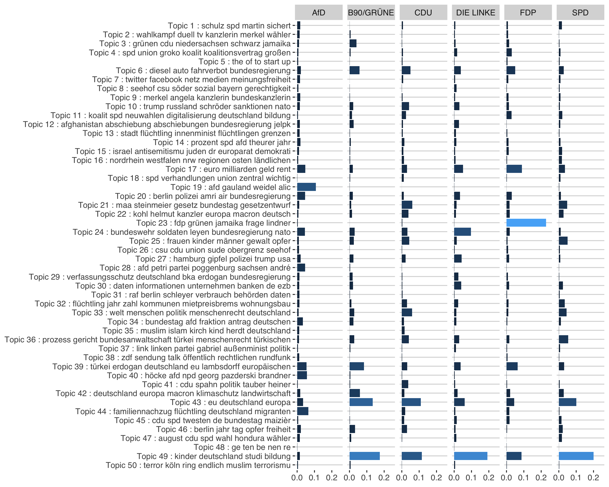

```{r echo=FALSE}
# knitr::opts_chunk$set(echo=FALSE)
```

Parties and candidates not only want to be present in the media (coverage bias), or evaluated in a positive way (tonality bias). They also want the media agenda to be congruent with their own agenda to define the issue-based criteria on which they will be evaluated by voters. Thus, parties choose their issue agenda carefully, highlighting issues that they are perceived to be competent on, that they "own" and that are important to their voters. In that sense agenda bias refers to the extent to which political actors appear in the public domain in conjunction with the topics they wish to emphasize. 

To allow for an operationalization of agenda bias, I use parties' campaign communication as an approximation of the potential universe of news stories (D’Alessio & Allen, 2000; Eberl, 2017). I compare the policy issues addressed in campaign communication (i.e., the party agenda) with the policy issues the parties address in media coverage (i.e., the mediated party agenda).

Press releases were scraped from the following websites:

- AfD: https://www.afd.de/presse
- SPD: https://www.spdfraktion.de
- DIE LINKE: https://www.die-linke.de/start/presse/aus-dem-bundestag
- FDP: https://www.fdp.de
- B90/Die Grünen: https://www.gruene-bundestag.de/
- Union: https://www.presseportal.de/nr/7846

To discover the latent topics in the corpus of press releases (1.942) and news articles (11.880), a structural topic modeling (STM) developed by [Roberts (2016)](https://scholar.princeton.edu/sites/default/files/bstewart/files/a_model_of_text_for_experimentation_in_the_social_sciences.pdf) is applied. The STM is an unsupervised machine learning approach that models topics as multinomial distributions of words and documents as multinomial distributions of topics, allowing to incorporate external variables that effect both, topical content and topical prevalence.

# Structural Topic Model

```{r eval=FALSE, include=FALSE}
set.seed(4556)

library(stm)
library(tidyverse)
library(dplyr)
library(ggthemes)

rm(list = ls())
load("../output/pressReleases.Rda")
load("../output/data_step2.Rda")

btw %>%
  mutate(date = as.Date(date),
         type = "news",
         source = medium 
         ) %>%
  bind_rows(.,pressReleases) -> model_df
```

```{r eval=FALSE, include=FALSE}
model_df %>%
  ggplot(aes(source, fill=type)) +
  geom_bar(show.legend = F, alpha = 0.8) +
  coord_flip() +
  facet_wrap(~type, scales = "free") +
  theme_hc() +
  scale_fill_gdocs() +
  labs(title = "Document distribution", y=NULL, x = NULL)

ggsave(file="../figs/data.png", width = 6, height = 3)
```


## Build Corpus
```{r eval=FALSE, include=FALSE}
library(stm)

processed <- textProcessor(model_df$text_cleaned1, 
                           metadata = model_df[,c("source","type","text_cleaned1")],
                           wordLengths = c(2,Inf),
                           lowercase = F,
                           removestopwords = F,
                           removenumbers = F,
                           removepunctuation = F,
                           stem = F)
out <- prepDocuments(processed$documents, processed$vocab, processed$meta)
out$meta$source <- as.factor(out$meta$source)

save(model_df, out, file="../output/final_modeldf.Rda")
```

## Select Model

STM assumes a fixed user-specified number of topics. There is not a "right" answer to the number of topics that are appropriate for a given corpus (Grimmer and Stewart 2013), but the function searchK uses a data-driven approach to selecting the number of topics. The function will perform several automated tests to help choose the number of topics including calculating the held out likelihood (Wallach et al. 2009) and performing a residual analysis
(Taddy 2012).

```{r eval=FALSE, include=FALSE}
# Model search across numbers of topics
k=c(40,45,50,55,60)

storage <- stm(documents = out$documents, vocab = out$vocab,
              K = k, prevalence =~ source, content = ~type, data = out$meta)
```

```{r message=FALSE, warning=FALSE}
library(stm)

load("../output/models/selectK_content2.RData")
plot(storage)
```


## Run Model
```{r eval=FALSE, include=FALSE}
k=50

stmOut <- stm(documents = out$documents, vocab = out$vocab,
              K = k, prevalence =~ source, content = ~type,
              max.em.its = 75, data = out$meta,
              init.type = "Spectral")

save(model_df, out, stmOut, file = "../output/models/finalmodel_50.Rda")
```

I included the document source as a control for the topical topical prevalence and the type (press release or news article) as a control for topical content. Thus, I assume that the distribution of topics depends on the source and the word distribution within each topic differes between party press releases and news articles. The number of topics is set to 50.

## Results
```{r include=FALSE}
library(stm)
library(tidyverse)
library(ggthemes)

rm(list = ls())
source("func/functions.R")
load("../output/models/finalmodel_50.RDa")

model_df <- model_df %>%
  dplyr::mutate(doc_index = as.numeric(rownames(.)),
         source = ifelse(source == "welt.de", "DIE WELT", source),
         source = ifelse(source == "zeit.de", "ZEIT ONLINE", source),
         source = ifelse(source == "focus.de", "FOCUS Online", source),
         source = ifelse(source == "bild.de", "Bild.de", source),
         source = ifelse(source == "spiegel.de", "SPIEGEL ONLINE", source),
         
         source = ifelse(source == "union", "Union", source),
         source = ifelse(source == "spd", "SPD", source),
         source = ifelse(source == "afd", "AfD", source),
         source = ifelse(source == "gruene", "Grüne", source),
         source = ifelse(source == "linke", "Linke", source),
         source = ifelse(source == "fdp", "FDP", source)
         )
```

### Label topics

To explore the words associated with each topic we use the words with the highest probability in each topic. As we included the source type (press release or news paper) as a control for the topical content (the word distribution of each topic), we have two different labels for each topic.

```{r echo=FALSE}
sagelabs <- sageLabels(stmOut)

newsLabels <- as.data.frame(sagelabs$cov.betas[[1]]$problabels) %>% 
  transmute(topic = as.numeric(rownames(.)),
            topic_name_news_short = paste(V1,V2),
            topic_name_news = paste(V1,V2,V3,V4))

pressLabels <- as.data.frame(sagelabs$cov.betas[[2]]$problabels) %>% 
  transmute(topic = as.numeric(rownames(.)),
            topic_name_press_short = paste(V1,V2),
            topic_name_press = paste(V1,V2,V3,V4))

topics.df <- left_join(newsLabels, pressLabels, by="topic") %>%
  mutate(joint_label = paste("Topic",topic,":",topic_name_news_short, topic_name_press_short))

topics.df %>% select(joint_label, topic_name_news, topic_name_press) %>% 
  htmlTable::htmlTable(align="l", header = c("Joint label", "News articles","Press releases"),
                       rnames = F)
```

```{r include=FALSE}
theta <- as.data.frame(stmOut$theta) %>% # get all theta values for each document
  
  mutate(doc_index = as.numeric(rownames(.))) %>%
  # convert to long format
  gather(topic, theta, V1:V50) %>%
  mutate(topic = as.numeric(gsub("V","",topic))) %>%
  
  # join with topic df
  left_join(., topics.df, by="topic") %>%
  
  # join with model_df
  left_join(., model_df %>% 
              select(date,type,source,doc_index,title_text), by="doc_index")
```

### Topic distribution 

For each document, we have a distribution over all topics, e.g.:

```{r include=FALSE}
sample_doc <- sample(nrow(model_df),1)

# uncomment this to only select docs from press releases
#sample_doc <- theta %>% filter(type=="press") %>% sample_n(1) %>% select(doc_index)
#sample_doc <- sample_doc$doc_index

title <- model_df$title[which(model_df$doc_index == sample_doc)]
source <- model_df$source[which(model_df$doc_index == sample_doc)]
```

```{r eval=FALSE, include=FALSE}
theta %>%
  filter(doc_index == sample_doc) %>%
  select(doc_index, topic_name_news, theta) %>%
  ggplot(aes(topic_name_news, theta)) +
  geom_col(fill="#0099c6", alpha = 0.8) +
  ylim(c(0,1)) +
  coord_flip() +
  theme_hc() +
  labs(title = paste("Topic distribution of document",sample_doc),
       subtitle = paste0("Source: ",source,"\nTitle: ", title),
       x = NULL, y = NULL
       ) +
  theme(axis.text.x = element_text(size = 6))

ggsave("../figs/example_distr.png", height = 8, width = 8)
```


What is the document acutally about? 

```{r echo=FALSE}
model_df %>%
  filter(doc_index == sample_doc) %>%
  select(source, title_text) %>%
  htmlTable::htmlTable(align="l", rnames=FALSE, header = c("Source", "Title + Body"))
```

### Topic frequency

The expected proportion of the corpus that belongs to each topic is used to get an initial overview of the results. The figure below displays the topics ordered by their expected frequency across the corpus. The four most frequent words in each topic are used as a label for that topic. 

```{r include=FALSE}
overall_freq <- as.data.frame(colMeans(stmOut$theta)) %>%
  transmute(
    topic = as.numeric(rownames(.)),
    frequency = colMeans(stmOut$theta)
         ) %>%
  left_join(., topics.df, by = "topic") %>% 
  arrange(desc(frequency))%>%
  mutate(order = row_number())
```

```{r Plot expected frequency, eval=FALSE, include=FALSE}
overall_freq %>%
  ggplot(aes(reorder(joint_label, -order), frequency)) +
  geom_col(fill="#0099c6", alpha = 0.8) +
  coord_flip() +
  theme_hc() +
  labs(x=NULL, y=NULL) +
  theme(axis.text = element_text(size = 5))

ggsave("../figs/topic_proportion.png", height = 6, width = 5)
```


### Measure Agendas

Agendas were measured in terms of percentage distributions across the 50 topics. For each source the average distribution of each topic is calculated for each month. The following pictures show the overall topic distribution.

```{r include=FALSE}
# calculate topic mean by source and month
topicmean <- theta %>%
  mutate(
    year = lubridate::year(date),
    month = lubridate::month(date)
    ) %>%
  group_by(topic,source, month, year) %>%
  dplyr::summarise(topicmean = mean(theta)) %>% 
  ungroup() %>%
  spread(source, topicmean) %>%
  filter(month != 3)
```

```{r include=FALSE}
topicmean_news <- theta %>%
  filter(type == "news") %>%
  group_by(topic,joint_label, source) %>%
  summarise(topicmean = mean(theta)) %>% 
  ungroup()

topicmean_press <- theta %>%
  filter(type == "press") %>%
  group_by(topic,joint_label, source) %>%
  summarise(topicmean = mean(theta)) %>% 
  ungroup()
```

```{r eval=FALSE, include=FALSE}
topicmean_news %>%
  ggplot(aes(reorder(joint_label,desc(topic)),topicmean)) +
  geom_col(fill="#0099c6", alpha = 0.8) +
  coord_flip() +
  theme_hc() +
  facet_grid(~source) +
  labs(x=NULL, y=NULL, title="Average distribution of topics",
       subtitle = "Online news") +
  theme(axis.text.x = element_text(size = 6))

ggsave("../figs/topic_proportion_news.png", width = 11, height =8)
```


```{r eval=FALSE, include=FALSE}
topicmean_press %>%
  ggplot(aes(reorder(joint_label,desc(topic)),topicmean)) +
  geom_col(fill = "#66AA00", alpha=0.8) +
  coord_flip() +
    theme_hc() +
  facet_grid(~source) +
  labs(x=NULL, y=NULL, title="Average distribution of topics",
       subtitle = "Press releases"
       ) +
  theme(axis.text.x = element_text(size = 6))

ggsave("../figs/topic_proportion_press.png", width = 11, height =8)
```



Then, we estimated bivariate correlations between party agendas and the mediated party agendas in the online news. These correlations represent the agenda selectivity each party experiences in each media outlet. The higher the correlation, the more congruent both agendas are. 

```{r eval=FALSE, include=FALSE}
media <- unique(model_df %>% filter(type == "news") %>% select(source))
parties <- unique(model_df %>% filter(type == "press") %>% select(source))
  
rm(corrDF)
for (i in parties$source) {
  
  topicmean %>%
    group_by(month, year) %>%
    do(data.frame(Cor=t(cor(.[,media$source], .[,i])))) %>%
    gather(medium, cor, 3:9) %>%
    mutate(party = i,
           medium = gsub("Cor.","",medium)) -> tempdf
  
  if (exists("corrDF")){
    corrDF <- rbind(corrDF,tempdf)
  } else {
    corrDF <- tempdf
  }
  
}

corrDF <- corrDF %>% 
  mutate(date = as.Date(paste0(year,"/",month,"/1"))) %>%
  dplyr::mutate(medium = ifelse(medium == "DIE.WELT", "DIE WELT", medium),
                medium = ifelse(medium ==  "ZEIT.ONLINE", "ZEIT ONLINE", medium),
                medium = ifelse(medium == "FOCUS.Online", "FOCUS Online", medium),
                medium = ifelse(medium == "SPIEGEL.ONLINE", "SPIEGEL ONLINE", medium),
                )
```

```{r eval=FALSE, include=FALSE}
corrDF %>%
  ggplot(aes(date, cor, fill = medium)) +
  geom_col(show.legend = FALSE, alpha = 0.7) +
  theme_gdocs() +
  scale_fill_gdocs(name=NULL) +
  facet_grid(party~medium) +
  labs(x = NULL, y = NULL, title = "Correlation of topic prevalence") +
  theme(axis.text = element_text(size = 5),
        strip.text = element_text(size = 6),
        title = element_text(size = 7)
        )

ggsave("../figs/agenda_correlation.png", width = 7, height = 5)
```

Again, to measure the bias and not just outlet specificities, for each outlet the mean agenda selectivity of all other parties was subtracted from each party's specific agenda selectivity value.


```{r eval=FALSE, include=FALSE}
parties <- unique(corrDF$party)

rm(agendaBias)
for (i in parties) {
  
    df1 <- corrDF %>% filter(party == i) 
    
    df2 <- corrDF %>%
      filter(party != i) %>%
      group_by(medium, year, month) %>%
      dplyr::summarise(avg_cor = mean(cor)) %>% ungroup()
    
    tempdf <- left_join(df1,df2, by=c("medium","year","month")) %>%
      mutate(agenda_bias = cor-avg_cor)
    
    if (exists('agendaBias')){
      agendaBias <- bind_rows(agendaBias,tempdf)
    } else {
      agendaBias <- tempdf
    }
}

agendaBias <- agendaBias %>% mutate(date = as.Date(paste0(year,"/",month,"/1"))) 
```

```{r eval=FALSE, include=FALSE}
agendaBias %>%
  ggplot(aes(date, agenda_bias, fill = medium)) +
  geom_col(show.legend = FALSE, alpha = 0.7) +
  theme_gdocs() +
  scale_fill_gdocs(name=NULL) +
  facet_grid(party~medium) +
  labs(x = NULL, y = NULL, title = "Agenda bias", 
       subtitle = "Normalized between -1 and 1") +
  theme(axis.text = element_text(size = 5),
        strip.text = element_text(size = 6),
        title = element_text(size = 7)
        )


ggsave("../figs/agenda_bias.png", width = 7, height = 5)
```


```{r eval=FALSE, include=FALSE}
save(agendaBias, file = "../output/agendabias.Rda")
```

