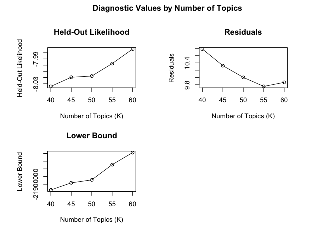
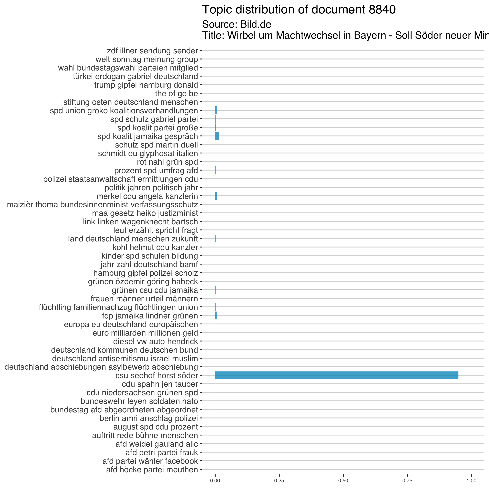
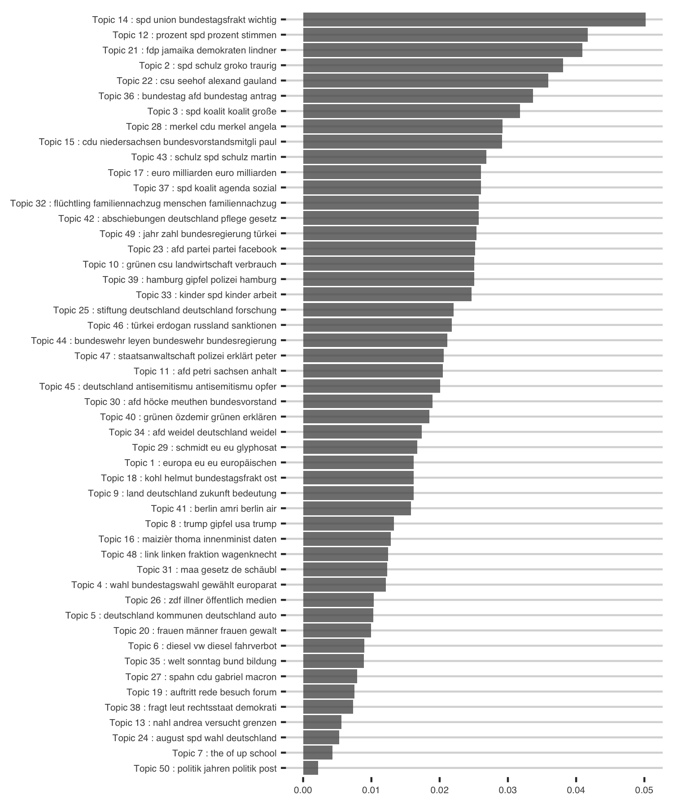
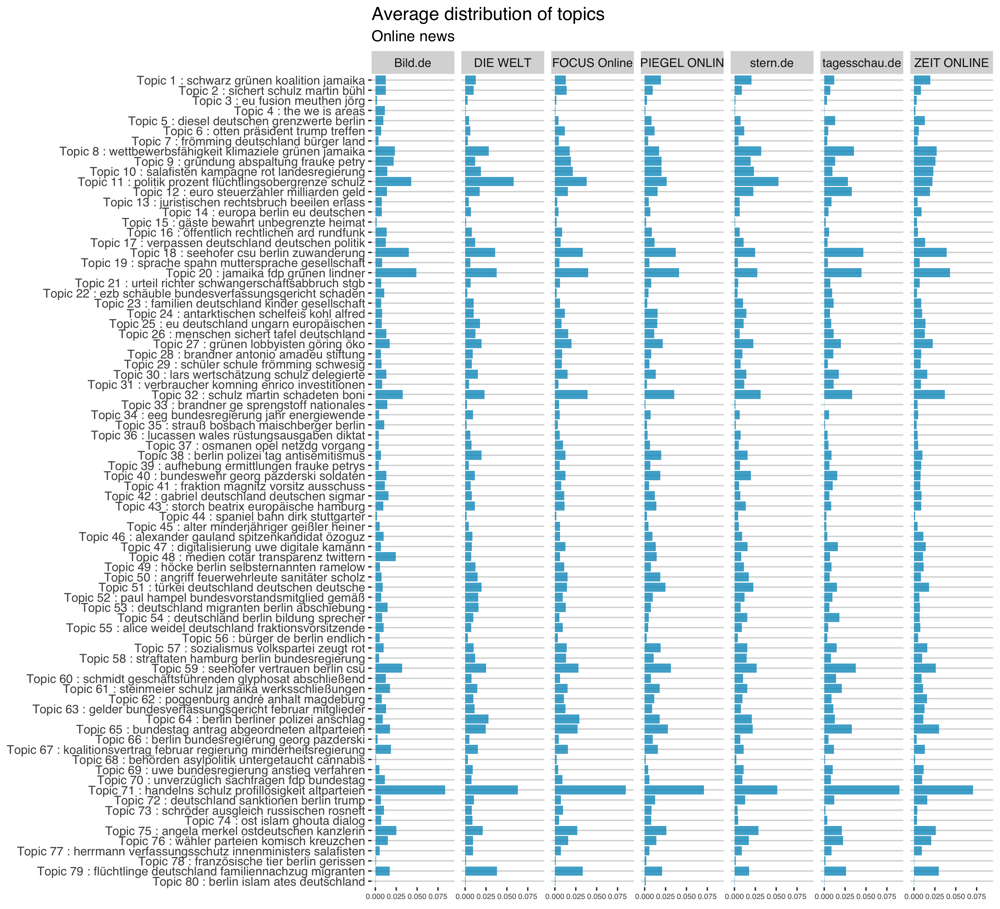
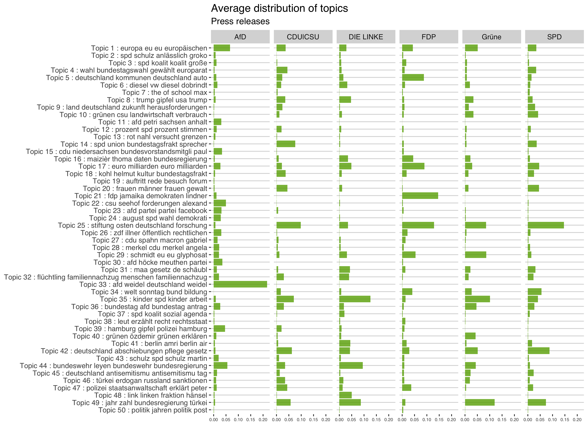
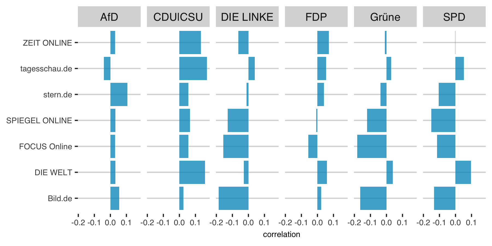
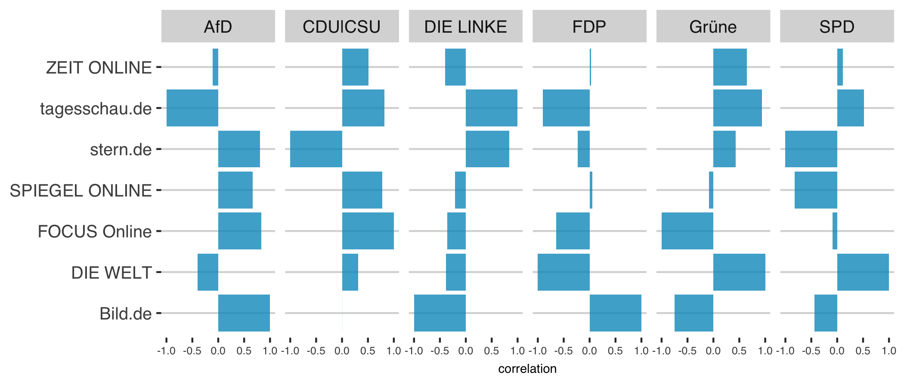

Different types of media bias - agenda bias
================
Franziska Löw
2018-11-11

Parties and candidates not only want to be present in the media (coverage bias), or evaluated in a positive way (tonality bias). They also want the media agenda to be congruent with their own agenda to define the issue-based criteria on which they will be evaluated by voters. Thus, parties choose their issue agenda carefully, highlighting issues that they are perceived to be competent on, that they "own" and that are important to their voters. In that sense agenda bias refers to the extent to which political actors appear in the public domain in conjunction with the topics they wish to emphasize.

To allow for an operationalization of agenda bias, I use parties' campaign communication as an approximation of the potential universe of news stories (D’Alessio & Allen, 2000; Eberl, 2017). I compare the policy issues addressed in campaign communication (i.e., the party agenda) with the policy issues the parties address in media coverage (i.e., the mediated party agenda).

To discover the latent topics in the corpus of press releases (1.942) and news articles (11.880), a structural topic modeling (STM) developed by [Roberts (2016)](https://scholar.princeton.edu/sites/default/files/bstewart/files/a_model_of_text_for_experimentation_in_the_social_sciences.pdf) is applied. The STM is an unsupervised machine learning approach that models topics as multinomial distributions of words and documents as multinomial distributions of topics, allowing to incorporate external variables that effect both, topical content and topical prevalence.

Structural Topic Model
======================

Build Corpus
------------

Select Model
------------

STM assumes a fixed user-specified number of topics. There is not a "right" answer to the number of topics that are appropriate for a given corpus (Grimmer and Stewart 2013), but the function searchK uses a data-driven approach to selecting the number of topics. The function will perform several automated tests to help choose the number of topics including calculating the held out likelihood (Wallach et al. 2009) and performing a residual analysis (Taddy 2012).

``` r
library(stm)

load("../output/models/selectK_content2.RData")
plot(storage)
```



Run Model
---------

I included the document source as a control for the topical topical prevalence and the type (press release or news article) as a control for topical content. Thus, I assume that the distribution of topics depends on the source and the word distribution within each topic differes between party press releases and news articles. The number of topics is set to 55.

Results
-------

### Label topics

To explore the words associated with each topic we use the words with the highest probability in each topic. As we included the source type (press release or news paper) as a control for the topical content (the word distribution of each topic), we have two different labels for each topic.

<table class="gmisc_table" style="border-collapse: collapse; margin-top: 1em; margin-bottom: 1em;">
<thead>
<tr>
<th style="border-bottom: 1px solid grey; border-top: 2px solid grey; text-align: center;">
Joint label
</th>
<th style="border-bottom: 1px solid grey; border-top: 2px solid grey; text-align: center;">
News articles
</th>
<th style="border-bottom: 1px solid grey; border-top: 2px solid grey; text-align: center;">
Press releases
</th>
</tr>
</thead>
<tbody>
<tr>
<td style="text-align: left;">
Topic 1 : europa eu eu europäischen
</td>
<td style="text-align: left;">
europa eu deutschland europäischen
</td>
<td style="text-align: left;">
eu europäischen europäisch button
</td>
</tr>
<tr>
<td style="text-align: left;">
Topic 2 : spd schulz anlässlich groko
</td>
<td style="text-align: left;">
spd schulz gabriel partei
</td>
<td style="text-align: left;">
anlässlich groko fraktion traurig
</td>
</tr>
<tr>
<td style="text-align: left;">
Topic 3 : spd koalit koalit große
</td>
<td style="text-align: left;">
spd koalit jamaika gespräch
</td>
<td style="text-align: left;">
koalit große großen schwarz
</td>
</tr>
<tr>
<td style="text-align: left;">
Topic 4 : wahl bundestagswahl gewählt europarat
</td>
<td style="text-align: left;">
wahl bundestagswahl parteien mitglied
</td>
<td style="text-align: left;">
gewählt europarat parlamentarischen deutschen
</td>
</tr>
<tr>
<td style="text-align: left;">
Topic 5 : deutschland kommunen deutschland auto
</td>
<td style="text-align: left;">
deutschland kommunen deutschen bund
</td>
<td style="text-align: left;">
deutschland auto energien präsidiumsmitgli
</td>
</tr>
<tr>
<td style="text-align: left;">
Topic 6 : diesel vw diesel dobrindt
</td>
<td style="text-align: left;">
diesel vw auto hendrick
</td>
<td style="text-align: left;">
diesel dobrindt fahrverbot autoindustri
</td>
</tr>
<tr>
<td style="text-align: left;">
Topic 7 : the of school max
</td>
<td style="text-align: left;">
the of ge be
</td>
<td style="text-align: left;">
school max world up
</td>
</tr>
<tr>
<td style="text-align: left;">
Topic 8 : trump gipfel usa trump
</td>
<td style="text-align: left;">
trump gipfel hamburg donald
</td>
<td style="text-align: left;">
usa trump un nationen
</td>
</tr>
<tr>
<td style="text-align: left;">
Topic 9 : land deutschland zukunft herausforderungen
</td>
<td style="text-align: left;">
land deutschland menschen zukunft
</td>
<td style="text-align: left;">
zukunft herausforderungen stärken engag
</td>
</tr>
<tr>
<td style="text-align: left;">
Topic 10 : grünen csu landwirtschaft verbrauch
</td>
<td style="text-align: left;">
grünen csu cdu jamaika
</td>
<td style="text-align: left;">
landwirtschaft verbrauch schmidt verbraucherschutz
</td>
</tr>
<tr>
<td style="text-align: left;">
Topic 11 : afd petri sachsen anhalt
</td>
<td style="text-align: left;">
afd petri partei frauk
</td>
<td style="text-align: left;">
sachsen anhalt poggenburg andré
</td>
</tr>
<tr>
<td style="text-align: left;">
Topic 12 : prozent spd prozent stimmen
</td>
<td style="text-align: left;">
prozent spd umfrag afd
</td>
<td style="text-align: left;">
prozent stimmen zahl zahlen
</td>
</tr>
<tr>
<td style="text-align: left;">
Topic 13 : rot nahl versucht grenzen
</td>
<td style="text-align: left;">
rot nahl grün spd
</td>
<td style="text-align: left;">
versucht grenzen nahl flüchtlingspolitik
</td>
</tr>
<tr>
<td style="text-align: left;">
Topic 14 : spd union bundestagsfrakt sprecher
</td>
<td style="text-align: left;">
spd union groko koalitionsverhandlungen
</td>
<td style="text-align: left;">
bundestagsfrakt sprecher wichtig hierzu
</td>
</tr>
<tr>
<td style="text-align: left;">
Topic 15 : cdu niedersachsen bundesvorstandsmitgli paul
</td>
<td style="text-align: left;">
cdu niedersachsen grünen spd
</td>
<td style="text-align: left;">
bundesvorstandsmitgli paul de hampel
</td>
</tr>
<tr>
<td style="text-align: left;">
Topic 16 : maizièr thoma daten bundesregierung
</td>
<td style="text-align: left;">
maizièr thoma bundesinnenminist verfassungsschutz
</td>
<td style="text-align: left;">
daten bundesregierung grundrecht innenminist
</td>
</tr>
<tr>
<td style="text-align: left;">
Topic 17 : euro milliarden euro milliarden
</td>
<td style="text-align: left;">
euro milliarden millionen geld
</td>
<td style="text-align: left;">
euro milliarden jahr rent
</td>
</tr>
<tr>
<td style="text-align: left;">
Topic 18 : kohl helmut kultur bundestagsfrakt
</td>
<td style="text-align: left;">
kohl helmut cdu kanzler
</td>
<td style="text-align: left;">
kultur bundestagsfrakt ost osten
</td>
</tr>
<tr>
<td style="text-align: left;">
Topic 19 : auftritt rede besuch forum
</td>
<td style="text-align: left;">
auftritt rede bühne menschen
</td>
<td style="text-align: left;">
besuch forum pure nähe
</td>
</tr>
<tr>
<td style="text-align: left;">
Topic 20 : frauen männer frauen gewalt
</td>
<td style="text-align: left;">
frauen männer urteil männern
</td>
<td style="text-align: left;">
frauen gewalt opfer bundestagsfrakt
</td>
</tr>
<tr>
<td style="text-align: left;">
Topic 21 : fdp jamaika demokraten lindner
</td>
<td style="text-align: left;">
fdp jamaika lindner grünen
</td>
<td style="text-align: left;">
demokraten lindner freien deutschland
</td>
</tr>
<tr>
<td style="text-align: left;">
Topic 22 : csu seehof forderungen alexand
</td>
<td style="text-align: left;">
csu seehof horst söder
</td>
<td style="text-align: left;">
forderungen alexand gauland wähler
</td>
</tr>
<tr>
<td style="text-align: left;">
Topic 23 : afd partei partei facebook
</td>
<td style="text-align: left;">
afd partei wähler facebook
</td>
<td style="text-align: left;">
partei facebook urteil studi
</td>
</tr>
<tr>
<td style="text-align: left;">
Topic 24 : august spd wahl demokrati
</td>
<td style="text-align: left;">
august spd cdu prozent
</td>
<td style="text-align: left;">
wahl demokrati deutschland bundestagswahl
</td>
</tr>
<tr>
<td style="text-align: left;">
Topic 25 : stiftung osten deutschland forschung
</td>
<td style="text-align: left;">
stiftung osten deutschland menschen
</td>
<td style="text-align: left;">
deutschland forschung digitalisierung menschen
</td>
</tr>
<tr>
<td style="text-align: left;">
Topic 26 : zdf illner öffentlich rechtlichen
</td>
<td style="text-align: left;">
zdf illner sendung sender
</td>
<td style="text-align: left;">
öffentlich rechtlichen rundfunk medien
</td>
</tr>
<tr>
<td style="text-align: left;">
Topic 27 : cdu spahn macron gabriel
</td>
<td style="text-align: left;">
cdu spahn jen tauber
</td>
<td style="text-align: left;">
macron gabriel französischen deutsch
</td>
</tr>
<tr>
<td style="text-align: left;">
Topic 28 : merkel cdu merkel angela
</td>
<td style="text-align: left;">
merkel cdu angela kanzlerin
</td>
<td style="text-align: left;">
merkel angela bundeskanzlerin afrika
</td>
</tr>
<tr>
<td style="text-align: left;">
Topic 29 : schmidt eu eu glyphosat
</td>
<td style="text-align: left;">
schmidt eu glyphosat italien
</td>
<td style="text-align: left;">
eu glyphosat bundesregierung türkei
</td>
</tr>
<tr>
<td style="text-align: left;">
Topic 30 : afd höcke meuthen partei
</td>
<td style="text-align: left;">
afd höcke partei meuthen
</td>
<td style="text-align: left;">
meuthen partei bundesvorstand jörg
</td>
</tr>
<tr>
<td style="text-align: left;">
Topic 31 : maa gesetz de schäubl
</td>
<td style="text-align: left;">
maa gesetz heiko justizminist
</td>
<td style="text-align: left;">
de schäubl masi banken
</td>
</tr>
<tr>
<td style="text-align: left;">
Topic 32 : flüchtling familiennachzug menschen familiennachzug
</td>
<td style="text-align: left;">
flüchtling familiennachzug flüchtlingen union
</td>
<td style="text-align: left;">
menschen familiennachzug deutschland jelpk
</td>
</tr>
<tr>
<td style="text-align: left;">
Topic 33 : afd weidel deutschland weidel
</td>
<td style="text-align: left;">
afd weidel gauland alic
</td>
<td style="text-align: left;">
deutschland weidel alic migranten
</td>
</tr>
<tr>
<td style="text-align: left;">
Topic 34 : welt sonntag bund bildung
</td>
<td style="text-align: left;">
welt sonntag meinung group
</td>
<td style="text-align: left;">
bund bildung schulen länder
</td>
</tr>
<tr>
<td style="text-align: left;">
Topic 35 : kinder spd kinder arbeit
</td>
<td style="text-align: left;">
kinder spd schulen bildung
</td>
<td style="text-align: left;">
kinder arbeit mindestlohn fraktion
</td>
</tr>
<tr>
<td style="text-align: left;">
Topic 36 : bundestag afd bundestag antrag
</td>
<td style="text-align: left;">
bundestag afd abgeordneten abgeordnet
</td>
<td style="text-align: left;">
bundestag antrag deutschen fraktion
</td>
</tr>
<tr>
<td style="text-align: left;">
Topic 37 : spd koalit sozial agenda
</td>
<td style="text-align: left;">
spd koalit partei große
</td>
<td style="text-align: left;">
sozial agenda fraktion kort
</td>
</tr>
<tr>
<td style="text-align: left;">
Topic 38 : leut erzählt recht rechtsstaat
</td>
<td style="text-align: left;">
leut erzählt spricht fragt
</td>
<td style="text-align: left;">
recht rechtsstaat demokrati politischen
</td>
</tr>
<tr>
<td style="text-align: left;">
Topic 39 : hamburg gipfel polizei hamburg
</td>
<td style="text-align: left;">
hamburg gipfel polizei scholz
</td>
<td style="text-align: left;">
polizei hamburg polizisten gipfel
</td>
</tr>
<tr>
<td style="text-align: left;">
Topic 40 : grünen özdemir grünen erklären
</td>
<td style="text-align: left;">
grünen özdemir göring habeck
</td>
<td style="text-align: left;">
grünen erklären hofreit anton
</td>
</tr>
<tr>
<td style="text-align: left;">
Topic 41 : berlin amri berlin air
</td>
<td style="text-align: left;">
berlin amri anschlag polizei
</td>
<td style="text-align: left;">
berlin air beschäftigten bundesregierung
</td>
</tr>
<tr>
<td style="text-align: left;">
Topic 42 : deutschland abschiebungen pflege gesetz
</td>
<td style="text-align: left;">
deutschland abschiebungen asylbewerb abschiebung
</td>
<td style="text-align: left;">
pflege gesetz gesetzentwurf erklärt
</td>
</tr>
<tr>
<td style="text-align: left;">
Topic 43 : schulz spd schulz martin
</td>
<td style="text-align: left;">
schulz spd martin duell
</td>
<td style="text-align: left;">
schulz martin deutschland nato
</td>
</tr>
<tr>
<td style="text-align: left;">
Topic 44 : bundeswehr leyen bundeswehr bundesregierung
</td>
<td style="text-align: left;">
bundeswehr leyen soldaten nato
</td>
<td style="text-align: left;">
bundeswehr bundesregierung syrien afghanistan
</td>
</tr>
<tr>
<td style="text-align: left;">
Topic 45 : deutschland antisemitismu antisemitismu tag
</td>
<td style="text-align: left;">
deutschland antisemitismu israel muslim
</td>
<td style="text-align: left;">
antisemitismu tag opfer deutschland
</td>
</tr>
<tr>
<td style="text-align: left;">
Topic 46 : türkei erdogan russland sanktionen
</td>
<td style="text-align: left;">
türkei erdogan gabriel deutschland
</td>
<td style="text-align: left;">
russland sanktionen russischen russisch
</td>
</tr>
<tr>
<td style="text-align: left;">
Topic 47 : polizei staatsanwaltschaft erklärt peter
</td>
<td style="text-align: left;">
polizei staatsanwaltschaft ermittlungen cdu
</td>
<td style="text-align: left;">
erklärt peter steudtner türkischen
</td>
</tr>
<tr>
<td style="text-align: left;">
Topic 48 : link linken fraktion hänsel
</td>
<td style="text-align: left;">
link linken wagenknecht bartsch
</td>
<td style="text-align: left;">
fraktion hänsel bundesregierung wagenknecht
</td>
</tr>
<tr>
<td style="text-align: left;">
Topic 49 : jahr zahl bundesregierung türkei
</td>
<td style="text-align: left;">
jahr zahl deutschland bamf
</td>
<td style="text-align: left;">
bundesregierung türkei erdogan menschenrecht
</td>
</tr>
<tr>
<td style="border-bottom: 2px solid grey; text-align: left;">
Topic 50 : politik jahren politik post
</td>
<td style="border-bottom: 2px solid grey; text-align: left;">
politik jahren politisch jahr
</td>
<td style="border-bottom: 2px solid grey; text-align: left;">
politik post politisch rheinischen
</td>
</tr>
</tbody>
</table>
### Topic distribution

For each document, we have a distribution over all topics, e.g.:



What is the document acutally about?

<table class="gmisc_table" style="border-collapse: collapse; margin-top: 1em; margin-bottom: 1em;">
<thead>
<tr>
<th style="border-bottom: 1px solid grey; border-top: 2px solid grey; text-align: center;">
Source
</th>
<th style="border-bottom: 1px solid grey; border-top: 2px solid grey; text-align: center;">
Title + Body
</th>
</tr>
</thead>
<tbody>
<tr>
<td style="border-bottom: 2px solid grey; text-align: left;">
FOCUS Online
</td>
<td style="border-bottom: 2px solid grey; text-align: left;">
Die Linke im Streit: Bizarrer Machtkampf in der Führungsriege Wagenknecht, Bartsch, Kipping und Riexinger - in der Führungsriege der Linken geht es nicht gerade harmonisch zu. Der Burgfrieden des Wahlkampfs ist dahin. Sorgen um die Stammwähler sind groß.

Eigentlich kann die Linke froh sein, dass sie als kleinste Oppositionskraft hinter SPD und AfD im Moment im Windschatten der beginnenden Jamaika-Sondierungen segelt. Trotz schmerzhafter Wählerverluste im Osten leistet sie sich aber einen bizarren Machtkampf.

Am Dienstag und Mittwoch kommt die neu gewählte Linken-Fraktion in Potsdam zur Klausur zusammen. Sahra Wagenknecht und Dietmar Bartsch wollen wieder an die Spitze gewählt werden. Doch unmittelbar vor dem Treffen gibt es noch Gerangel. So liegen Anträge vor, nach denen die in der Fraktion vertretenen Parteichefs Katja Kipping und Bernd Riexinger im Fraktionsvorstand mitbeschließen dürfen sollen. Gestritten wird auch darüber, wer im Plenum des Bundestags wie für die Linke sprechen darf.

Es rächt sich bei der Linken, dass Konflikte unter den Teppich gekehrt wurden. So rief die Partei im Dezember Wagenknecht und Bartsch erst zu den Spitzenkandidaten im Wahlkampf aus, nachdem beide klar gemacht hatten, dass sie nicht für ein Spitzenquartett mit den Parteichefs Kipping und Riexinger zu haben sind. Nach der Wahl scheint der Burgfriede dahin.

Zunächst sorgte Bundesgeschäftsführer Matthias Höhn für Schlagzeilen. Er wolle wegen eines Zerwürfnisses mit Kipping und Riexinger zurücktreten, hieß es. Er habe die beiden nicht öffentlich gegen die Kritik von Oskar Lafontaine in Schutz genommen, sollen Kipping und Riexinger Höhn vorgeworfen haben. Lafontaine, der Mann Wagenknechts, hatte bei Facebook unter anderem gepostet, dass die Parteichefs "wenig Zustimmung bei den Wählern" haben.
</td>
</tr>
</tbody>
</table>
### Topic frequency

The expected proportion of the corpus that belongs to each topic is used to get an initial overview of the results. The figure below displays the topics ordered by their expected frequency across the corpus. The four most frequent words in each topic are used as a label for that topic.



### Measure Agendas

Agendas were measured in terms of percentage distributions across the 55 topics. For each source the average distribution of each topic is calculated.





Then, we estimated bivariate correlations between party agendas and the mediated party agendas in the online news. These correlations represent the agenda selectivity each party experiences in each media outlet. The higher the correlation, the more congruent both agendas are.



Again, to measure the bias and not just outlet specificities, for each outlet the mean agenda selectivity of all other parties was subtracted from each party's specific agenda selectivity value and then standardized to range from −1 to 1, where −1 stands for both agendas being not congruent at all and +1 stands for both agendas being identical.


