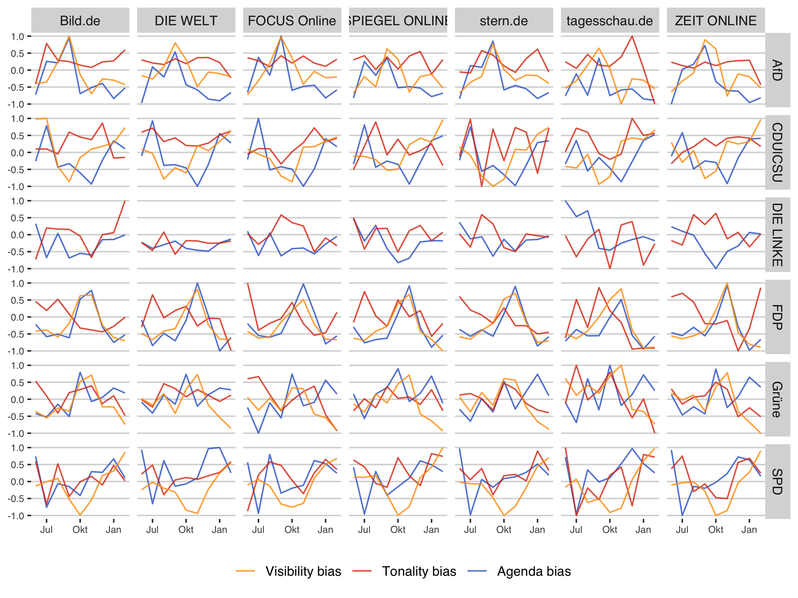

We use the data from the "Sonntagsumfrage" (Sunday survey) from [infratest dimap](https://www.infratest-dimap.de/umfragen-analysen/bundesweit/sonntagsfrage/). The institution regularly asks at least 1000 German citizens the question: "Which party would you choose if federal elections take place next Sunday?" The survey thus measures the current election tendencies and therefore reflects an intermediate state in the opinion-forming process of the electoral population.

```{r include=FALSE}
knitr::opts_chunk$set(eval=FALSE, include=FALSE)
```

```{r}
rm(list = ls())
library(tidyverse)
library(ggthemes)
library(lubridate)
library(scales)

source("func/functions.R")
```

```{r}
# import bias dataframes
load("../output/agendabias.Rda")
load("../output/sentbias.Rda")
load("../output/visbias.Rda")

agendaBias %>%
  left_join(., visBias, by = c("medium","party","date")) %>%
  left_join(., sentBias, by = c("medium","party","date")) %>% ungroup() -> bias

# Import and prepare survey data
load("../output/polls.Rda")

polls <- table_long %>%
  dplyr::mutate(
    year = lubridate::year(Datum),
    month = lubridate::month(Datum),
    date = as.Date(paste0(year,"/",month,"/1"))
    ) %>%
  filter(Datum > as.Date("2017-05-01")) %>%
  filter(Datum < as.Date("2018-03-01")) %>%
  filter(!party %in% c("Piraten", "Sonstige")) %>%
  group_by(year,month,date, party) %>%
  dplyr::summarise(poll_value = mean(value, na.rm=T)) %>%
  ungroup() %>%
  mutate(poll_normalized = normalize_data2(poll_value))
```

To ensure comparability between different metrics, all have been standardized to range from −1 to 1.

```{r}
biasDF <- left_join(bias, polls, by = c('date','party','month','year')) %>%
  mutate(agenda_bias_norm = normalize_data2(agenda_bias),
         sent_bias_norm = normalize_data2(sent_bias),
         vis_bias_norm = normalize_data2(visibility_bias),
         polls_norm = normalize_data2(poll_value)
         ) %>%
    select(medium, party, date, agenda_bias_norm, vis_bias_norm, sent_bias_norm, polls_norm)
  
biasDF_long <- biasDF %>%
  gather(metric, value, agenda_bias_norm:polls_norm) 
```

```{r}
biasDF_long %>%
  ggplot(aes(date, value, color = metric)) +
  geom_line(alpha=0.8) +
  #geom_text(aes(y = 0), size = 3) +
  theme_hc() +
  scale_color_gdocs(name=NULL,
                   breaks=c("vis_bias_norm", "sent_bias_norm", "agenda_bias_norm","polls_norm"),
                   labels=c("Visibility bias", "Tonality bias", "Agenda bias", "Poll value")) +
  facet_grid(party~medium) +
  labs(x = NULL, y = NULL) +
  theme(axis.text = element_text(size = 7),
        axis.title = element_text(size = 7)
        )

ggsave("../figs/bias.png", width = 9, height = 6)
```




