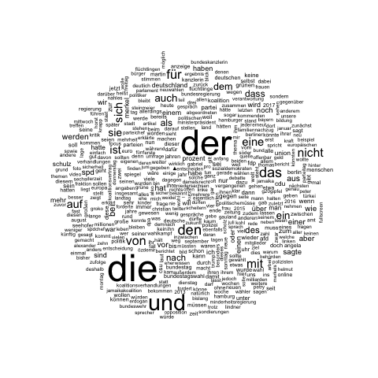
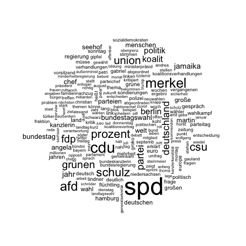
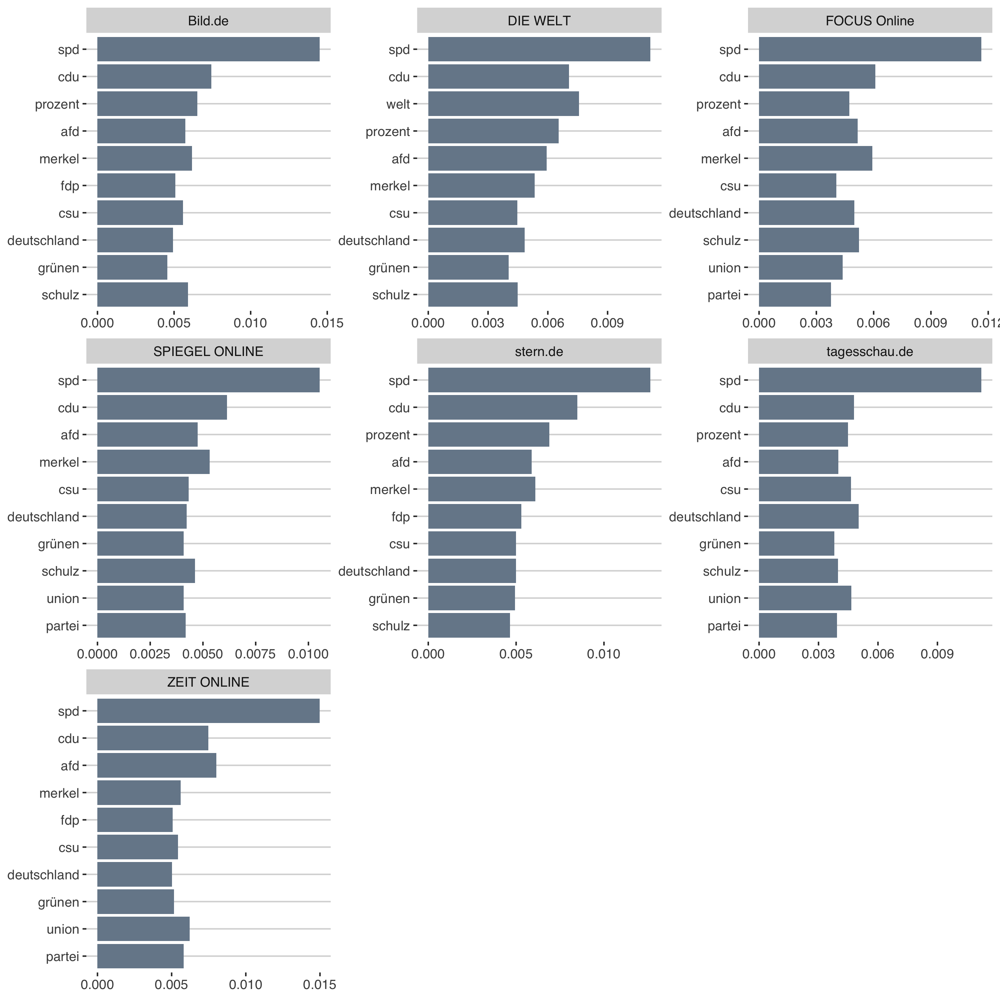
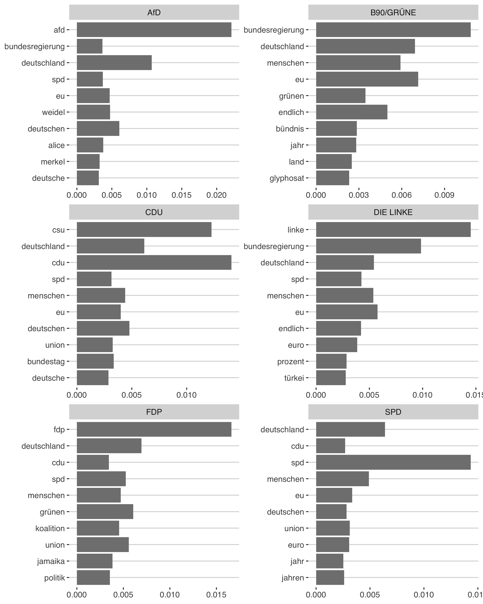
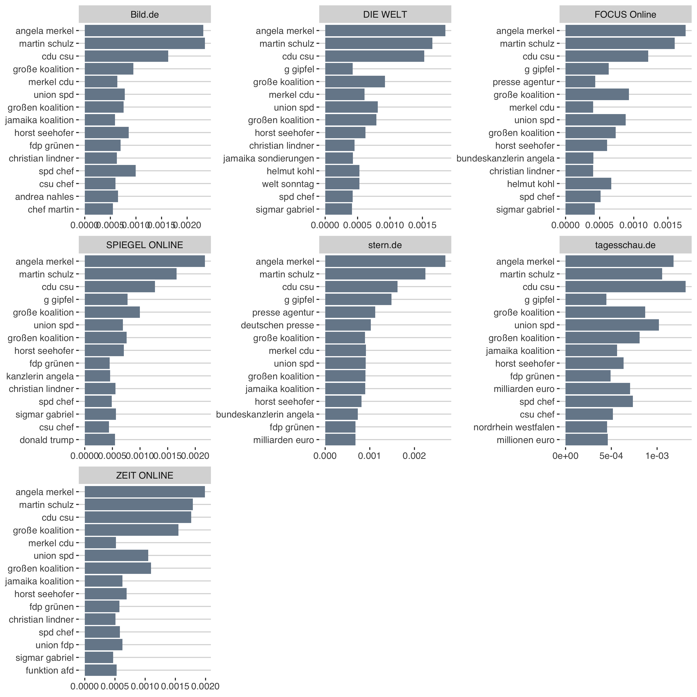
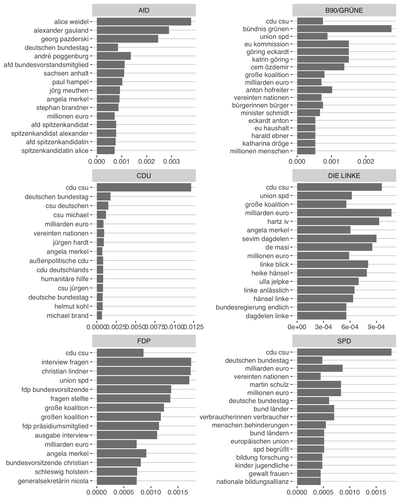

**Hypothesis**: Media tends to bias reporting towards reader preferences

**Data**: 

  - Time period: June 2017 - March 2018
  - 15.135 online news articles (Bild.de, DIE WELT, FOCUS ONLINE, SPIEGEL ONLINE, stern.de, ZEIT ONLINE, Tagesschau.de)
  - 2.666 press releases (german parties in the Bundestag) 

**Methodology**: To measure the political slant of german online newspaper, the topics addressed in newspapers are compared with topics addressed in press releases of political parties...

1. **Estimate the slant index**:

  a. **Sentiment analysis**: Estimate the sentiment of a document, using a dictionary-based ("bag of words") approach
  b. **Topic probabilty**: Find the latent topics in the corpus using a structural topic model
  c. **Weighted topic probabilty**: Multiply the sentiment value of each document with its topic probability vector
  d. **Correlation**: Estimate the correlation of the weighted topic probabilty between media and press releases

2. **Compare slant index with reader preferences**:

  a. **Reutes digital insititue**
  b. ...


```{r include=FALSE}
knitr::opts_chunk$set(message=FALSE, warning=FALSE)
```

```{r}
set.seed(4556)

library(stm)
library(tidyverse)
library(dplyr)
library(ggthemes)
library(tidytext)
library(patchwork)
library(magrittr)

rm(list = ls())

color1 <- "#778899"
color2 <- "#808080"
color3 <- "#000000"

# load press releases
load("../output/pressReleases.Rda")
# load news article data
load("../output/data_step2.Rda")

# combine both
model_df <- btw %>% 
  dplyr::mutate(date = as.Date(date),
         type = "news",
         source = medium) %>%
           bind_rows(.,pressReleases %>% 
                       mutate(source = party)) %>%
  dplyr::mutate(doc_index = as.numeric(rownames(.)))
```

# Inspect data

```{r}
model_df %>%
  group_by(type, source) %>%
  tally() %>%
  ggplot(aes(reorder(source, n),n, fill = type)) +
  geom_col(show.legend = F) +
  theme_hc() +
  coord_flip() +
  labs(y="# documents", x=NULL, title = "Number of documents", subtitle = "June 2017 - March 2018") +
  facet_wrap(~type, scales = "free")
```

## Wordclouds 

Before pre-processing:
```{r eval=FALSE, include=FALSE}
png('../figs/wordcloud.png')
  
wordcloud::wordcloud(model_df$title_text, max.words = 200)
  
dev.off()
```


Pre-processed Data:

```{r eval=FALSE, include=FALSE}
png('../figs/wordcloud_cleaned.png')
  
wordcloud::wordcloud(model_df$text_cleaned1, max.words = 200)
  
dev.off()
```


```{r eval=FALSE, include=FALSE}
source <- unique(model_df$source)

for (i in source) {
  
  name <- gsub(paste("\\/",".de"," ",sep  = "|"),"",i)
  
  png(paste0('../figs/wordclouds/',name,'.png'))
  
  wordcloud::wordcloud(model_df$text_cleaned1[model_df$source == i], max.words = 300)
  
  dev.off()
  
}
```

## TF-IDF

The statistic tf-idf (term frequency - inverse document frequency) is intended to measure how important a word is to a document in a collection (or corpus) of documents. 

The inverse document frequency for any given term is defined as 

$$
idf\text{(term)}=\frac{n_{\text{documents}}}{n_{\text{documents containing term}}}
$$

```{r eval=FALSE, include=FALSE}
tokens <- model_df %>% unnest_tokens(word, text_cleaned)

tokens.news <- tokens %>%
  filter(type == "news") %>%
  count(source, word, sort = TRUE) %>%
  ungroup() %>%
  bind_tf_idf(word,source,n)

tokens.press <- tokens %>%
  filter(type == "press") %>%
  count(source, word, sort = TRUE) %>%
  ungroup() %>%
  bind_tf_idf(word,source,n)
```

```{r eval=FALSE, include=FALSE}
tokens.news %>% 
  select(source, word, tf) %>%
  mutate(word = factor(word, levels = rev(unique(word)))) %>% 
  group_by(source) %>% 
  top_n(10) %>%
  arrange(desc(tf)) %>%
  ungroup() %>%
  ggplot(aes(word, tf)) +
  geom_col(fill=color1, show.legend = FALSE) +
  theme_hc() +
  labs(x = NULL, y = NULL) +
  facet_wrap(~source, ncol = 3, scales = "free") +
  coord_flip()

ggsave("../figs/tf_news.png", width = 10, height = 10)
```



```{r eval=FALSE, include=FALSE}
tokens.press %>% 
  select(source, word, tf) %>%
  mutate(word = factor(word, levels = rev(unique(word)))) %>% 
  group_by(source) %>% 
  top_n(10) %>% 
  arrange(desc(tf)) %>%
  ungroup() %>%
  ggplot(aes(reorder(word,tf),tf)) +
  geom_col(fill=color2, show.legend = FALSE) +
  theme_hc() +
  labs(x = NULL, y = NULL) +
  facet_wrap(~source, ncol = 2, scales = "free") +
  coord_flip()

ggsave("../figs/tf_press.png", width = 8, height = 10)
```



## Bigrams

```{r eval=FALSE, include=FALSE}
bigrams <- model_df %>% unnest_tokens(bigram, text_cleaned, token = "ngrams", n = 2)

bigrams.news <- bigrams %>%
  filter(type == "news") %>%
  count(source, bigram, sort = TRUE) %>%
  ungroup() %>%
  bind_tf_idf(bigram,source,n)

bigrams.press <- bigrams %>%
  filter(type == "press") %>%
  count(source, bigram, sort = TRUE) %>%
  ungroup() %>%
  bind_tf_idf(bigram,source,n)
```

```{r eval=FALSE, include=FALSE}
bigrams.news %>% 
  select(source, bigram, tf) %>%
  mutate(bigram = factor(bigram, levels = rev(unique(bigram)))) %>% 
  group_by(source) %>% 
  arrange(desc(tf)) %>%
  top_n(15) %>%
  ungroup() %>%
  arrange(source, desc(tf)) %>%
  ggplot(aes(bigram, tf)) +
  geom_col(fill=color1, show.legend = FALSE) +
  theme_hc() +
  labs(x = NULL, y = NULL) +
  facet_wrap(~source, ncol = 3, scales = "free") +
  coord_flip()

ggsave("../figs/tf_bigrams_news.png", width = 10, height = 10)
```



```{r eval=FALSE, include=FALSE}
bigrams.press %>% 
  arrange(desc(tf)) %>%
  select(source, bigram, tf) %>%
  mutate(bigram = factor(bigram, levels = rev(unique(bigram)))) %>% 
  group_by(source) %>% 
  top_n(15) %>% 
  ungroup() %>%
  arrange(source, tf) %>%
  ggplot(aes(bigram,tf)) +
  geom_col(fill=color2, show.legend = FALSE) +
  theme_hc() +
  labs(x = NULL, y = NULL) +
  facet_wrap(~source, ncol = 2, scales = "free") +
  coord_flip()

ggsave("../figs/tf_bigrams_press.png", width = 8, height = 10)
```



# Sentiment analysis

To measure the tone (or sentiment) of an article a dictionary-based method is applied. To conduct such an analysis, a list of words (dictionary) associated with a given emotion, such as negativity is pre-defined. The document is then deconstructed into individual words and each word is assigned a sentiment value according to the dictionary, where the sum of all values results in the emotional score for the given document. Such lexical or "bag-of-words" approaches are widely presented in the finance literature to determine the effect of central banks' monetary policy communications on asset prices and real variables. 

The present paper uses a dictionary that lists words associated with positive and negative polarity weighted within the interval of $[-1; 1]$. [SentimentWortschatz](http://wortschatz.uni-leipzig.de/de/download), is a publicly available German-language resource for sentiment analysis, opinion mining, etc.. The current version of SentiWS (v1.8b) contains 1,650 positive and 1,818 negative words, which sum up to 15,649 positive and 15,632 negative words including their inflections, respectively. 

```{r}
# 1. SentiWS
# ---------
SentiWS <- c(
  # positive Wörter
  readLines("dict/SentiWS_v2.0_Negative.txt",
            encoding = "UTF-8"),
  # negative W??rter
  readLines("dict/SentiWS_v2.0_Positive.txt",
            encoding = "UTF-8")
  ) %>%
  
  lapply(function(x) {
  # Extrahieren der einzelnen Spalten
  res <- strsplit(x, "\t", fixed = TRUE)[[1]]
  return(data.frame(words = res[1], value = res[2],
                    stringsAsFactors = FALSE))
  }) %>%
  
  bind_rows %>%
  mutate(word = gsub("\\|.*", "", words) %>% 
           tolower, value = as.numeric(value),
         type = gsub(".*\\|", "", words)) %>%
  
  # nur adjektive oder adverben
  ## filter(type == "ADJX" | type == "ADV") %>%
  # manche Wörter kommen doppelt vor, hier nehmen wir den mittleren Wert
  group_by(word) %>%
  dplyr::summarise(polarity = mean(value)) %>% ungroup %>%
  # Delete "Heil" (wegen Hubertus Heil)
  filter(!grepl('heil',word,ignore.case = T)) %>%
  # welcome to hell (g20)
  filter(!grepl('hell',word,ignore.case = T)) %>%
  # filter values that that score between -0.1 and +0.1 
  filter(!dplyr::between(polarity, -0.1,0.1)) %>%
  # create a -1 / 1 index for the sentiments
  mutate(senti_dummy = ifelse(polarity > 0, 1, -1))

# 2. BPW
# ------
posBPW <- xlsx::read.xlsx("dict/BPW_Dictionary.xlsx", sheetName = "POS_BPW", 
                          header = FALSE, stringsAsFactors = FALSE, encoding = "UTF-8")
negBPW <- xlsx::read.xlsx("dict/BPW_Dictionary.xlsx", sheetName = "NEG_BPW", 
                          header = FALSE, stringsAsFactors = FALSE, encoding = "UTF-8")

BPW <- as.data.frame(rbind(cbind(posBPW, y = 1), cbind(negBPW, y = -1)))
names(BPW) <- c("word","senti_dummy")
```

### Dictionary match

The sentiment score for each document $d$ is calculated based on the weighted polarity values for a word, defined on an interval between -1 and 1. The score is then calculated from the sum of the words in a document (which can be assigned to a word from the dictionary) divided by the total number of words in that document:
 
$$
\text{SentScore}_d = \frac{|\text{positive polarity score}_d| - |\text{negative polarity score}_d|}{|\text{TotalWords}_d|}
$$

```{r}
sent_token <- model_df %>% 
  select(doc_index, date, source, title_text) %>%
  unnest_tokens(word, title_text)

SentiWS.token <- sent_token %>% left_join(., SentiWS, by = "word")
BPW.token <- sent_token %>% left_join(., BPW, by = "word" )
```

```{r Sample sentiment analysis 1}
doc <- sample(unique(model_df$doc_index),1)

SentiWS.token %>% filter(doc_index == doc)
```

```{r Sample sentiment analysis 2}
BPW.token %>% filter(doc_index == doc)
```

```{r Calculacte document sentiment-socres}
sent_df1 <- SentiWS.token %>% 
  group_by(doc_index) %>% 
  dplyr::summarise(n = n(),
                   SentiWS_polarity = sum(polarity, na.rm = T),
                   SentiWS_dummy = sum(senti_dummy, na.rm = T),
                   SentiWS = SentiWS_dummy/n
                   )

sent_df2 <- BPW.token %>% 
  group_by(doc_index) %>% 
  dplyr::summarise(
                  n = n(),
                   BPW_dummy = sum(senti_dummy, na.rm = T),
                   BPW = sum(senti_dummy, na.rm = T)/n
                   ) %>%
  select(-n)

model_df <- left_join(model_df, sent_df1, by="doc_index") %>% left_join(., sent_df2, by="doc_index")
```

### SentimentR

```{r Load Packages}
#if (!require("pacman")) install.packages("pacman")
#pacman::p_load_current_gh("trinker/lexicon", "trinker/sentimentr")

pacman::p_load(sentimentr)
```

```{r Prepare dictionary, message=FALSE, warning=FALSE}
sentiment_df <- SentiWS %>% 
  select(word, polarity) %>% 
  rbind(., c("nicht",-0.8)) %>%
  transmute(
    words = word,
    polarity = as.numeric(polarity)
  ) %>%
  # define as key for sentimentR
  as_key()
```

We may wish to see the output from `sentiment_by` line by line with positive/negative sentences highlighted. The `highlight` function wraps a `sentiment_by` output to produces a highlighted HTML file (positive = green; negative = pink). Here we look at two random articles

```{r}
model_df %>% 
  group_by(source) %>%
  sample_n(1) %>%
  mutate(title_split = get_sentences(title)) %$%
  sentiment_by(title_text, source,
               polarity_dt = sentiment_df) %>%
  sentimentr::highlight()
```

```{r Apply on text data, eval=FALSE, include=FALSE}
sentimenR.df <- model_df %>% 
  mutate(text_split = get_sentences(title_text)) %$%
  sentiment(text_split, polarity_dt = sentiment_df)

model_df <- sentimenR.df %>%
  group_by(element_id) %>% 
  dplyr::summarise(sentimentR = mean(sentiment, na.rm = T)) %>%
  dplyr::ungroup() %>%
  mutate(doc_index = element_id) %>%
  left_join(., model_df, by="doc_index")

sent_df <- model_df %>% 
  select(doc_index, source, type, n, SentiWS_polarity, SentiWS_dummy, SentiWS, BPW_dummy, BPW, sentimentR)

save(sent_df,sentimenR.df, file="../output/sentiment.Rda")
```

```{r}
load("../output/sentiment.Rda")

plot <- sent_df %>%
  group_by(source, type) %>%
  dplyr::summarise(
   SentiWS = mean(SentiWS, na.rm = T),
   BPW = mean(BPW, na.rm = T),
   sentimentR = mean(sentimentR, na.rm = T)
  ) %>%
  ungroup() %>%
  gather(metric, sent_value, SentiWS:sentimentR) %>%
  group_by(type, metric) %>%
  mutate(
    sent_m = median(sent_value)
  ) %>% ungroup()

ggplot(plot, aes(source, sent_value, label = round(sent_value,3))) +
  geom_point(aes( color = metric), size = 3) +
  geom_line(aes(source, sent_m, color = metric, group = metric), linetype=2) +
  geom_text(show.legend = F, color="black", size=2, vjust=-1) +
  coord_flip() +
  labs(x=NULL, y=NULL) +
  ggthemes::theme_hc() +
  ggthemes::scale_color_fivethirtyeight() +
  theme(legend.position = "bottom") +
  facet_grid(type~., scales = "free_y") 
```

```{r}
radar <- plot %>%
  select(-type, -sent_m) %>%
  spread(source, sent_value)

ggiraphExtra::ggRadar(radar, aes(color = metric), rescale = F,
                      interactive = T,
                      alpha = 0) 
```


# Structural Topic Model

Parties want the media agenda to be congruent with their own agenda to define the issue-based criteria on which they will be evaluated by voters ( [Eberl, 2017](https://journals.sagepub.com/doi/abs/10.1177/0093650215614364) ). Thus, parties instrumentalize their press releases in order to highlight issues that they are perceived to be competent on, that they "own" and that are important to their voters ( [Kepplinger & Maurer, 2004](https://link.springer.com/chapter/10.1007%2F978-3-322-83381-5_9) ). Editors can select from this universe and decide which of these topics will be discussed in the news. In that sense the ideological content of a newspaper refers to the extent to which the topics promoted by the parties correlate with the topics discussed in the news articles.

To discover the latent topics in the corpus of press releases and news articles, a structural topic modeling (STM) developed by [Roberts (2016)](https://scholar.princeton.edu/sites/default/files/bstewart/files/a_model_of_text_for_experimentation_in_the_social_sciences.pdf) is applied. The STM is an unsupervised machine learning approach that models topics as multinomial distributions of words and documents as multinomial distributions of topics, allowing to incorporate external variables that effect both, topical content and topical prevalence.

## Build Corpus

```{r eval=FALSE, include=FALSE}
library(stm)

processed <- textProcessor(model_df$text_cleaned1, 
                           metadata = model_df[,c("source","type","text_cleaned1")],
                           wordLengths = c(2,Inf),
                           lowercase = F,
                           removestopwords = F,
                           removenumbers = F,
                           removepunctuation = F,
                           stem = F)
out <- prepDocuments(processed$documents, processed$vocab, processed$meta)
out$meta$source <- as.factor(out$meta$source)

save(model_df, out, file="../output/final_modeldf.Rda")
```

## Select Model

STM assumes a fixed user-specified number of topics. There is not a "right" answer to the number of topics that are appropriate for a given corpus (Grimmer and Stewart 2013). [Roberts et al. (2016)](https://cran.r-project.org/web/packages/stm/vignettes/stmVignette.pdf) propose to measure
topic quality through a combination of semantic coherence and exclusivity of words to topics. Semantic coherence is a criterion developed by [Mimno et al. (2011)](https://dl.acm.org/citation.cfm?id=2145462) and is closely related to pointwise mutual information (Newman et al. 2010): it is maximized when the most probable words in a given topic frequently co-occur together.

Using the function searchK several automated tests are  performed to help choose the number of topics including
the average exclusivity and semantic coherence as well as the held out likelihood (Wallach et al. 2009) and the residuals (Taddy 2012).

```{r eval=FALSE, include=FALSE}
load("../output/final_modeldf.Rda")
library(stm)

rm(list = ls())
# Model search across numbers of topics
k=c(40,50,60,70,80,90,100)

storage <- searchK(documents = out$documents, vocab = out$vocab,
              K = k, prevalence =~ source, content = ~type, data = out$meta)

save(storage, file = "../output/models/searchK.Rda")
```

```{r echo=FALSE}
library(stm)
rm(list = ls())

load("../output/models/searchK.Rda")
plot(storage)
```

## Run Model
```{r eval=FALSE, include=FALSE}
load("../output/final_modeldf.Rda")

k=50

stmOut <- stm(documents = out$documents, vocab = out$vocab,
              K = k, prevalence =~ source,
              max.em.its = 75, data = out$meta,
              init.type = "Spectral")

save(model_df, out, stmOut, file = "../output/models/finalmodel_50.RDa")
```

This process revealed that a model with 50 topics best reflects the structure in the corpus. Furthermore, the source of a document (each party as well as each media outlet represent one source) is used as covariate in the topic prevalence. In other words, I assume that the probability distribution of topics for a specific document is influenced by the source of that document. Additionally the type of that source (news website or party) is used as a covariate for the term frequency as I assume that the words used for the same topic differ between news articles or press releases.  

## STM Results

```{r message=FALSE, warning=FALSE}
library(stm)
library(tidyverse)
library(tidytext)
library(ggthemes)
library(xtable)

rm(list = ls())
color <- "#b7b7b7"
color1 <- "#778899"
color2 <- "#808080"
color3 <- "#000000"
source("func/functions.R")

# stm results
load("../output/models/finalmodel_50.RDa")
# sentiment results
load("../output/sentiment.Rda")
k <- stmOut$settings$dim$K
  
model_df <- model_df %>%
  dplyr::mutate(doc_index = as.numeric(rownames(.))) %>%
  left_join(., sent_df %>% select(-source, -type), by="doc_index")

stmOut$settings$call
```

```{r}
length(stmOut$vocab)
```

### Label topics

To explore the words associated with each topic we use the words with the highest probability in each topic. As we included the source type (press release or news paper) as a control for the topical content (the word distribution of each topic), we have two different labels for each topic.

```{r}
sagelabs <- sageLabels(stmOut, 20)
```

```{r}
newsLabels <- as.data.frame(sagelabs$cov.betas[[1]]$problabels) %>%  
  transmute(topic = as.numeric(rownames(.)),
            topic_name_news = paste(V1,V2,V3))

pressLabels <- as.data.frame(sagelabs$cov.betas[[2]]$problabels) %>% 
  transmute(topic = as.numeric(rownames(.)),
            topic_name_press = paste(V1,V2,V3))

topics.df <- left_join(newsLabels, pressLabels, by="topic") %>%
  mutate(label1 = paste(topic_name_news, topic_name_press))

for (i in seq(k)) {
  label <- paste(unique(unlist(strsplit(topics.df$label1[i], " "))), collapse = " ")
  topics.df$joint_label[i] <- paste("Topic",topics.df$topic[i],":", label)
}

topics.df %>% 
  select(joint_label, topic_name_news, topic_name_press) %>% 
  htmlTable::htmlTable(align="l", header = c("Joint label", "News articles","Press releases"),
                       rnames = F)
```

```{r Save label-plot for each topic, include=FALSE}
for (i in seq(k)) {
  
  name <- paste0("topic_label",i)

  png(paste0('../figs/topiclabel/',name,'.png'), width = 400, height = 450)

  plotQuote(
    
    c(paste(sagelabs$covnames[1],":",
            paste(sagelabs$cov.betas[[1]]$problabels[i,], collapse="\n")),
      paste(sagelabs$covnames[2],":",
            paste(sagelabs$cov.betas[[2]]$problabels[i,], collapse="\n"))
      )
    )

  dev.off()

}
```

```{r Print out to a latex table , eval=FALSE, include=FALSE}
newsLabels <- as.data.frame(sagelabs$cov.betas[[1]]$problabels) %>%  
  transmute(topic = as.numeric(rownames(.)),
            topic_name_news = paste(V1,V2,V3,V4,V5))

pressLabels <- as.data.frame(sagelabs$cov.betas[[2]]$problabels) %>% 
  transmute(topic = as.numeric(rownames(.)),
            topic_name_press = paste(V1,V2,V3,V4,V5))

xt <- xtable(left_join(newsLabels, pressLabels, by="topic") %>%
  transmute(Topic = as.character(topic),
            topic_name_news = topic_name_news,
            topic_name_press = topic_name_press),
  type="latex",
  caption ="Most frequent words")

names(xt) <- c("Topic", "News articles","Press releases")
print(xt, include.rownames = F, file="../writing/tables/labels.tex" )
```

### Topic probabilty

```{r}
theta <- as.data.frame(stmOut$theta) %>% # get all theta values for each document
  
  mutate(doc_index = as.numeric(rownames(.))) %>%
  # convert to long format
  gather(topic, theta, -doc_index) %>%
  mutate(topic = as.numeric(gsub("V","",topic))) %>%
  
  # join with topic df
  left_join(., topics.df, by="topic") %>%
  
  # join with model_df
  left_join(., model_df %>% 
              select(date,type,source,doc_index,title_text), by="doc_index") %>%  
  
  # join with sentiment df
  left_join(., sent_df %>% select(-source, -type), by="doc_index") %>%
  
  # delete documents that are published in Mai 2017
  mutate(
    year = lubridate::year(date),
    month = lubridate::month(date)
    ) %>%
  filter(month != 5)
```

Each document has a probabilty distribution over all topics, e.g.

```{r fig.height=8}
# select a random document
doc <- sample(unique(theta$doc_index),1)

sample <- theta %>% filter(doc_index == doc) 
caption <- model_df %>% filter(doc_index == doc) %>% select(title, source)

sample %>%
  ggplot(aes(reorder(joint_label,desc(topic)), theta)) +
  geom_col(fill = color1) +
  coord_flip() +
  ylim(c(0,1)) +
  theme_hc() +
  labs(x = NULL, y = NULL, caption = paste("title:",caption$title,"(",caption$source,")"))

#ggsave("../figs/doc_topic_distr.png", height = 8, width = 8)
```

What is the document about? 

```{r}
sample$title_text[1]
```

The figure below displays the topics ordered by their expected frequency across the corpus.

```{r}
topicmean <- theta %>%
  group_by(topic, joint_label) %>%
  summarise(frequency = mean(theta)) %>%
  ungroup() %>%
  arrange(desc(frequency)) %>%
  mutate(order = row_number())
```

```{r Plot expected frequency, fig.height=8}
topicmean %>%
  ggplot(aes(reorder(joint_label, -order),frequency, fill=frequency)) +
  geom_col(show.legend = FALSE) +
  coord_flip() +
  theme_hc() +
  labs(x=NULL, y=NULL) 

#ggsave("../figs/topic_proportion.png", height = 8, width = 8)
```

For each source the average distribution of each topic is calculated. 

```{r}
topicmean_news <- theta %>%
  filter(type == "news") %>%
  group_by(topic,joint_label,source) %>%
  summarise(frequency = mean(theta, na.rm = T)) %>% 
  ungroup()

topicmean_press <- theta %>%
  filter(type == "press") %>%
  group_by(topic,joint_label, source) %>%
  summarise(frequency = mean(theta, na.rm = T)) %>% 
  ungroup()
```

```{r eval=FALSE, include=FALSE}
# Save latex table
table_out <- bind_rows(topicmean %>% mutate(source = "_overall") %>% select(-order),
                       topicmean_news, topicmean_press) %>%
  mutate(Topic = as.character(topic),
            frequency = round(frequency,3),
            source = source) %>% 
  spread(source, frequency) %>% select(-topic, -joint_label)

# Print out the dataframe to a latex table 
xt <- xtable(table_out,
             type="latex",
            digits = 3,
             caption ="Topic frequency")

print(xt, include.rownames = F, file="../writing/tables/topic_probability.tex" )
```

#### News articles

```{r fig.align="center", fig.height=11, fig.width=11}
topicmean_news %>%
  ggplot(aes(reorder(joint_label,desc(topic)),
             frequency, fill=frequency)) +
  geom_col(show.legend = F) +
  coord_flip() +
  theme_hc() +
  facet_grid(~source) +
  #scale_fill_gradient2(limits=c(0,0.25), low="white", mid="blue", high="red") +
  scale_y_continuous(limits = c(0,0.25), breaks = c(0,0.1,0.2)) +
  labs(x=NULL, y=NULL) 
  #theme(axis.text.y = element_blank())

#ggsave("../figs/topic_proportion_news.png", width = 10, height =8)
```

#### Press releases

```{r fig.align="center", fig.height=11, fig.width=11}
topicmean_press %>%
  ggplot(aes(reorder(joint_label,desc(topic)),
             frequency, fill=frequency)) +
  geom_col(show.legend = FALSE) +
  coord_flip() +
    theme_hc() +
  facet_grid(~source) +
  #scale_fill_gradient2(limits=c(0,0.25), low="white", mid="blue", high="red") +
  scale_y_continuous(limits = c(0,0.25), breaks = c(0,0.1,0.2)) +
  labs(x=NULL, y=NULL) 

#ggsave("../figs/topic_proportion_press.png", width = 10, height =8)
```

## Weighted topic probability

In order to measure topic-specific tone, the sentiment values are combined with the results of the STM procedure. The output of the STM algorithm provides estimates of topic proportions $\theta_d = [\theta^1_{d},...,\theta^{50}_{d}]'$ for each document $d$. In other words, STM calculates which of the K = 50 topics is discussed in which proportion in each document. These topic proportions are combined with the tone of the corresponding paragraph as in [Jegadeesh and Wu (2017)](https://papers.ssrn.com/sol3/papers.cfm?abstract_id=2939937). 

The topic-specific tone and uncertainty is measured by calculating nettone scores (NTS)

$$
\text{NTS}^k_d=\theta^{k}_{d}*\text{NT}_d
$$
where $\theta^k_{d}$ is the proportion of topic $k$ in document $d$ obtained from the STM procedure and $NT_d$ is the number of positive words minus the number of negative words (nettone) in $d$.

```{r}
theta <- theta %>% 
  mutate(SentiWS_theta = SentiWS*theta,
         BPW_theta = BPW*theta,
         sentR_theta = sentimentR*theta
         )
```

```{r Zero mean and unit variance}
# normalize variable to have a mean of 0 and a standard deviation (and variance) of 1

scaledX <- function(x){
  (x - mean(x))/sd(x)
}
```

```{r}
plot <- theta %>%
  group_by(topic,joint_label) %>%
  dplyr::summarise(
    SentiWS_theta = mean(SentiWS_theta, na.rm = T),
    BPW_theta = mean(BPW_theta, na.rm = T),
    sentR_theta = mean(sentR_theta, na.rm = T)
  ) %>%
  ungroup() %>%
  mutate(
    SentiWS_theta = scaledX(SentiWS_theta),
    BPW_theta = scaledX(BPW_theta),
    sentR_theta = scaledX(sentR_theta)
  ) 
```

```{r fig.height=5, fig.width=5}
library(patchwork)

p1 <- plot %>%
  ggplot(aes(reorder(joint_label,SentiWS_theta), 
             SentiWS_theta, fill=SentiWS_theta)) +
  geom_col(show.legend = F) + 
  coord_flip() + theme_hc() +
  labs(x=NULL, y=NULL, title="SentiWS")

p2 <- plot %>%
  ggplot(aes(reorder(joint_label,SentiWS_theta), 
             BPW_theta, fill=BPW_theta)) +
  geom_col(show.legend = F) + 
  coord_flip() + theme_hc() +
  theme(axis.text.y = element_blank(),
        axis.ticks.x = element_blank()) +
  labs(x=NULL, y=NULL, title="BPW")

p3 <- plot %>%
  ggplot(aes(reorder(joint_label,SentiWS_theta), 
             sentR_theta, fill=sentR_theta)) +
  geom_col(show.legend = F) + 
  coord_flip() + theme_hc() +
  theme(axis.text.y = element_blank(),
        axis.ticks.x = element_blank()) +
  labs(x=NULL, y=NULL, title="SentimentR")

p1 + p2 + p3
```

```{r}
corr.df <- theta %>%
  group_by(topic, type, source, joint_label) %>%
  dplyr::summarise(
    SentiWS_theta = mean(SentiWS_theta, na.rm = T),
    BPW_theta = mean(BPW_theta, na.rm = T),
    sentR_theta = mean(sentR_theta, na.rm = T)
  ) %>%
  ungroup() %>%
  mutate(
    SentiWS_theta = scaledX(SentiWS_theta),
    BPW_theta = scaledX(BPW_theta),
    sentR_theta = scaledX(sentR_theta)
  ) 
```

```{r fig.height=5, fig.width=8}
corr.df %>%
  ggplot(aes(reorder(joint_label,topic),
             SentiWS_theta, fill=SentiWS_theta)) +
  geom_col(show.legend = F) +
  coord_flip() +
  theme_hc() +
  labs(x=NULL, y=NULL, title="SentiWS") +
  facet_grid(.~source)
```

```{r fig.height=5, fig.width=8}
corr.df %>%
  ggplot(aes(reorder(joint_label,topic),
             BPW_theta, fill=BPW_theta)) +
  geom_col(show.legend = F) +
  coord_flip() +
  theme_hc() +
  labs(x=NULL, y=NULL, title="BPW") +
  facet_grid(.~source)
```

```{r fig.height=5, fig.width=8}
corr.df %>%
  ggplot(aes(reorder(joint_label,topic),
             sentR_theta, fill=sentR_theta)) +
  geom_col(show.legend = F) +
  coord_flip() +
  theme_hc() +
  labs(x=NULL, y=NULL, title="SentimentR") +
  facet_grid(.~source)
```

### Correlation of weighted topic distribution

On the basis of thes weighted topic distributions, the bivariate Pearson correlation coefficients are calculated for each pair of media outlet and party. The higher the correlation coefficient, the higher the slant index for a party in a media outlet.

```{r}
library(Hmisc)
library(ggcorrplot)
library(corrr)

news <- c("DIE WELT","stern.de", "ZEIT ONLINE", "FOCUS Online", "Bild.de", "SPIEGEL ONLINE", "tagesschau.de" )
parties <- c("CDU", "SPD", "AfD", "B90/GRÜNE", "DIE LINKE", "FDP" )
```

```{r Network plot, fig.align="centre", message=FALSE, warning=FALSE}
corr.df.sm <- corr.df %>%
  select(topic, source, BPW_theta) %>%
  spread(source, BPW_theta)

x <- as.matrix(corr.df.sm[,-1])

rs <- correlate(x)

rs %>% 
  network_plot()
```

```{r}
plot <- rs %>%
  as_tibble() %>%
  dplyr::rename(source1 = rowname) %>%
  gather(key = source2, value = corr, -source1) %>% 
  mutate(
    type1 = ifelse(source1 %in% news, "news", "party"),
    type2 = ifelse(source2 %in% news, "news", "party")
  ) 
```

```{r fig.align="centre", fig.height=4, fig.width=8}
library(patchwork)

p1 <- plot %>%
  filter(type1 == "news") %>%
  filter(type2 == "news") %>%
  ggplot(aes(source1, source2, 
                 label=round(corr, digits = 2),
                 fill=corr)) +
  geom_tile() +
  scale_fill_gradient2(low = color, high = color1) +
  geom_text(size=1.8) +
  theme_hc() +
  labs(x = NULL, y = NULL, title = "Medium / Medium") + 
  scale_x_discrete(expand = c(0, 0)) +
  scale_y_discrete(expand = c(0, 0)) +
  theme(legend.position = "none",
        axis.text = element_text(size = 6),
       axis.text.x = element_text(angle = 90))

p2 <- plot %>%
  filter(type1 == "news") %>%
  filter(type2 == "party") %>%
  ggplot(aes(source1, source2, 
                 label=round(corr, digits = 2),
                 fill=corr)) +
  geom_tile() +
  scale_fill_gradient2(low = color, high = color1) +
  geom_text(size=1.8) +
  theme_hc() +
  labs(x = NULL, y = NULL, title = "Medium / Partei") + 
  scale_x_discrete(expand = c(0, 0)) +
  scale_y_discrete(expand = c(0, 0)) +
  theme(legend.position = "none",
        axis.text = element_text(size = 6),
        #axis.text.y = element_blank(),
       axis.text.x = element_text(angle = 90))

p3 <- plot %>%
  filter(type1 == "party") %>%
  filter(type2 == "party") %>%
  ggplot(aes(source1, 
             source2,label=round(corr, digits = 2), fill=corr)) +
  geom_tile() +
  scale_fill_gradient2(low = color, high = color1) +
  geom_text(size=1.8) +
  theme_hc() +
  labs(x = NULL, y = NULL, title = "Partei / Partei") + 
  scale_x_discrete(expand = c(0, 0)) +
  scale_y_discrete(expand = c(0, 0)) +
  theme(legend.position = "none",
        axis.text = element_text(size = 6),
       axis.text.x = element_text(angle = 90))

p1 + p2 + p3

#ggsave("../figs/corrplot.png", width = 10, height =4)
```

```{r eval=FALSE, include=FALSE}
# save to latex table
Rnew <- corstars(x)
xt <- xtable(Rnew, type="latex")
print(xt, include.rownames = F, file="../writing/tables/topic_correlation.tex" )
```

## Radar chart

```{r}
radar <- plot %>%
  filter(type1 == "party") %>%
  filter(type2=="news") %>%
  select(source1, source2, corr) %>%
  spread(key = source1, value = corr)
```

```{r eval=FALSE, include=FALSE}
ggiraphExtra::ggRadar(radar, aes(color = source2),
                      rescale = F,
                      alpha = 0) +
  theme_hc() +
  scale_color_viridis_d() +
  theme(legend.position = "none",
        legend.title = element_blank()) +
   guides(col = guide_legend(ncol = 1)) 

#ggsave("../figs/radar_corr.png", width = 5, height = 5, dpi = 200)
```

```{r}
ggiraphExtra::ggRadar(radar, aes(color = source2),
                      rescale = F,
                      interactive = T,
                      alpha = 0) 
```

```{r}
# Print out the dataframe to a latex table 
xt <- xtable(radar,
             digits = c(0,3,3,3,3,3,3,3),
             type="latex",
             caption ="Topic correlation")

print(xt, include.rownames = F, file="../writing/tables/correlation.tex" )
```

Rescale the values

```{r}
radar_rescaled <- as_tibble(sapply(radar[,-1], function(x) normalize_data2(x) ) ) %>%
  mutate(medium = radar$source2)
```

```{r include=FALSE}
ggiraphExtra::ggRadar(radar_rescaled, 
                      aes(color = medium),
                      rescale = F,
                      alpha = 0) + 
  theme_hc() +
  scale_color_viridis_d() +
  theme(legend.position = "right",
        legend.title = element_blank()) +
   guides(col = guide_legend(ncol = 1))

ggsave("../figs/radar_corr_rescaled.png", width = 6, height = 5, dpi = 200)
```

```{r}
ggiraphExtra::ggRadar(radar_rescaled, 
                      aes(color = medium),
                      rescale = F,
                      interactive = T,
                      alpha = 0) 
```

```{r}
ggiraphExtra::ggRadar(radar_rescaled, 
                      aes(color = medium),
                      rescale = F,
                      interactive = T,
                      alpha = 0) 
```

## Compare with reader preferences

Since 2012, the [Reuters Institute Digital News Survey](http://www.digitalnewsreport.org/about-us-2018/) has been investigating the media use of digital content. Among others, the following questions are investigated: What websites do you visit to access news online? What is your political orientation?

The study is being conducted simultaneously in 37 countries under the coordination of the Reuters Institute for the Study of Journalism, based in Oxford (UK). [The Hans Bredow Institute](https://www.hans-bredow-institut.de/de/projekte/reuters-institute-digital-news-survey) has been responsible for the German part of the study as a cooperation partner since 2013. Fieldwork was undertaken between 19th - 22nd January 2018 conducting an online survey. Total sample size for Germany was 2038 adults (aged 18+) who access news once a month or more.

```{r}
reutersDF1 <- readxl::read_excel("../data/reuters_clean.xlsx")
reutersDF2 <- readxl::read_excel("../data/reuters_clean.xlsx", sheet = "orientation")
```

**Q5b. Which of the following brands have you used to access news online in the last week (via websites, apps, social media, and other forms of Internet access)? Please select all that apply.**

```{r include=FALSE}
keeps <- c("Bild.de", "Spiegel Online","Welt Online","Focus Online", "Stern.de","ZEIT Online","Tagesschau.de")
```

Which of the brands have you used to access news online in the last week?

```{r echo=FALSE, fig.align="centre"}
reutersDF1 %>%
  gather(key = "orientation", value = "count", -medium) %>%
  group_by(medium) %>%
  summarise(count = sum(count)) %>%
  mutate(insample = ifelse(medium %in% keeps, "In sample", "Not in sample")) -> reutersDF1.grouped

p <- reutersDF1.grouped %>%
  ggplot(aes(reorder(medium,count),count,
             fill = insample
             )) +
  geom_col(show.legend = F) +
  coord_flip() +
  theme_hc() +
  labs(x = NULL, y = NULL,title = NULL, caption = "Source: Hans-Bredow-Institut")

p
#ggsave({p + theme_hc()}, filename = "../figs/reuters1.png", width = 8, height = 8)
```

**Q1F. Some people talk about 'left', 'right' and 'centre' to describe parties and politicians. (Generally socialist parties would be considered ‘left wing’ whilst conservative parties would be considered ‘right wing’). With this in mind, where would you place yourself on the following scale?**

```{r echo=FALSE, fig.align="centre"}
p<- reutersDF2 %>%
  mutate(count_rel = 100*(count/2038),
    partisan_scale = ifelse(partisan == "Very left-wing", -3,NA),
         partisan_scale = ifelse(partisan == "Fairly left-wing", -2, partisan_scale),
         partisan_scale = ifelse(partisan == "Slightly left-of-centre", -1,partisan_scale),
         partisan_scale = ifelse(partisan == "Centre", 0, partisan_scale),
         partisan_scale = ifelse(partisan == "Slightly right-of-centre", 1, partisan_scale),
         partisan_scale = ifelse(partisan == "Fairly right-wing",2, partisan_scale),
         partisan_scale = ifelse(partisan == "Very right-wing", 3, partisan_scale)
  ) %>%
  ggplot(aes(reorder(partisan, partisan_scale), count_rel,
             label = paste(round(count_rel, digits = 1),"%")
            )) +
  geom_col(fill=color1) +
  geom_text(hjust = 1.5, color = "white", size =2) +
  labs(x = NULL, y = "%") +
  theme_hc() +
  theme(axis.text.x = element_text(angle = 90),
        axis.text = element_text(size= 6))

p
#ggsave({p + theme_hc()}, filename = "../figs/reuters2.png", width = 4, height = 3)
#ggsave({p + theme_hc()}, filename = "../slides/img/reuters2.png", width = 4, height = 2)
```

```{r}
reutersDF.long <- reutersDF1 %>%
  select(medium:`Very rightwing`) %>%
  mutate(order = Centre...5) %>%
  gather(partisan, count, `Very leftwing`:`Very rightwing`) %>%
  mutate(partisan = ifelse(partisan == "Centre...5", "Centre", partisan)) %>%
  mutate(partisan.f = as.factor(partisan)) %>%
  mutate(
    partisan_scale = ifelse(partisan == "Very leftwing", -3,NA),
         partisan_scale = ifelse(partisan == "Fairly leftwing", -2, partisan_scale),
         partisan_scale = ifelse(partisan == "Slightly leftofcentre", -1,partisan_scale),
         partisan_scale = ifelse(partisan == "Centre", 0, partisan_scale),
         partisan_scale = ifelse(partisan == "Slightly rightofcentre", 1, partisan_scale),
         partisan_scale = ifelse(partisan == "Fairly rightwing",2, partisan_scale),
         partisan_scale = ifelse(partisan == "Very rightwing", 3, partisan_scale)
  ) 

reutersDF.long <- reutersDF.long %>%
  
  # group by partisan 
  group_by(partisan.f) %>%
  mutate(count_sum_p = sum(count)) %>%
  ungroup() %>%
  
  # group by medium
  group_by(medium) %>%
  mutate(count_sum_m = sum(count)) %>%
  ungroup() %>%
  
  # calulate relative counts by partisan and medium
  mutate(count_relative_p = count/count_sum_p,
         count_relative_m = count/count_sum_m,
         order_relative_p = order/count_sum_p,
         order_relative_m = order/count_sum_m,
         insample = ifelse(medium %in% keeps, "Yes", "No")
         )
  
```

```{r fig.align="centre"}
p1 <- reutersDF.long %>%
  filter(!grepl("know",medium)) %>%
  filter(!grepl("None",medium)) %>%
  filter(medium %in% keeps) %>%
  mutate(
    label = (count_relative_m*100),
    label_color = ifelse(label > 18, "white", "black")
  ) %>%
  ggplot(aes(reorder(partisan.f, partisan_scale),
             reorder(medium, order_relative_m), 
             fill = count_relative_m)) +
  geom_tile() +
  scale_fill_gradient2(low = color, high = color1) +
  geom_text(aes(label=round(label, digits = 1)), color = color3, size = 2) +
  #scale_color_manual(values = c("black"=color3, "white"="white")) +
  theme_hc() +
  labs(x = NULL, y = NULL) + 
  scale_x_discrete(expand = c(0, 0)) +
  scale_y_discrete(expand = c(0, 0)) +
  theme(legend.position = "none",
        axis.text = element_text(size = 6),
       axis.text.x = element_text(angle = 90))

p2 <- reutersDF.long %>%
  filter(!grepl("know",medium)) %>%
  filter(medium %in% keeps) %>%
  group_by(medium) %>%
  summarise(count_sum = sum(count),
            order_relative_m = sum(order_relative_m)) %>%
  ggplot(aes(reorder(medium,order_relative_m), count_sum)) +
  geom_col(fill = color1) +
  geom_text(aes(label=count_sum), hjust = 1, size = 2, color = "white") +
  coord_flip() +
  theme_hc() +
  labs(x = NULL, y = NULL) +
  theme(axis.text.y = element_blank(),
        axis.text = element_text(size = 6),
        axis.ticks.y = element_blank()
        )

p1 + p2 + plot_layout(widths = c(2,1))

#ggsave("../figs/reuters3.png", width = 5, height = 3)
```

```{r}
p1 <- reutersDF.long %>%
  filter(!grepl("know",medium)) %>%
  filter(!grepl("None",medium)) %>%
  filter(medium %in% keeps) %>%
  mutate(
    medium = ifelse(grepl("Welt",medium,ignore.case = T),"DIE WELT", medium),
    medium = ifelse(grepl("stern",medium,ignore.case = T),"stern.de", medium),
    medium = ifelse(grepl("Zeit",medium,ignore.case = T),"ZEIT ONLINE", medium),
    medium = ifelse(grepl("Focus",medium,ignore.case = T),"FOCUS OnlineT", medium),
    medium = ifelse(grepl("Bild",medium,ignore.case = T),"Bild.de", medium),
    medium = ifelse(grepl("Spiegel",medium,ignore.case = T),"SPIEGEL ONLINE", medium),
    medium = ifelse(grepl("tagesschau",medium,ignore.case = T),"tagesschau.de", medium)
  ) %>%

#  mutate(count = scaledX(count)) %>%
  ggplot(aes(reorder(partisan.f, partisan_scale), medium, 
             fill = count)) +
  geom_tile() +
  geom_text(aes(label= round(count,2))) +
  theme_hc() +
  labs(x = NULL, y = NULL, title = "Reader preferences") + 
  scale_x_discrete(expand = c(0, 0)) +
  scale_y_discrete(expand = c(0, 0)) +
  theme(legend.position = "none", axis.text.x = element_text(angle = 90))

p2 <- plot %>%
  filter(type1 == "news") %>%
  filter(type2 == "party") %>%
#  mutate(corr = scaledX(corr)) %>%
  mutate(
    party_order = ifelse(source2 == "DIE LINKE", 1, 0),
    party_order = ifelse(source2 == "B90/GRÜNE", 2, party_order),
    party_order = ifelse(source2 == "SPD", 3, party_order),
    party_order = ifelse(source2 == "FDP", 4, party_order),
    party_order = ifelse(source2 == "CDU", 5, party_order),
    party_order = ifelse(source2 == "AfD", 6, party_order)
    ) %>%
  
  ggplot(aes(reorder(source2, party_order), source1, fill=corr)) +
  geom_tile() +
  geom_text(aes(label = round(corr,2))) +
  theme_hc() +
  labs(x = NULL, y = NULL, title = "Medium / Partei") + 
  theme(legend.position = "none", axis.text.x = element_text(angle = 90))

p1 + p2
```

# ---- Backup ---- #

```{r eval=FALSE, include=FALSE}
# calculate topic mean by source and month
topicmean_monthly <- theta %>%
  group_by(topic,source, month, year) %>%
  dplyr::summarise(topicmean = mean(sentiment_theta)) %>%
  ungroup() %>%
  spread(source, topicmean) 
```

```{r eval=FALSE, include=FALSE}
media <- unique(model_df %>% filter(type == "news") %>% select(source))
parties <- unique(model_df %>% filter(type == "press") %>% select(source))
  
rm(corrDF)
for (i in parties$source) {
  
  tempdf <- topicmean_monthly %>%
    group_by(month, year) %>%
    do(data.frame(Cor=t(cor(.[,media$source], .[,i])))) %>%
    gather(medium, cor, 3:9) %>%
    mutate(party = i,
           medium = gsub("Cor.","",medium)) %>%
    ungroup()
  
  if (exists("corrDF")){
    corrDF <- rbind(corrDF,tempdf)
  } else {
    corrDF <- tempdf
  }
  
}

agenda <- corrDF %>% 
  mutate(date = as.Date(paste0(year,"/",month,"/1")),
         cor_norm = normalize_data2(cor)
         ) %>%
  dplyr::mutate(medium = ifelse(medium == "DIE.WELT", "DIE WELT", medium),
                medium = ifelse(medium ==  "ZEIT.ONLINE", "ZEIT ONLINE", medium),
                medium = ifelse(medium == "FOCUS.Online", "FOCUS Online", medium),
                medium = ifelse(medium == "SPIEGEL.ONLINE", "SPIEGEL ONLINE", medium)
  )
```

```{r eval=FALSE, include=FALSE}
p <- agenda %>%
  ggplot(aes(date, cor, 
             color = medium,
             linetype = medium)) +
  geom_line() +
  geom_hline(yintercept = 0, size = 0.3, color = color1) +
  facet_wrap(~party) +
  theme_hc() +
  scale_color_viridis_d() +
  labs(y=NULL, x =NULL) +
  scale_x_date(date_breaks = "2 month", date_labels = "%b/%y") +
  theme(legend.position = "bottom",
        legend.title = element_blank()) +
     guides(col = guide_legend(nrow = 1))

plotly::ggplotly(p, tooltip=c("cor","medium"))

#ggsave("../figs/corr_timeline.png", height = 5, width = 8)
```


