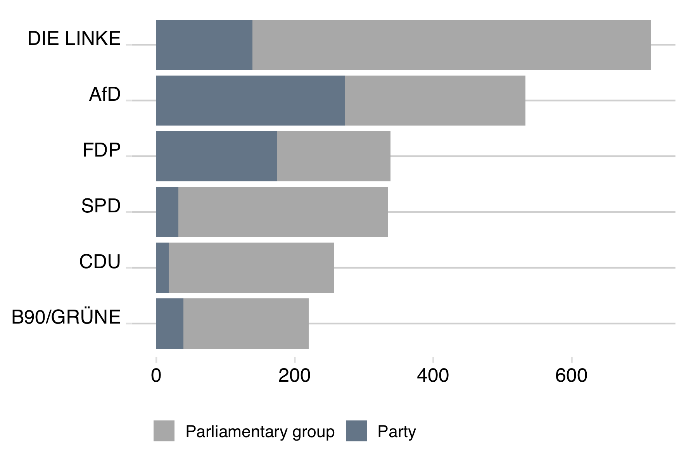

```{r include=FALSE}
knitr::opts_chunk$set(warning = FALSE, message = FALSE)
```


This is part of my current [paper](https://github.com/franziloew/news_paper) about political reporting in German online news. 

To measure the ideological content of several major online news services, I compare the topics discussed in these media with the press releases of the Bundestag parties using a [structural topic model](https://www.structuraltopicmodel.com/).

The following is an analysis of the content of the press releases scraped from the public websites of the political parties and political groups. A big part of this analysis is inspired from the work of Julia Silge and David Robinson ([Text Mining with R - A Tidy Approach](https://www.tidytextmining.com/)).

I assume that parties utilize their press releases to promote their issues and positions and thus also contribute to the election campaign. However, it should be noted that there is a difference between the press releases of the parties and the factions. Parties are financed by membership dues, donations and campaign expenses, while factions are financed by state funds. According to Parteigesetzt §25 (2) state funded factions may not support parties from their funds, because otherwise parties that are not in the Bundestag would be practically disadvantaged.

Since it is difficult to draw the line between faction activity and election campaign assistance, I assume that factions intervene in the public perception of this party with their press releases, which is why I include both the press releases of the federal party and the federal faction.

```{r include=FALSE}
library(tidyverse)
library(lubridate)

rm(list = ls())
```

## Load Data

### CDU

- Partei (https://www.cdu.de)
- Fraktion / Union (https://www.presseportal.de)

```{r eval=FALSE, include=FALSE}
# Partei
load("../data/pressReleases/cdu.Rda")
cdu.p <- cdu %>% mutate(type = "party") %>% select(-scrape_time, -source)

# Fraktion
cdu.f <- read.csv("../data/pressReleases/python/cdu.csv", stringsAsFactors=FALSE)
cdu.f <- cdu.f %>% mutate(type = "faction") %>% select(-link)

# combine both
cdu <- rbind(cdu.p,cdu.f) %>% 
  # date format
  mutate(date = as.Date(date, format="%d.%m.%Y")) %>% 
  # filter time perion
  filter(date >= as.Date("2017-06-01")) %>%
  filter(date < as.Date("2018-03-01")) %>%
  
  # clean text
  mutate(text = gsub('Berlin','',body, ignore.case = TRUE, perl = TRUE),
         text = gsub('ots','',text, ignore.case = TRUE, perl = TRUE),
         text = gsub('Presse.*','', text, perl = TRUE, ignore.case = TRUE),
         text = gsub('Telefon.*','', text, perl = TRUE, ignore.case = TRUE),
         text = gsub('Fax.*','', text, perl = TRUE, ignore.case = TRUE),
         text = gsub('Internet.*','', text, perl = TRUE, ignore.case = TRUE),
         text = gsub('Email.*','', text, perl = TRUE, ignore.case = TRUE),
         title = gsub('(.+?):','',title, perl = T),
         title_text = paste(title, text),
         party = "CDU"
         ) %>%
  distinct(title, .keep_all = T) %>%
  # remove text about inner-party votes
  filter(!grepl("wahl ",title,ignore.case = T)) %>%
  # keep variables 
  select(title, title_text, party, type, date)

rm(cdu.f, cdu.p)
```

### SPD

- Partei (https://www.spd.de)
- Fraktion (https://www.spdfraktion.de)

```{r eval=FALSE, include=FALSE}
# Partei
load("../data/pressReleases/spd.Rda")
spd.p <- spd %>% mutate(type = "party",
                        date = as.Date(date, format="%d.%m.%Y")
                        ) %>% select(-scrape_time, -source)

# Fraktion
spd.f <- read.csv("../data/pressReleases/python/spd.csv", stringsAsFactors=FALSE)
spd.f <- spd.f %>% mutate(type = "faction",
                          date = as.Date(gsub('\\|.*','',date, perl = T), format = "%d.%m.%Y")
                          ) %>% select(-link) 

# combine both
spd <- rbind(spd.p,spd.f) %>%
  # filter time perion
  filter(date >= as.Date("2017-06-01")) %>%
  filter(date < as.Date("2018-03-01")) %>%
  
  # clean text
  mutate(text = gsub('(.+?):','', body, perl = TRUE, ignore.case = TRUE),
         title = title,
         title_text = paste(title, text),
         party = "SPD"
         ) %>%
  distinct(title, .keep_all = T) %>%
  # remove text about inner-party votes
  filter(!grepl("wahl ",title,ignore.case = T)) %>%
  # keep variables 
  select(title, title_text, party, type, date)
  
rm(spd.f, spd.p)
```

### FDP

- Partei (https://www.fdp.de)
- Fraktion (https://www.fdpbt.de)

```{r eval=FALSE, include=FALSE}
fdp.p <- read.csv("../data/pressReleases/python/fdp.csv", stringsAsFactors=FALSE)

fdp.p <- fdp.p %>%
  mutate(
    date = as.Date(date, format = "%d.%m.%Y"),
    title = gsub('\n','',title, perl = T),
    type = "party") 

fdp.f <- read.csv("../data/pressReleases/python/fdpbt.csv", stringsAsFactors=FALSE)

fdp.f <- fdp.f %>% 
  mutate(
        date = as.Date(date, format="%d.%m.%Y"),
        title = gsub('\n','', title, perl = T),
        title = gsub('\t','', title, perl = T),
        type = "faction")

# combine both
fdp <- rbind(fdp.p,fdp.f) %>%
  
  filter(!grepl("Gastbeitrag",title)) %>%
  filter(!grepl("Interview",title)) %>%
  
  # clean text
  mutate(title = gsub('(.+?):','', title, perl = TRUE, ignore.case = TRUE),
         title_text = paste(title, body),
         party = "FDP"
         ) %>%
  distinct(title, .keep_all = T) %>%
  # remove text about inner-party votes
  filter(!grepl("wahl ",title,ignore.case = T)) %>%
  # keep variables 
  select(title, title_text, party, type, date)
  
rm(fdp.f, fdp.p)
```

### B90 / Die Grünen

- Partei (https://www.gruene.de)
- Fraktion (https://www.gruene-bundestag.de/)

```{r eval=FALSE, include=FALSE}
# Partei 
load("../data/pressReleases/gruene.Rda")
gruene.p <- gruene %>% mutate(type = "party",
                              date = as.Date(date, format="%d.%m.%Y")
                              ) %>% select(-scrape_time, -source)

# Fraktion
gruene.f <- read.csv("../data/pressReleases/python/gruene.csv", stringsAsFactors=FALSE)
gruene.f <- gruene.f %>% mutate(type = "faction",
                                date = as.Date(date, format="%d.%m.%Y")) %>% select(-link, -party) 

# combine both
gruene <- rbind(gruene.p,gruene.f) %>%
  # clean text
  mutate(text = gsub('Die Fraktionspressestelle auf Twitter: @GruenSprecher','',body),
         title = title,
         title_text = paste(title, text),
         party = "B90/GRÜNE"
         ) %>%
  distinct(title, .keep_all = T) %>%
  # remove text about inner-party votes
  filter(!grepl("wahl ",title,ignore.case = T)) %>%
  # keep variables 
  select(title, title_text, party, type, date)

rm(gruene.f, gruene.p)
```

### DIE LINKE

- Partei (https://www.die-linke.de)
- Fraktion (https://www.die-linke.de/start/presse/aus-dem-bundestag/)

```{r eval=FALSE, include=FALSE}
# Partei 
load("../data/pressReleases/linke.Rda")
linke.p <- linke %>% mutate(type = "party",
                            date = as.Date(date, format="%d. %B %Y")
                            ) %>% select(-scrape_time, -source)

# Fraktion
linke.f <- read.csv("../data/pressReleases/python/linke.csv", stringsAsFactors=FALSE)
linke.f <- linke.f %>% mutate(type = "faction",
                              date = gsub("\n","", date, perl = T),
                              date = as.Date(date, format="%d. %b %Y")) %>% select(-link, -party) 

# combine both
linke <- rbind(linke.p,linke.f) %>%
  # filter time perion
  filter(date >= as.Date("2017-06-01")) %>%
  filter(date < as.Date("2018-03-01")) %>%
  
  # clean text
  mutate(text = body,
         title = title,
         title_text = paste(title, text),
         party = "DIE LINKE"
         ) %>%
  distinct(title, .keep_all = T) %>%
  # keep variables 
  select(title, title_text, party, type, date)

rm(linke.f, linke.p)
```

### AfD

- Partei (https://www.afd.de)
- Fraktion (https://www.afdbundestag.de)

```{r eval=FALSE, include=FALSE}
load("../data/pressReleases/afd.Rda")
load("../data/pressReleases/afdf.Rda")

afd <- rbind(afd %>% mutate(type = "party"), 
             afd.f %>% mutate(source = "AfD", type = "faction")) %>%
  mutate( date = str_extract(body, "(?<=,\\s)(\\d{1,2}.\\s\\w{1,}\\s\\d{4})"),
          date = as.Date(date, format = "%d. %B %Y"),
          text = gsub('Berlin[^n\\.]*','',body, ignore.case = TRUE, perl = TRUE),
          text = gsub(".fusion-button[^\n]*",'',text, ignore.case = TRUE, perl = TRUE),
          title_text = paste(title, text),
          party = "AfD"
          ) %>%
  distinct(title, .keep_all = T) %>%
  select(title, title_text, party, type, date)

rm(afd.f)
```

```{r eval=FALSE, include=FALSE}
filter <- paste("wahl","wählt","personalentscheidung","gremien","rufbereitschaft","erreichbarkeit", sep = "|")
  
pressReleases <- bind_rows(cdu, spd, afd, gruene, linke, fdp) %>%
  filter(date >= as.Date("2017-06-01")) %>%
  filter(date < as.Date("2018-03-01")) %>%
  mutate(
    author = type,
    type = "press",
    text_length = sapply(gregexpr("\\S+", title_text), length)) %>%
  # remove text about inner-party votes
  filter(!grepl(filter,title_text,ignore.case = T)) %>%
  filter(text_length > 50) %>%
  filter(text_length < 2000)
```

```{r eval=FALSE, include=FALSE}
pressReleases %>%
  group_by(party, author) %>%
  tally() %>%
  ggplot(aes(reorder(party, n),n, fill = author)) +
  geom_col() +
  coord_flip() +
  ggthemes::theme_hc() +
  ggthemes::scale_fill_hc() +
  labs(y = NULL, x = NULL, 
       title = "Number of press releases (June 2017 - March 2018)",
       fill = NULL)

ggsave("../figs/press_releases.png", width = 6, height = 3)
```


## Clean Data

1. Remove... 

  - punctuation, numbers, special characters
  - stopwords (frequently used words, that are not important for the analysis like "und", "ist", "in",...)
  
2. Stemming

```{r eval=FALSE, include=FALSE}
pressReleases$text_cleaned <- gsub("[[:punct:]]", " ", pressReleases$title_text)
pressReleases$text_cleaned <- gsub("[[:cntrl:]]", " ", pressReleases$text_cleaned)
pressReleases$text_cleaned <- gsub("[[:digit:]]", " ", pressReleases$text_cleaned)
pressReleases$text_cleaned <- gsub("^[[:space:]]+", " ", pressReleases$text_cleaned)
pressReleases$text_cleaned <- gsub("[[:space:]]+$", " ", pressReleases$text_cleaned)
pressReleases$text_cleaned <- tolower(pressReleases$text_cleaned)

## Remove stopwords
# 1
german_stopwords_full <- read.table("dict/german_stopwords_full.txt", stringsAsFactors = F)
german_stopwords_full <- german_stopwords_full$V1

# 2
mystopwords <- c("januar","februar","märz","april","mai","juni","juli","august",
                 "september","oktober","november","dezember",
                 "montag","dienstag","mittwoch","donnerstag","freitag","samstag","sonntag",
                 "button","hierzu","erklärt","erklären","sprecher","sprecherin",
                 "fraktionsvorsitzende","bundestagsabgeordnete",
                 "stellvertretende","vorsitzende","stellvertretender","vorsitzender",
                 "fraktionsvorsitzender","bundestagsabgeordneter",
                 "drucken","bundestagsfraktion","fraktion",
                 "freie","demokraten","freien","demokraten","bündnis",
                 "linke","cdu","csu","union","spd","afd","grüne","fdp"
                 )
stopwords <- c(german_stopwords_full, mystopwords)
stopwords <- unique(stopwords)

# 3
pressReleases$text_cleaned<- tm::removeWords(pressReleases$text_cleaned, stopwords)

## Stemming
stem_text<- function(text, language = "porter", mc.cores = 1) {
  # stem each word in a block of text
  stem_string <- function(str, language) {
    str <- strsplit(x = str, split = "\\s")
    str <- SnowballC::wordStem(unlist(str), language = language)
    str <- paste(str, collapse = " ")
    return(str)
  }
   
  # stem each text block in turn
  x <- parallel::mclapply(X = text, FUN = stem_string, language, mc.cores = mc.cores)
   
  # return stemed text blocks
  return(unlist(x))
}

pressReleases$text_cleaned1 <- stem_text(pressReleases$text_cleaned)
```

```{r eval=FALSE, include=FALSE}
save(pressReleases, file = "../output/pressReleases.Rda")

pressReleases %>%
  select(party, title_text) %>%
  write.csv(file = "../output/pressReleases.csv")
```

```{r include=FALSE}
library(tidyverse)
library(tidytext)
library(scales)
library(htmlTable)

rm(list = ls())
load("../output/pressReleases.Rda")
```

```{r echo=FALSE}
pressReleases %>%
  sample_n(1) %>%
  select(title_text, text_cleaned) %>%
  htmlTable::htmlTable()
```

## Inspect Data

### Tokens

```{r}
tokens <- pressReleases %>% unnest_tokens(word, text_cleaned1)

tokens.count <- tokens %>%
  count(party, word, sort = TRUE) %>%
  ungroup() %>%
  bind_tf_idf(word,party,n)
```

```{r fig.height=8, fig.width=10}
tokens.count %>% 
  arrange(desc(tf)) %>%
  mutate(word = factor(word, levels = rev(unique(word)))) %>% 
  group_by(party) %>% 
  top_n(15) %>% 
  ungroup %>%
  ggplot(aes(word, tf, fill = party)) +
  geom_col(show.legend = FALSE, fill = "darkslategray4", alpha = 0.9) +
  labs(x = NULL, y = "Term Frequency") +
  facet_wrap(~party, ncol = 3, scales = "free") +
  coord_flip()
```

Compare the word frequency for the different parties.

- an empty space at low frequency indicates less similarity between two parties. 

- if words in a two-sided panel are closer to the zero-slope line the two parties use more similar words.

```{r}
frequency <- tokens.count %>%
  group_by(party) %>%
  mutate(proportion = n/sum(n)) %>%
  select(party, word, proportion) %>%
  spread(party, proportion) 
```

#### CDU
```{r fig.height=8, fig.width=12}
frequency %>% 
  gather(party, proportion, -word, -CDU) %>%
  ggplot(aes(x = proportion, y = `CDU`, color = abs(`CDU` - proportion))) +
  geom_abline(color = "gray40", lty = 2) +
  geom_jitter(alpha = 0.1, size = 2.5, width = 0.3, height = 0.3) +
  geom_text(aes(label = word), check_overlap = TRUE, vjust = 1.5) +
  scale_x_log10(labels = percent_format()) +
  scale_y_log10(labels = percent_format()) +
  scale_color_gradient(limits = c(0, 0.001), low = "darkslategray4", high = "gray75") +
  facet_wrap(~party, nrow = 2) +
  theme(legend.position="none") +
  labs(y = "CDU", x = NULL)

#ggsave("../figs/word_freq_CDU.png", width = 15, height = 10)
```

#### SPD
```{r fig.height=8, fig.width=12}
frequency %>% 
  gather(party, proportion, -word, -SPD) %>%
  ggplot(aes(x = proportion, y = `SPD`, color = abs(`SPD` - proportion))) +
  geom_abline(color = "gray40", lty = 2) +
  geom_jitter(alpha = 0.1, size = 2.5, width = 0.3, height = 0.3) +
  geom_text(aes(label = word), check_overlap = TRUE, vjust = 1.5) +
  scale_x_log10(labels = percent_format()) +
  scale_y_log10(labels = percent_format()) +
  scale_color_gradient(limits = c(0, 0.001), low = "darkslategray4", high = "gray75") +
  facet_wrap(~party, nrow = 2) +
  theme(legend.position="none") +
  labs(y = "SPD", x = NULL)

#ggsave("../figs/word_freq_SPD.png", width = 15, height = 10)
```

#### FDP
```{r fig.height=8, fig.width=12}
frequency %>% 
  gather(party, proportion, -word, -FDP) %>%
  ggplot(aes(x = proportion, y = `FDP`, color = abs(`FDP` - proportion))) +
  geom_abline(color = "gray40", lty = 2) +
  geom_jitter(alpha = 0.1, size = 2.5, width = 0.3, height = 0.3) +
  geom_text(aes(label = word), check_overlap = TRUE, vjust = 1.5) +
  scale_x_log10(labels = percent_format()) +
  scale_y_log10(labels = percent_format()) +
  scale_color_gradient(limits = c(0, 0.001), low = "darkslategray4", high = "gray75") +
  facet_wrap(~party, nrow = 2) +
  theme(legend.position="none") +
  labs(y = "FDP", x = NULL)

#ggsave("../figs/word_freq_FDP.png", width = 15, height = 10)
```

#### B90/GRÜNE
```{r fig.height=8, fig.width=12}
frequency %>% 
  gather(party, proportion, -word, -`B90/GRÜNE`) %>%
  ggplot(aes(x = proportion, y = `B90/GRÜNE`, color = abs(`B90/GRÜNE` - proportion))) +
  geom_abline(color = "gray40", lty = 2) +
  geom_jitter(alpha = 0.1, size = 2.5, width = 0.3, height = 0.3) +
  geom_text(aes(label = word), check_overlap = TRUE, vjust = 1.5) +
  scale_x_log10(labels = percent_format()) +
  scale_y_log10(labels = percent_format()) +
  scale_color_gradient(limits = c(0, 0.001), low = "darkslategray4", high = "gray75") +
  facet_wrap(~party, nrow = 2) +
  theme(legend.position="none") +
  labs(y = "B90/GRÜNE", x = NULL)

#ggsave("../figs/word_freq_GRUENE.png", width = 15, height = 10)
```

#### DIE LINKE
```{r fig.height=8, fig.width=12}
frequency %>% 
  gather(party, proportion, -word, -`DIE LINKE`) %>%
  ggplot(aes(x = proportion, y = `DIE LINKE`, color = abs(`DIE LINKE` - proportion))) +
  geom_abline(color = "gray40", lty = 2) +
  geom_jitter(alpha = 0.1, size = 2.5, width = 0.3, height = 0.3) +
  geom_text(aes(label = word), check_overlap = TRUE, vjust = 1.5) +
  scale_x_log10(labels = percent_format()) +
  scale_y_log10(labels = percent_format()) +
  scale_color_gradient(limits = c(0, 0.001), low = "darkslategray4", high = "gray75") +
  facet_wrap(~party, nrow = 2) +
  theme(legend.position="none") +
  labs(y = "DIE LINKE", x = NULL)

#ggsave("../figs/word_freq_LINKE.png", width = 15, height = 10)
```

#### AfD
```{r fig.height=8, fig.width=12}
frequency %>% 
  gather(party, proportion, -word, -`AfD`) %>%
  ggplot(aes(x = proportion, y = `AfD`, color = abs(`AfD` - proportion))) +
  geom_abline(color = "gray40", lty = 2) +
  geom_jitter(alpha = 0.1, size = 2.5, width = 0.3, height = 0.3) +
  geom_text(aes(label = word), check_overlap = TRUE, vjust = 1.5) +
  scale_x_log10(labels = percent_format()) +
  scale_y_log10(labels = percent_format()) +
  scale_color_gradient(limits = c(0, 0.001), low = "darkslategray4", high = "gray75") +
  facet_wrap(~party, nrow = 2) +
  theme(legend.position="none") +
  labs(y = "AfD", x = NULL)

#ggsave("../figs/word_freq_AfD.png", width = 15, height = 10)
```

#### TF-IDF

The statistic tf-idf (term frequency - inverse document frequency) is intended to measure how important a word is to a document in a collection (or corpus) of documents. In this case we measure how important a word is to a party (within all the press releases of that party) in the collection of all parties (and their press releases).

The inverse document frequency for any given term is defined as 

$$
idf\text{(term)}=\frac{n_{\text{documents}}}{n_{\text{documents containing term}}}
$$

In this case, $n_{\text{documents}} = 6$ as we have 6 different parties.

Terms with low tf-idf:

```{r}
tokens.count %>%
  arrange(tf_idf) 
```

A 0 idf (and thus tf-idf) indicate, that these terms appear in all six parties press-releases. 

The inverse document frequency (and thus tf-idf) is very low (0) for terms that occur in many (all) of the documents (all press releases of one party) in a collection (all press releases of one party); 

Terms with high tf-idf.

```{r}
tokens.count %>%
  arrange(desc(tf_idf))
```

```{r fig.height=8, fig.width=10}
tokens.count %>% 
  arrange(desc(tf_idf)) %>%
  mutate(word = factor(word, levels = rev(unique(word)))) %>% 
  group_by(party) %>% 
  top_n(15) %>% 
  ungroup %>%
  ggplot(aes(word, tf_idf, fill = party)) +
  geom_col(show.legend = FALSE, fill = "darkslategray4", alpha = 0.9) +
  labs(x = NULL, y = "tf-idf") +
  facet_wrap(~party, ncol = 3, scales = "free") +
  coord_flip()

#ggsave("../figs/tf-idf.png", width = 11, height = 6)
```

### N-Grams

Words can be considered not only as single units, but also as their relationship to each other. N-grams, for example, help to investigate which words tend to follow others immediately. To do this, we tokenize the text into successive sequences of words called n-grams. By seeing how often word X is followed by word Y, we can then build a model of the relationships between them.

#### Bigrams

```{r}
bigrams <- pressReleases %>% unnest_tokens(bigram, text_cleaned1, token="ngrams", n=2)

bigrams.count <- bigrams %>%
  count(party, bigram, sort = TRUE) %>%
  ungroup() %>%
  bind_tf_idf(bigram,party,n)
```

```{r fig.height=8, fig.width=10}
bigrams.count %>% 
  arrange(desc(tf_idf)) %>%
  mutate(word = factor(bigram, levels = rev(unique(bigram)))) %>% 
  group_by(party) %>% 
  top_n(15) %>% 
  arrange(desc(tf_idf)) %>%
  ungroup %>%
  ggplot(aes(reorder(bigram, tf_idf), tf_idf, fill = party)) +
  geom_col(show.legend = FALSE, fill = "darkslategray4", alpha = 0.9) +
  labs(x = NULL, y = "tf-idf") +
  facet_wrap(~party, ncol = 3, scales = "free") +
  coord_flip()

#ggsave("../figs/tf-idf_bigram.png", width = 11, height = 6)
```

#### Trigrams

```{r}
trigrams <- pressReleases %>% unnest_tokens(trigram, text_cleaned1, token="ngrams", n=3)

trigrams.count <- trigrams %>%
  count(party, trigram, sort = TRUE) %>%
  ungroup() %>%
  bind_tf_idf(trigram,party,n)
```

```{r fig.height=8, fig.width=10}
trigrams.count %>% 
  arrange(desc(tf_idf)) %>%
  mutate(word = factor(trigram, levels = rev(unique(trigram)))) %>% 
  group_by(party) %>% 
  top_n(15) %>% 
  arrange(desc(tf_idf)) %>%
  ungroup %>%
  ggplot(aes(reorder(trigram, tf_idf), tf_idf, fill = party)) +
  geom_col(show.legend = FALSE, fill = "darkslategray4", alpha = 0.9) +
  labs(x = NULL, y = "tf-idf") +
  facet_wrap(~party, ncol = 3, scales = "free") +
  coord_flip()

#ggsave("../figs/tf-idf_trigram.png", width = 12, height = 6)
```
