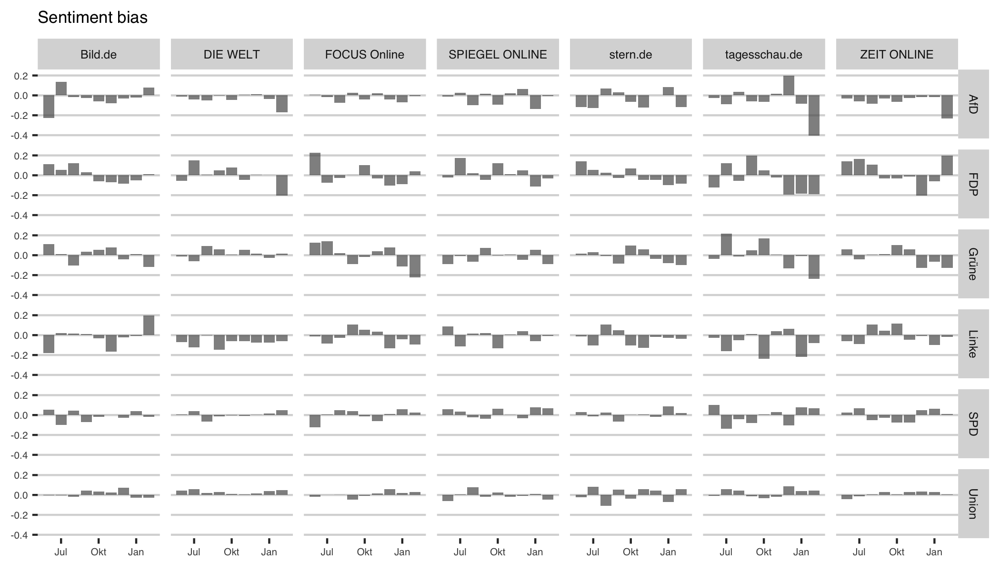

```{r include=FALSE}
knitr::opts_chunk$set(eval=FALSE, include=FALSE)
library(tidyverse)
```

```{r}
rm(list = ls())

library(tidyverse)
library(ggthemes)
source("func/functions.R")

load("../output/data_step2.Rda")

parties <- c("SPD",paste("CDU","CSU",sep = "|"),"FDP","Grüne","AfD","Linke")
btw %>% mutate(doc_index = as.numeric(rownames(.))) -> btw
```

To measure the tone (or sentiment) of a document adictionary-based method is applied. To conduct such an analysis, a lists of words (dictionary) associated with a given emotion, such as negativity is pre-defined by the analyst. The target text is then deconstructed into individual words (or tokens) and the frequencies of words contained in a given dictionary are then calculated. 

The present paper uses a dictionary that lists words associated with positive and negative polarity weighted within the interval of $[-1; 1]$. [SentimentWortschatz](http://wortschatz.uni-leipzig.de/de/download), or SentiWS for short, is a publicly available German-language resource for sentiment analysis, opinion mining etc. The current version of SentiWS (v1.8b) contains 1,650 positive and 1,818 negative words, which sum up to 15,649 positive and 15,632 negative word forms incl. their inflections, respectively. It not only contains adjectives and adverbs explicitly expressing a sentiment, but also nouns and verbs implicitly containing one.

The sentiment score for each party in an article is calculated from each word that occurs in a window of two sentences before and two sentences after the occurence of that political party. An article can mention several party names, or switch tone. The given interval ensures a more reliable correlation between the political party being mentioned (the "target") and the word's polarity score, contrary to measuring all adjectives in the article. A similar approach for target identification is used in de Fortuny et al. (2012) and in Balahur et al. (2010). They latter used a 10-word window and report improved accuracy when compared to measuring all words in the article. Furthermore adjectives that score between -0.1 and +0.1 are excluded to reduce noise. 

The score is then calculated from the sum of the words in a document (which can be assigned to a word from the dictionary) divided by the total number of words in that document.

```{r eval=TRUE, include=TRUE, echo=FALSE}
sent <- c(
  # positive Wörter
  readLines("dict/SentiWS_v1.8c_Negative.txt",
            encoding = "UTF-8"),
  # negative W??rter
  readLines("dict/SentiWS_v1.8c_Positive.txt",
            encoding = "UTF-8")
  ) %>%
  
  lapply(function(x) {
  # Extrahieren der einzelnen Spalten
  res <- strsplit(x, "\t", fixed = TRUE)[[1]]
  return(data.frame(words = res[1], value = res[2],
                    stringsAsFactors = FALSE))
  }) %>%
  
  bind_rows %>%
  mutate(word = gsub("\\|.*", "", words) %>% 
           tolower, value = as.numeric(value),
         type = gsub(".*\\|", "", words)) %>%
  
  # nur adjektive oder adverben
  # filter(type == "ADJX" | type == "ADV") %>%
  # manche Wörter kommen doppelt vor, hier nehmen wir den mittleren Wert
  group_by(word) %>%
  dplyr::summarise(value = mean(value)) %>% ungroup %>%
  # Delete "Heil" (wegen Hubertus Heil)
  filter(!grepl('heil',word,ignore.case = T)) %>%
  # welcome to hell (g20)
  filter(!grepl('hell',word,ignore.case = T)) %>%
  # filter values that that score between -0.1 and +0.1 
  filter(!between(value, -0.1,0.1))

sent %>% 
  sample_n(10) %>%
  htmlTable::htmlTable(align="l")
```

```{r, message=FALSE, warning=FALSE, include=FALSE}
library(tidytext)

# Tokenize text to sentences
sentence <- btw %>%
  select(doc_index, text) %>%
  unnest_tokens(sentence, text, token = "sentences") 
  
sentence <- sentence %>%
  mutate(party = ifelse(grepl("SPD",sentence, ignore.case = T),"SPD",NA),
         party = ifelse(grepl("AfD",sentence, ignore.case = T),"AfD",party),
         party = ifelse(grepl("FDP",sentence, ignore.case = T),"FDP",party),
         party = ifelse(grepl("Grüne",sentence, ignore.case = T),"Grüne",party),
         party = ifelse(grepl("Linke",sentence, ignore.case = T),"Linke",party),
         party = ifelse(grepl(paste("CDU","CSU","Union",sep="|"),sentence, ignore.case = T),"Union",party)
         )
```

```{r}
sentDF <- data.frame() 

for (x in btw$doc_index) {
  
  token <- sentence %>%
    filter(doc_index == x) %>%
    mutate(sentence_index = as.numeric(rownames(.))) %>%
    unnest_tokens(word, sentence) %>%
    # Combine second word with sentiment values
    left_join(., sent, by = "word") 
  
  for (i in parties) {
    
    token %>% 
      filter(party == i) %>% 
      # get all sentences where the party is mentioned
      distinct(sentence_index) %>%
      # get the 2-sentence range
      mutate(lower = sentence_index - 2,
             upper = sentence_index + 2
             ) %>% 
      gather(index, sentence) %>% 
      distinct(sentence) %>%
      filter(sentence > 0) %>%
      select(sentence) -> tempdf
  
    token %>%
      filter(sentence_index %in% tempdf$sentence) %>%
      summarise(mean_value = mean(value, na.rm = T),
                sum_value = sum(value, na.rm = T)) -> sentiment
    
    tempdf2 <- cbind(x,i,sentiment) 
    sentDF <- rbind(sentDF,tempdf2)
  } 
}

sentDF %>%
  transmute(doc_index = x,
            party = as.character(i),
            sentiment_mean = mean_value,
            sentiment_sum = sum_value
            ) %>%
  left_join(.,btw %>% select(doc_index, medium, text), by="doc_index") -> sentDF

save(sentDF, file = "../output/sentiment.Rda")
```

As with visibility bias, we then take the average party tonality in each outlet, with tonality bias computed as the deviation of each party's specific tonality from the average tonality of all parties in that outlet.

```{r}
load("../output/sentiment.Rda")

sentDF <- sentDF %>%
  left_join(., btw %>% select(date, doc_index), by="doc_index") %>%
  mutate(
    year = lubridate::year(date),
    month = lubridate::month(date),
    date = as.Date(paste0(year,"/",month,"/1")),
    party = ifelse(grepl("Cdu",party, ignore.case = T),"Union",party),
    party = ifelse(grepl("Linke",party, ignore.case = T),"Linke",party)
    )
```

```{r}
sentDF %>%
  group_by(medium, party, date) %>%
  dplyr::summarise(sentiment = mean(sentiment_mean, na.rm = T)) %>%
  ggplot(aes(date, sentiment, fill = medium)) +
  geom_col(show.legend = FALSE, alpha = 0.7) +
  theme_gdocs() +
  scale_fill_gdocs(name=NULL) +
  facet_grid(party~medium) +
  labs(x = NULL, y = NULL, title = "Sentiment") +
  theme(axis.text = element_text(size = 5),
        strip.text = element_text(size = 6),
        title = element_text(size = 7)
        )

ggsave("../figs/sentiment.png", width = 7, height = 4)
```

```{r}
sent <- sentDF %>% 
  group_by(medium, party, date) %>%
  dplyr::summarise(avg_sent_p_s = mean(sentiment_mean, na.rm = T)) %>%
  ungroup()
```

```{r Estimate Bias}
parties <- unique(sentDF$party)

rm(sentBias)
for (i in parties) {
  
  df1 <- sent %>% 
    filter(party == i) 
  
  df2 <- sentDF %>% 
    filter(party != i) %>%
    group_by(medium, date) %>%
    dplyr::summarise(avg_sent = mean(sentiment_mean, na.rm = T)) 
  
  left_join(df1,df2, by=c("medium","date")) %>%
    mutate(sent_bias = avg_sent_p_s-avg_sent) -> tempdf
    
    if (exists('sentBias')){
      sentBias <- bind_rows(sentBias,tempdf)
    } else {
      sentBias <- tempdf
    }
}
```

```{r}
sentBias %>%
  ggplot(aes(date, sent_bias, fill = medium)) +
  geom_col(show.legend = FALSE, alpha = 0.7) +
  theme_gdocs() +
  scale_fill_gdocs(name=NULL) +
  facet_grid(party~medium) +
  labs(x = NULL, y = NULL, title = "Sentiment bias"
       ) +
  theme(axis.text = element_text(size = 5),
        strip.text = element_text(size = 6),
        title = element_text(size = 7)
        )

ggsave("../figs/sent_bias.png", width = 7, height = 4)
```


```{r}
save(sentBias, file = "../output/sentbias.Rda")
```