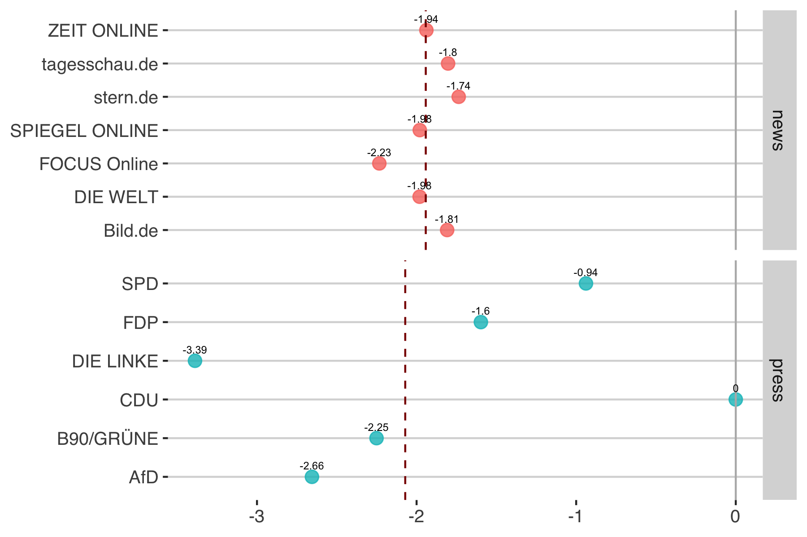
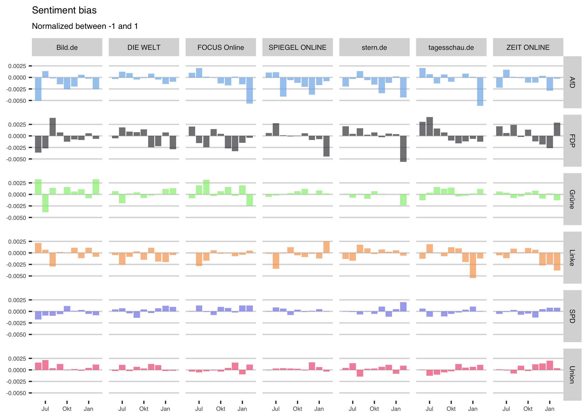
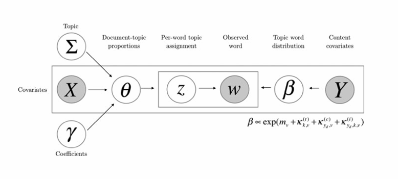
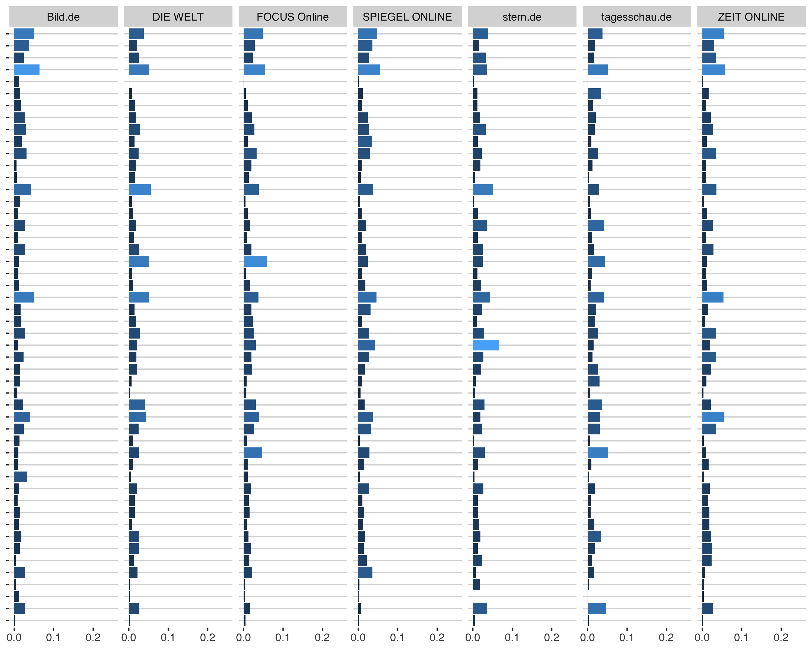

```{r include=FALSE}
# load the packages
libs <- c("readr","lubridate","tidyverse","tidyverse",
          "data.table","stringr","scales","ggthemes","xtable")
lapply(libs, library, character.only = TRUE)

rm(list=ls())
#source("func/functions.R")
```

## Agenda

###1. Introduction

###2. Literature

###3. Data

###4. Methodology

###5. Results

# Introduction

## Media and Politics

**Hypothesis:** 

  - A biased media reporting in political news may have a profound influence on voter opinions and preferences

  - The concept of media bias encompasses different subtypes (D'Alessio and Allen, 2000): (1) Coverage bias, (2) Tonality bias, (3) Agenda bias 

**Research Question:**

  - Is online media biased? 
  
  - What is the effect on voting behavior?

**Methodology:**

  - Calculate the different biases using a combination of different text-mining techniques.
    - extensive content analyses of large text data
    - reduces human induced bias and makes research more traceable and comparable
    
  - Estimate the effect of different bias measures on voting preferences
  
# Literature

## Bias and balance

**Unbiased reporting**: 

  - neutral / balanced report that is not strongly slanted in favor of or against any political side. All sides should be equally represented according to some benchmark.

**Biased reporting**: 

  - To what extend does a reporting deviate from that benchmark?

- What is the benchmark? 

## 3 types of media bias

- The concept of media bias encompasses different subtypes (D'Alessio and Allen, 2000): 

  1. Coverage bias (Quantity: How often do political actors appear in the media?)

  2. Tonality bias (Quality: How are parties evaluated?)

  3. Agenda bias (Quality: Is a party able to present their own political positions in the media?)
 
## Coverage bias

**Hypothesis:** 

  - Voters tend to prefer parties that are more visible in their media repertoire (Eberl et al., 2017)

**Benchmark:**

1. The amount of a parties campaign communication (Hopmann et al., 2012)

2. Standing in polls (Junqué de Fortuny et al., 2012)

3. Average visibility of all parties in each media outlet (Eberl et al., 2017)

**Methodology:**

- Manually coded data

- Textmining approach (e.g. count number of occurrences)

--------------------

- To estimate the effect of the bias on voting preferences...
  
  - Regional differences in the reach of certain media (DellaVigna and Kaplan, 2006; Enikolopov et al., 2011; Snyder and Strömberg , 2010). 
  - Historial data (Dewenter et al., 2018)

## Tonality bias 

**Hypothesis:** 

  - Positive or negative aspects of an object highlighted in the media affects the attitudes towards a certain subject (de Vreese & Boomgaarden, 2003; Druckman and Parkin, 2005; Eberl et al., 2017; Junqué de Fortuny et al., 2012)

**Benchmark:** 

  - Average sentiment value of other parties (Junqué de Fortuny et al., 2012) in each media outlet (Eberl et al., 2017)

**Methodology:**
  - Manually coded data (Eberl et al., 2017)

  - Textmining approach (e.g. dictionary based methods, Junqué de Fortuny et al., 2012)

## Coverage & tonality bias (results)

- Studies investigating both visibility and tonality bias conclude that these biases are not necessarily consistent in their effects, with tonality bias identified as having a greater impact (Boomgaarden & Semetko, 2012; Norris, Curtice, Sanders, Scammell, & Semetko, 1999; Eberl et al. ,2017).

## Agenda bias

**Hypothesis:** 

  - Greater visibility of the political content of a party can have a positive impact on attitudes towards that party. (Benewick et al., 1969; Eberl et al., 2017)

**Benchmark:** 

  - Parties' campaign communication as approximation of the potential universe of news stories (Eberl et al., 2017)

**Methodology:**

  - Manually coded data (Eberl et al., 2017)

**Results:**

  - Voters evaluate parties more favorably if those parties addressed their own favored topics more prominently in media coverage (Eberl et al., 2017)

# Methodology

## Data

Online news articles

  - n = 11.880
  - time: 01.06.2017 - 01.03.2018


## Visibility 

A party $p$ is treated as visible in an article of newspaper $s$ if the party itself is mentioned in an article (if an article contains the word "SPD", "CDU"/"CSU/Union","FDP","Grüne","AfD" or "Linke") 

$$
\text{visibility}(p,s) = \frac{\text{#Articles}_{p,s}}{\text{#Articles}_s}
$$

{width:80%}


## Visibility bias

*There is a bias in a medium when a political party is overrepresented compared to other parties and other outlets*

- **Benchmark**: Average visibility of all parties in each media outlet during the period of analysis 

- **Visibility bias**: Deviation of each party's specific visibility from the average visibility of all other parties in that outlet.

<div style="position:relative; margin:0 auto;">
  
</div>

## Tonality

- Dictionary-based method to measure the tone (or sentiment) of a document.

- Dictionary is a list of words associated with positive and negative polarity weighted within the interval of $[-1; 1]$

```{r echo=FALSE}
sent <- c(
  # positive Wörter
  readLines("dict/SentiWS_v1.8c_Negative.txt",
            encoding = "UTF-8"),
  # negative W??rter
  readLines("dict/SentiWS_v1.8c_Positive.txt",
            encoding = "UTF-8")
  ) %>%
  
  lapply(function(x) {
  # Extrahieren der einzelnen Spalten
  res <- strsplit(x, "\t", fixed = TRUE)[[1]]
  return(data.frame(words = res[1], value = res[2],
                    stringsAsFactors = FALSE))
  }) %>% 
  
  bind_rows %>%
  mutate(word = gsub("\\|.*", "", words) %>% 
           tolower, value = as.numeric(value),
         type = gsub(".*\\|", "", words)) %>%
  
  # nur adjektive oder adverben
  # filter(type == "ADJX" | type == "ADV") %>%
  # manche Wörter kommen doppelt vor, hier nehmen wir den mittleren Wert
  group_by(word) %>%
  dplyr::summarise(value = mean(value)) %>% ungroup %>%
  # Delete "Heil" (wegen Hubertus Heil)
  filter(!grepl('heil',word,ignore.case = T)) %>%
  # welcome to hell (g20)
  filter(!grepl('hell',word,ignore.case = T)) %>%
  # filter values that that score between -0.1 and +0.1 
  filter(!dplyr::between(value, -0.1,0.1))

sent %>% 
  sample_n(10) %>%
  htmlTable::htmlTable(align="l")
```

- The sentiment score for each party in an article is calculated from each word that occurs in a window of two sentences before and two sentences after the occurence of that political party.

------------------



## Tonality bias



## Agenda bias: 

Agenda bias refers to the extent to which political actors appear in the public domain in conjunction with the topics they wish to emphasize.

**Benchmark**: Policy issues addressed in party press releases as an approximation of the potential universe of news stories. . 


# How to find out latent topics in an article?

## Topic Model


<small>Credits: Christine Doig</small>

## The intuition behind LDA


<small>Credits: Blei (2012)</small>

<aside class="notes">
Model the generation of documents with latent topic structure
(1)a topic ~ a distribution over words
(2)a document ~ a mixture over topics
(3)a word ~ a sample drawn from one topic
Mixed memberhip model: Population of topics stays the same, but distrubution over topics changes for each document.
Each document is comming from a mixture model, where the mixture proportions change from document to document but mixture components are fixed a cross all documents.
</aside>

## LDA as a graphical model


  * $N =$ collection of words within a document.
  * $D =$ collection of documents within a corpus.
  * observed: word in a document $w_{d,n}$
  * fixed: mixture components (number of topics $K$ & vocabulary)
  * hidden: mixture proportions (per-document topic proportions $\theta_d$ & word-topic distribution $\beta_k$)
    
<aside class="notes">
Diagram:
(1)defines a factorization of the joint probability distribution of hidden and observed random variables.
(2)encodes indepence assumptions about the variables (which variables are dependent and conditionally independent) 
(3)Connects to algorithm for computing with data: Inference problem: finding the hidden variables given the observations.
</aside>


## Generative process

* $K$: choose the number of topics
   
    * $K=3$
   
* $\theta_d$: for each document $d$, choose a distribution over topics;
   
    * $\theta_d$ ~ Dirichlet($\alpha$)
  
  
<div style="position:relative; width:300px; height:300px; margin:0 auto;">
  
  
  
  
</div>


* $z_{d,n}|\theta_d$: according to $\theta_d$, assign a topic $z_{d,n}$ for the $n^{th}$ word;
      
      * $K=Topic 1$

<aside class="notes">
The higher value of $\alpha_i$, the greater “weight” of $X_i$ and the greater amount of the total “mass” is assigned to it (recall that in total it must be $x_1+⋯+x_k=1$). If all $\alpha_i$ are equal, the distribution is symmetric. If $\alpha_i<1$ it can be thought as anti-weight that pushes away $x_i$ toward extremes, while when it is high, it attracts $x_i$ toward some central value (central in the sense that all points are concentrated around it, not in the sense that it is symmetrically central). 
</aside>

## Generative process (contd.)

* $w_{d,n}|z_{d,n},\beta,\theta$: choose a term from that topic according to $\beta_k$
   
    * $\beta_k$ ~ Dirichlet($\eta$)
  
<div style="position:relative; width:500px; height:400px; margin:0 auto;">
  
  
</div>


* $N$: repead this process for all $n$ word-positions in the document.

* $D$: conduct this process for all $d$ documents in the corpus


## Strucutral Topic Model (Roberts et. al. (2016))

Allows to include covariates into a topic model: 

<aside class="notes">
(1)to estimate the impact of document-level covariates on topic content and prevalence as part of the topic model itself.
(2)We want to use estimates of $\theta_d$ as the dependent variable in an regression on covariates to test whether different types of documents have different content.
(2)This is contradictory because documents are assumed to be generated by the same statistical process.
</aside>

1. **Topic Prevalence**: Attributes that affect the likelihood of discussing topic $k$

2. **Topic Content**: Attributes that affect the likelihood of including term $w$ overall, and of including it within topic $k$

- I assume that the **topic prevalence** depends on the source (Bild.de, FOCUS ONLINE, FDP, ...) and the **topic content** differs between the type of sources (e.g. if the document is a party press releases or a news articles).

<div style="position:relative; width:850px; height:490px; margin:0 auto;">
  
  
  
  
</div>

<aside class="notes">
(3)Diagram:
$X$= Matrix of topic prevalence covariates, dimension: DxP
$Y$= Matrix of topical content covariates, dimension: DxA
$m$= marginal log-frequency of term $v$ (estimated from total counts)

- The process for generating individual words is the same as for plain LDA conditional on the $\beta_k$ and $\theta_d$ terms.
(3.1)Diagram: can be divided into three components
(a)topic prevalence model: which controls how words are allocated to topics as a function of covariates
(b)topical contnet model: which controls the frequency of terms in each topic as a function of covariates
(c)core language (or observation) model, which combines these two sources of variation to produce the actual words in each document.
</aside>

  
# Model Results

```{r include=FALSE}
library(stm)
library(tidyverse)
library(ggthemes)

rm(list = ls())
source("func/functions.R")
load("../output/models/finalmodel_50.RDa")

model_df <- model_df %>%
  dplyr::mutate(doc_index = as.numeric(rownames(.)),
         source = ifelse(source == "welt.de", "DIE WELT", source),
         source = ifelse(source == "zeit.de", "ZEIT ONLINE", source),
         source = ifelse(source == "focus.de", "FOCUS Online", source),
         source = ifelse(source == "bild.de", "Bild.de", source),
         source = ifelse(source == "spiegel.de", "SPIEGEL ONLINE", source),
         
         source = ifelse(source == "union", "Union", source),
         source = ifelse(source == "spd", "SPD", source),
         source = ifelse(source == "afd", "AfD", source),
         source = ifelse(source == "gruene", "Grüne", source),
         source = ifelse(source == "linke", "Linke", source),
         source = ifelse(source == "fdp", "FDP", source)
         )
```

## Label topics

```{r echo=FALSE}
sagelabs <- sageLabels(stmOut)

newsLabels <- as.data.frame(sagelabs$cov.betas[[1]]$problabels) %>% 
  transmute(topic = as.numeric(rownames(.)),
            topic_name_news_short = paste(V1,V2),
            topic_name_news = paste(V1,V2,V3,V4))

pressLabels <- as.data.frame(sagelabs$cov.betas[[2]]$problabels) %>% 
  transmute(topic = as.numeric(rownames(.)),
            topic_name_press_short = paste(V1,V2),
            topic_name_press = paste(V1,V2,V3,V4))

topics.df <- left_join(newsLabels, pressLabels, by="topic") %>%
  mutate(joint_label = paste("Topic",topic,":",topic_name_news_short, topic_name_press_short))

topics.df %>% 
  sample_n(10) %>%
  select(joint_label, topic_name_news, topic_name_press) %>% 
  htmlTable::htmlTable(align="l", header = c("Joint label", "News articles","Press releases"),
                       rnames = F)
```

```{r include=FALSE}
theta <- as.data.frame(stmOut$theta) %>% # get all theta values for each document
  
  mutate(doc_index = as.numeric(rownames(.))) %>%
  # convert to long format
  gather(topic, theta, V1:V50) %>%
  mutate(topic = as.numeric(gsub("V","",topic))) %>%
  
  # join with topic df
  left_join(., topics.df, by="topic") %>%
  
  # join with model_df
  left_join(., model_df %>% 
              select(date,type,source,doc_index,title_text), by="doc_index")
```

## Topic distribution 

For each document, we have a distribution over all topics, e.g.:

```{r include=FALSE}
#sample_doc <- sample(nrow(model_df),1)

# uncomment this to only select docs from press releases
sample_doc <- theta %>% filter(type=="press") %>% sample_n(1) %>% select(doc_index)
sample_doc <- sample_doc$doc_index

title <- model_df$title[which(model_df$doc_index == sample_doc)]
source <- model_df$source[which(model_df$doc_index == sample_doc)]
```

```{r eval=FALSE, include=FALSE}
theta %>%
  filter(doc_index == sample_doc) %>%
  select(doc_index, topic_name_news, theta) %>%
  ggplot(aes(topic_name_news, theta)) +
  geom_col(fill="#0099c6", alpha = 0.8) +
  ylim(c(0,1)) +
  coord_flip() +
  theme_hc() +
  labs(title = paste("Topic distribution of document",sample_doc),
       subtitle = paste0("Source: ",source,"\nTitle: ", title),
       x = NULL, y = NULL
       ) +
  theme(axis.text.x = element_text(size = 6))

ggsave("img/example_distr2.png", height = 7, width = 10)
```

<div style="position:relative; width:900px; margin:0 auto;">
  
  
</div>

## Expected topic frequency

<div style="position:relative; width:900px; margin:0 auto;">
  
</div>

## Measure Agendas

Agendas were measured in terms of percentage distributions across the 50 topics. 

<div style="position:relative; height:850px; width:490px; margin:0 auto;">
  
  
</div>


