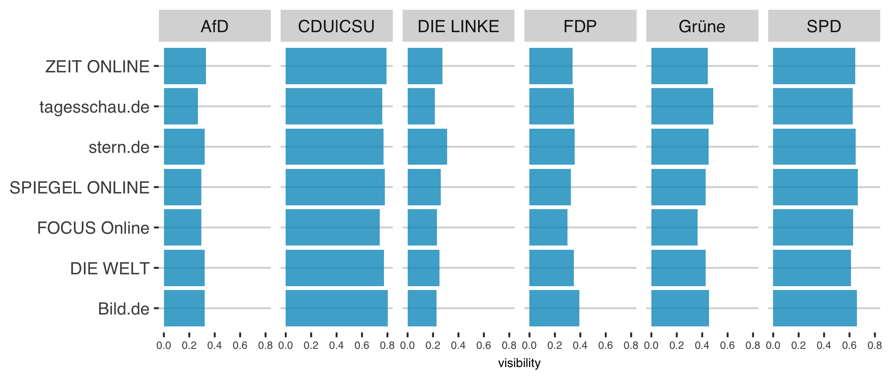

Different types of media bias - visibility bias
================
Franziska Löw
2018-11-11

The visibility of a party or a candidate is important as the visibility of political actors in media coverage will increase their accessibility to audiences, influencing subsequent political judgments. Studies combining media content data with voter surveys have indeed found that voters tend to infer a party's political importance from its media salience.

To determine visibility bias, we first need to measure visibility per se. A party is treated as visible in an article if the party itself is mentioned in an article (if an article contains the word "SPD", "CDU"/"CSU/Union","FDP","Grüne","AfD" or "Linke") ( [Eberl, 2017](https://journals.sagepub.com/doi/abs/10.1177/0093650215614364) )

The visibility of a party *p* in a newspaper *s* is defined as the number of news articles published by the newspaper on that party (e.g. articles that contain the name of the party), normalised on the total amount of articles by that newspaper in the corpus.

$$
\\text{visibility}(p,s) = \\frac{\\text{\#Articles}\_{p,s}}{\\text{\#Articles}\_s}
$$

The next step is to define an appropriate reference point to distinguish between balanced/neutral and biased reporting. As my interest lies in the extent to which some media outlets devote disproportionally more coverage to some actors than other outlets do, I focus on relative levels of visibility bias within one political and media system: There is a bias in a medium when a political actor is overrepresented compared to other actors and other outlets.

In the following analysis the average visibility of all parties in each media outlet during the period of analysis are used as a key benchmark. Visibility bias is then computed as the deviation of each party's specific visibility from the average visibility of all other parties in that outlet. The bias therefore captures whether party visibility is biased in comparison to what is typical for that outlet (Eberl, 2017).

Alternative approaches to conceptualize the benchmark are the amount of the party campaign communication or their standing in polls (Hopmann et al., 2011b). However, this logic does not allow for comparison across diverse media outlets as some media outlets might generally leave less space to parties or their issues, or be overall more skeptical of them, not due to partisan but rather due to genre or format influences.

