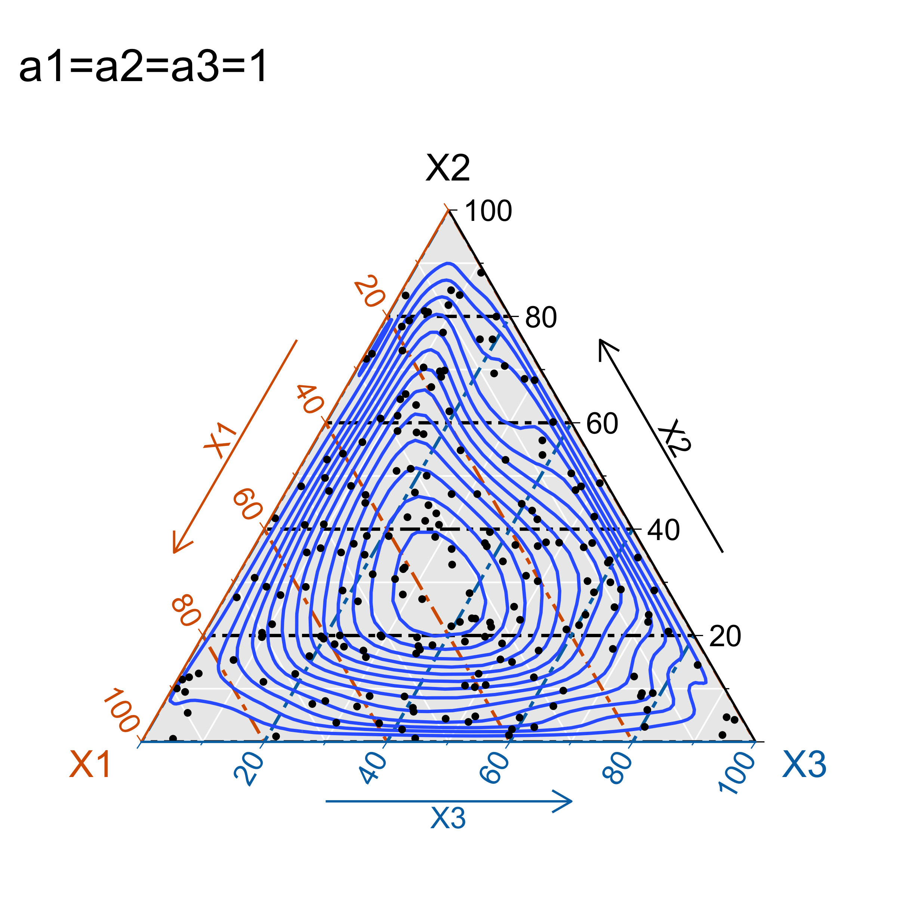
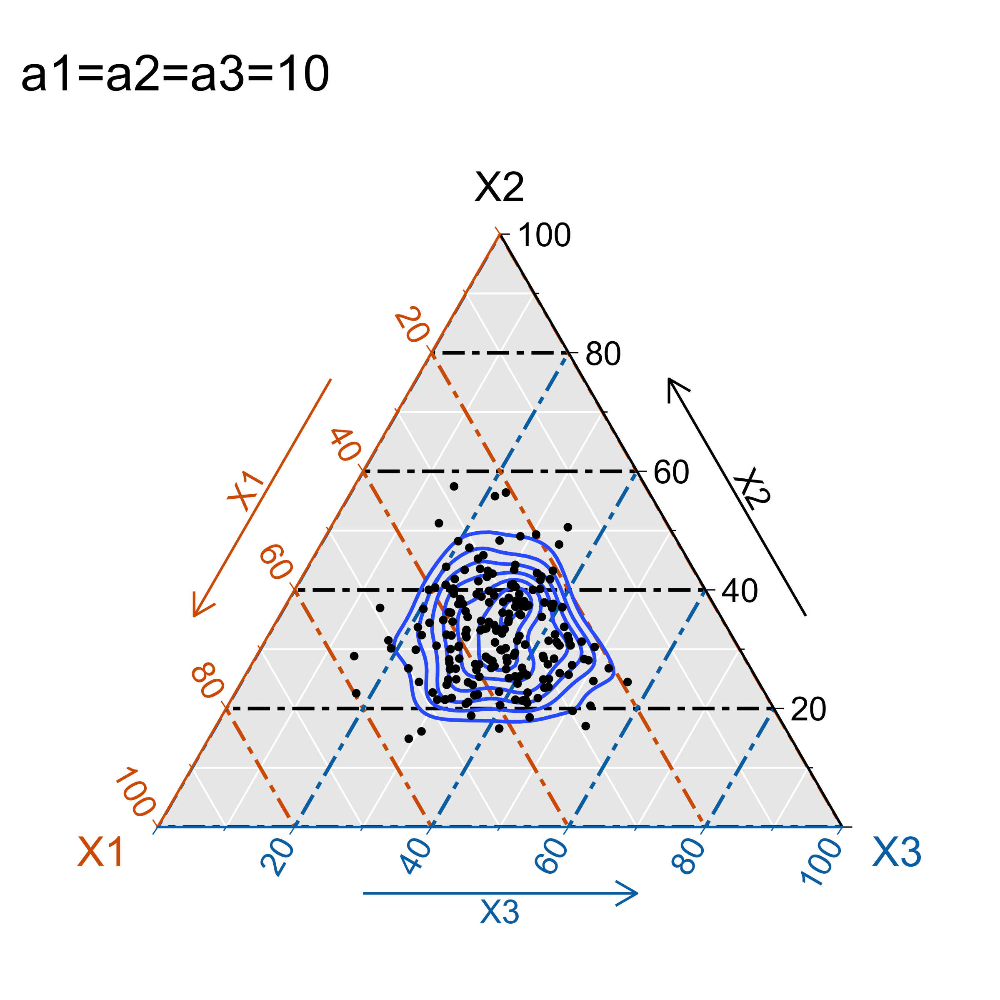
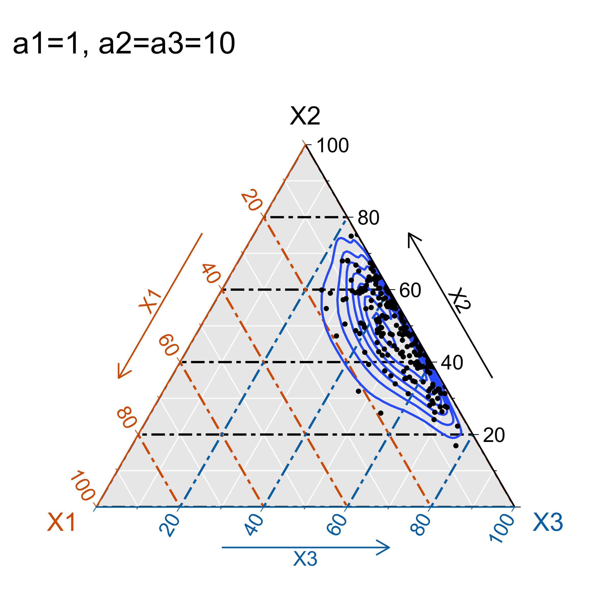
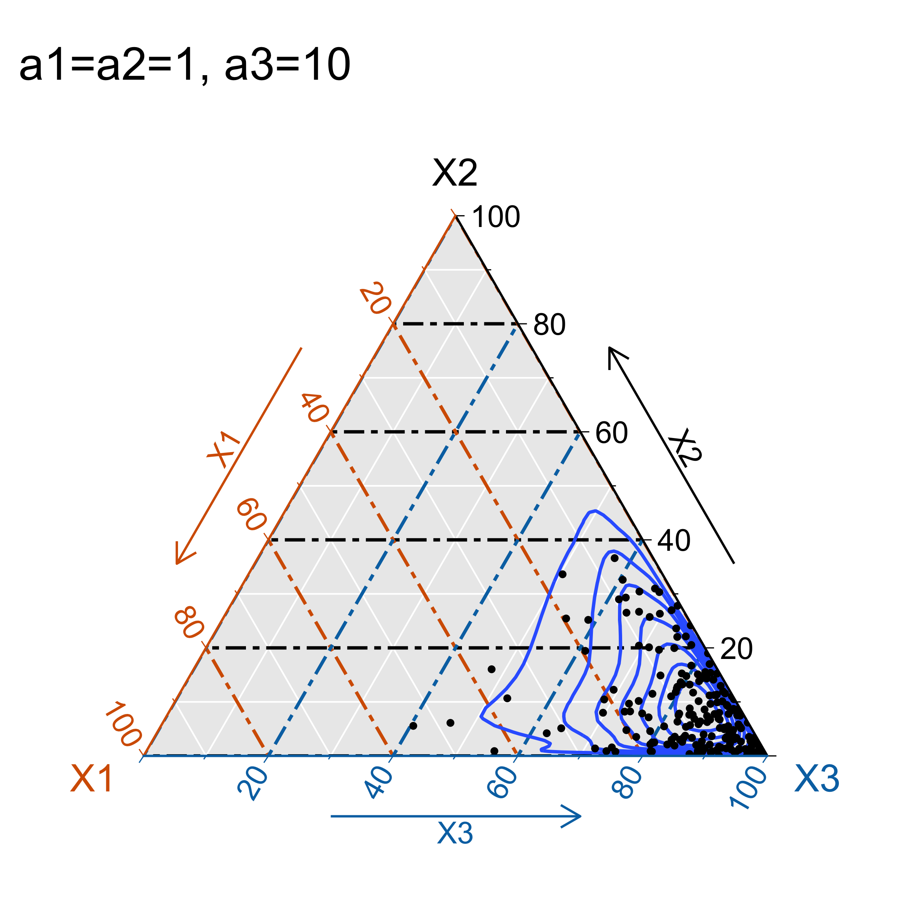
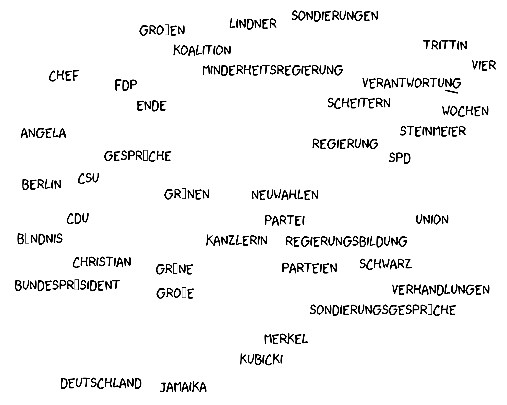
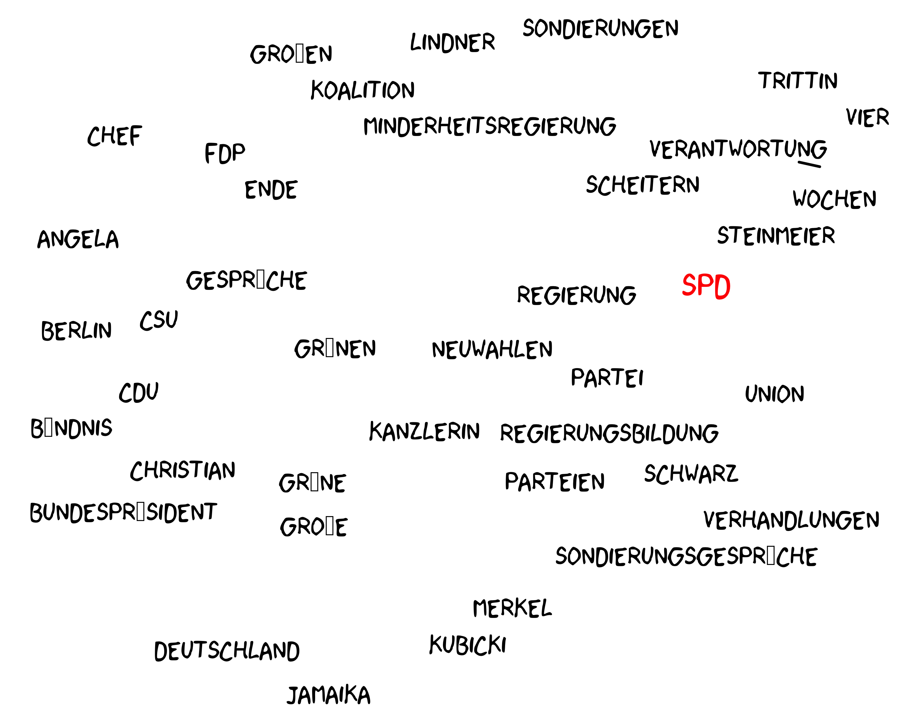

```{r setup, include=FALSE}
options(htmltools.dir.version = FALSE)
```

class: inverse, center, middle

# Einleitung

---

# Einleitung

- Bedeutung von Medien um politischen Kontext: 
  
  - Arena für öffentliche politische Debatten 
  
  - Informationsquelle für Wähler
  
  - vierte Gewalt

--

- Zentrale Aufgabe der Medien: ausgewogene und objektive Berichterstattung über relevante politische Themen.

--

- Vorwurf der Parteilichkeit und voreingenommenen Berichterstattung (**Media Bias**) hat verschiedene Bezeichnungen in der Literatur:

  - ideologische Verzerrungen (Hackett, 1984), 
  - Medienverzerrungen (Reeves, 1997), Nachrichtenverzerrungen (Boomgaarden & Semetko, 2012), 
  - Partisanenverzerrungen (D'Alessio & Allen, 2000), politische Verzerrungen (Hopmann, van Aelst, & Legnante, 2011b).


---

# Einleitung

Drei Arten des **Media Nias** (D'Alessio and Allen, 2000): 

--

1. **Coverage bias**: Wie oft erscheinen politische Akteure/Parteien in den Medien? (Quantität)

--

1. **Tonality bias**: Wie werden die politische Akteure/Parteien evaluiert? (Qualität)

--

1. **Agenda bias**: Ist eine Partei in der Lage, ihre eigenen politischen Positionen in den Medien zu präsentieren? (Qualität)

---

# Einleitung

**Forschungsfrage:** Berichten Medien verzerrt vor, während und nach der Bundestagswahl 2017?

--

- Wie unterscheidet sich die Verzerrung zwischen den verschiedenen Nachrichtenquellen / Medien?

--

- Welchen Einfluss haben die verschiedenen Bias-Arten auf die Wählerpräferenzen?

--

**Methode:**

--

- Berechnung mit Hilfe von Text-mining Techniken

--

- Schätzung des Effekts der unterschiedlichen Bias Arten auf Wählerpräferenzen (FE-Regression).

---

# Agenda

### 1.Literatur

### 2. Forschungsbeitrag

### 3. Datensatz

### 4. Berechnung der Bias Arten

### 5. Effekt auf Wählerpräferenzen

---
class: inverse, center, middle

# Literatur

---

# Literatur

**Berichterstattung ist unverzerrt, wenn...**

--

- ...alle Seiten gleichberechtigt vertreten sind, gemessen an einem Referenzwert/Benchmark

--

**Berichterstattung ist verzerrt, wenn...** 

- ... sie von diesem Referenzwert abweicht.

--

**Was ist der Benchmark?**

--

- Abhängig vom Bias-Typ

---

# Coverage bias

--

**Hypothese**: Wähler bevorzugen Parteien, die sichtbarer sind in den Medien, die sie konsumieren (Eberl et al., 2017; Dewenter et al., 2018)

--

**Benchmark**:

--

- Der Umfang der Kampagnenkommunikation einer Partei (Hopmann et al., 2012)

- Die aktuellen Umfragewerte (Junqué de Fortuny et al., 2012)

- Durchschnittliche Sichtbarkeit aller Parteien in allen Nachrichtenanbietern (Eberl et al., 2017)

--

**Methode**:

--

- Manuell codierte Daten (Dewenter et al., 2018; Eberl et al., 2017)

- **Text-mining Ansatz** (z.B. wie oft wird eine Partei genannt? Junqué de Fortuny et al., 2012)

---

# Tonality bias 

--

**Hypothese**: 
Je positiver eine Partei in den Medien besprochen wird, desto größer die Präferenz der Wähler für diese Partei (de Vreese & Boomgaarden, 2003; Druckman and Parkin, 2005; Eberl et al., 2017; Junqué de Fortuny et al., 2012)

--

**Benchmark**: 

--

- Durchschnittliche Tonalität aller Parteien (Junqué de Fortuny et al., 2012; Eberl et al., 2017)

--

**Methode**:

--

- Manuell codierte Daten (Eberl et al., 2017)

--

- **Textmining Ansatz** (z.B. Wörterbuch basiert, Junqué de Fortuny et al., 2012)

---

# Agenda bias

--

**Hypothese**: 
Eine größere Sichtbarkeit des politischen Inhalts einer Partei kann sich positiv auf die Einstellung zu dieser Partei auswirken. (Benewick et al., 1969; Eberl et al., 2017)

--

**Benchmark**: 

--

- Pressemitteilungen als Annäherung an das potenzielle Universum der Themen (Eberl et al., 2017)

--

**Methode**:

--

- Manually coded data (Eberl et al., 2017)

--

- **Text-mining Ansatz** (Structural Topic Model, Roberts et. al., 2016)

---

# Ergebnisse

- Evidenz dafür, dass alle drei Bias Arten die Wählerpräferenzen beeinflussen

- Aber: Bias Arten sind nicht unbedingt konsistent in Ausmaß und Wirkung:

  - Tonality bias hat eine stärkere Wirkung als Coverage bias (Boomgaarden & Semetko, 2012; Eberl et al. ,2017)

- Agenda bias wurde bislang wenig operationalisiert. 

  - Ausnahme Eberl et al., 2017: Wähler bewerten Parteien positiver, wenn diese ihre eigenen bevorzugten Themen in der Medienberichterstattung stärker ansprechen.

---
class: inverse, center, middle

# Forschungsbeitrag

---

# Forschungsbeitrag

1. Konzeptualisierung / Berechnung der verschiedenen Arten von **Media Bias** mit Hilfe von Text-mining Techniken

--
  
  - Erlaubt die Inhalte-Analyse eines großen Datensatzes an Textdaten
  
  - Reduziert die vom Menschen induzierte Verzerrung
  
  - Macht die Forschung nachvollziehbarer und vergleichbarer
  
--

1. Neue Methode zur Berechnung des Agenda Bias mit Hilfe eines Ansatzes aus dem maschinellen Lernen, der in anderen Forschungsfeldern bereits zum Einsatz gekommen ist

--

1. Neuer, aktueller Datensatz

---
class: inverse, center, middle

# Datensatz

```{r include=FALSE}
library(tidyverse)
library(ggthemes)
library(scales)
library(patchwork)

rm(list = ls())

source("../docs/func/functions.R")

col <- RColorBrewer::brewer.pal(4, "Dark2")
```

---

# Datensatz I

```{r include=FALSE}
load("../output/final_modeldf.Rda")
```

```{r echo=FALSE, fig.height=4, fig.width=8, dev='svg'}
p1 <- model_df %>%
  filter(type == "news") %>%
  mutate(date = as.Date(date)) %>%
  group_by(date) %>%
  tally() %>%
  ggplot(aes(date, n)) +
  geom_line(color= col[1]) +
  # Election
  geom_vline(xintercept = as.Date("2017-09-24"), 
             color = col[2],
             linetype=2) +
  annotate(geom="text", x=as.Date("2017-08-01"), 
           y=160, label="Wahltag") +
  
  # failure of the Jamaica coalition talks
  geom_vline(xintercept = as.Date("2017-11-19"),
             color = col[2],
             linetype=2) +
  
  annotate(geom="text", x=as.Date("2017-12-25"), 
           y=160, label="Ende Jamaika") +
  theme_hc() +
  scale_x_date(breaks = date_breaks("1 month"), 
               labels=date_format("%b\n%y", tz="CET")) +
  scale_color_hc(name = NULL) +
  labs(x="",y="", title = "Online Nachrichtenartikel (n=11.880)")

p2 <- model_df %>%
  filter(type == "news") %>%
  group_by(source) %>%
  tally() %>%
  ggplot(aes(reorder(source,n), n)) +
  geom_col(fill=col[1], alpha=0.8, show.legend = F) +
  coord_flip() +
  theme_hc() +
  labs(x = NULL)

p1 + p2 + plot_layout(widths = c(2,1))   
```

---

# Datensatz II

```{r echo=FALSE, fig.height=4, fig.width=8, dev='svg'}
p1 <- model_df %>%
  filter(type == "press") %>%
  mutate(date = as.Date(date)) %>%
  group_by(date) %>%
  tally() %>%
  ggplot(aes(date, n)) +
  geom_line(color= col[2]) +
  # Election
  geom_vline(xintercept = as.Date("2017-09-24"), 
             color = col[1],
             linetype=2) +
  annotate(geom="text", x=as.Date("2017-08-01"), 
           y=30, label="Wahltag") +
  
  # failure of the Jamaica coalition talks
  geom_vline(xintercept = as.Date("2017-11-19"),
             color = col[1],
             linetype=2) +
  
  annotate(geom="text", x=as.Date("2017-12-25"), 
           y=30, label="Ende Jamaika") +
  theme_hc() +
  scale_x_date(breaks = date_breaks("1 month"), 
               labels=date_format("%b\n%y", tz="CET")) +
  scale_color_hc(name = NULL) +
  labs(x="",y="", title = "Presseerklärungen (n=1.924)")

p2 <- model_df %>%
  filter(type == "press") %>%
  group_by(source) %>%
  tally() %>%
  ggplot(aes(reorder(source,n), n)) +
  geom_col(fill=col[2], alpha=0.8, show.legend = F) +
  coord_flip() +
  theme_hc() +
  labs(x = NULL)

p1 + p2 + plot_layout(widths = c(2,1))   
```

---

# Datensatz III

```{r include=FALSE}
load("../output/polls.Rda")

polls <- table_long %>%
  dplyr::mutate(
    year = lubridate::year(Datum),
    month = lubridate::month(Datum),
    date = as.Date(paste0(year,"/",month,"/1"))
    ) %>%
  filter(Datum > as.Date("2017-05-01")) %>%
  filter(Datum < as.Date("2018-03-01")) %>%
  filter(!party %in% c("Piraten", "Sonstige")) %>%
  group_by(year,month,date, party) %>%
  dplyr::summarise(poll_value = mean(value, na.rm=T)) %>%
  ungroup() %>%
  mutate(poll_normalized = normalize_data2(poll_value))
```

```{r echo=FALSE, fig.height=5, fig.width=7, dev='svg', fig.align='center'}
polls %>%
  ggplot(aes(date, poll_value, 
             group = factor(party),
             color = factor(party))) +
  geom_line() +
  theme_hc() +
  scale_color_manual(values =  c("deepskyblue", "gold", "limegreen", "deeppink", "red", "black")) +
  scale_x_date(breaks = date_breaks("1 month"), 
               labels=date_format("%b\n%y", tz="CET")) +
  # Election
  geom_vline(xintercept = as.Date("2017-09-24"), 
             color = "black",
             linetype=2) +
  annotate(geom="text", x=as.Date("2017-09-12"), 
           y=30, label="Wahltag") +
  
  # failure of the Jamaica coalition talks
  geom_vline(xintercept = as.Date("2017-11-19"),
             color = "black",
             linetype=2) +
  
  annotate(geom="text", x=as.Date("2017-12-01"), 
           y=30, label="Ende Jamaika") +
  
  labs(x="", y="%", color="",
       title = "Ergebnisse Sonntagsumfrage",
       subtitle = "Wen würden Sie wählen, wenn nächsten Sonntag Bundestagswahl wäre?",
       caption = "Quelle: infratest dimap") + 
  guides(color = guide_legend(nrow = 1,
                                label.theme = element_text(angle=0))) +
  theme(legend.position = "bottom")
```

---
class: inverse, center, middle

# Methode

```{r Normalize data function, include=FALSE}
load("../output/data_step2.Rda")
```

---

# Visibility 

- Eine Partei $i$ ist sichtbar in einem Artikel eines Mediums $m$, wenn ihr Name in dem Artikel genannt wird: $\text{aritcles}_{i,m}$

- Sichtbarkeit ("visibility") einer Partei in einem Medium: $v_i = \frac{\text{aritcles}_{i,m}}{\text{aritcles}_{m}}$

--

```{r claculate total amount of articles by newspaper, include=FALSE}
btw <- btw %>% 
  dplyr::mutate(
    year = lubridate::year(date),
    month = lubridate::month(date)) %>%
  group_by(medium,year,month) %>%
  dplyr::mutate(articles_s = n()) %>%
  ungroup()
```

```{r Apply function to all parties, include=FALSE}
parties <- c("SPD",paste("CDU","CSU","Union",sep = "|"),"FDP","Grüne","AfD","Linke")

rm(vis)
for (party in parties) {
  
    tempdf <- btw %>% 
      # filter all articles that contain the party as a word
      filter(grepl(party,text, ignore.case = T)) %>%
      # calculate the number of articles by each newspaper
      group_by(medium, year, month) %>%
      dplyr::summarise(
        # pass the total amount of articles to the grouped df
        articles_s = mean(articles_s),
        # calculate the number of articles about a party in a newsletter
        articles_p_s = n()) %>% ungroup() %>%
      mutate(
        party = party,
        # calculate relative amount
        visibility_p_s = articles_p_s/articles_s)
    
  if (exists('vis')) {
   vis <- bind_rows(vis, tempdf) 
  } else {
    vis <- tempdf
  }
}

vis <- vis %>%
  mutate(party = ifelse(grepl("CDU",party), "Union",party),
    date = as.Date(paste0(year,"/",month,"/1")))
```

```{r Plot visibility, echo=FALSE, fig.height=4, fig.width=6, fig.align='center', dev='svg'}
vis %>%
  ggplot(aes(date, visibility_p_s, fill=party)) +
  geom_col(show.legend = FALSE, alpha = 0.9) +
  theme_hc() +
  scale_fill_hc(name=NULL) +
  facet_grid(party~medium) +
  labs(x = NULL, y = "", title = "Visiblity") +
  theme(axis.text = element_text(size = 5),
        strip.text = element_text(size = 6),
        title = element_text(size = 7)
        )
```


---

# Visibility bias

Ein Medium berichtet verzerrt über eine Partei, wenn diese verhältnismäßig über- oder unterrepräsentiert ist.

--

**Benchmark**: Durchschnittl. Sichtbarkeit aller anderen Parteien in diesem Medium: $b_i = \frac{1}{n}\sum^{n-1}_{j\ne i}v_j$ 

--

**Bias**: Abweichung der Sichtbarkeit einer Partei von diesem Benchmark: $\text{visibility bias}_i = v_i - b_i$ 

---

# Visibility bias

```{r Estimate Bias, include=FALSE}
parties <- unique(vis$party)

rm(visBias)
for (i in parties) {
  
    # dataframe that only contains the party
    df1 <- vis %>% 
      filter(party == i) 
    
    # average visibility for the medium
    df2 <- vis %>%
      #filter(party != i) %>%
      group_by(medium, year, month) %>%
      dplyr::summarise(avg_visibility = mean(visibility_p_s, na.rm = TRUE)) %>%
      ungroup()
    
    # combine dataframes and calculate deviation
    tempdf <- left_join(df1,df2, by=c("medium","year","month")) %>%
      dplyr::mutate(visibility_bias = visibility_p_s-avg_visibility)
    
    if (exists('visBias')){
      visBias <- bind_rows(visBias,tempdf)
    } else {
      visBias <- tempdf
    }
}
```

```{r Plot bias, echo=FALSE, fig.height=5, fig.width=7, fig.align='center', dev='svg'}
visBias %>%
  mutate(date = as.Date(paste0(year,"/",month,"/1"))) %>%
  mutate(visibility_bias = normalize_data2(visibility_bias)) %>%
  ggplot(aes(date, visibility_bias, fill=party)) +
  geom_col(show.legend = FALSE, alpha = 0.9) +
  theme_hc() +
  scale_fill_hc(name=NULL) +
  facet_grid(party~medium) +
  labs(x = NULL, y = "", title = "Visibility bias (normalisiert zw. -1 u.1)"
       ) +
  theme(axis.text = element_text(size = 5),
        strip.text = element_text(size = 6),
        title = element_text(size = 7)
        )
```

---

# Tonality

- Wörterbuch-basierte Methode, um die Tonalität eines Artikel bezügl. einer Partei zu messen.

--

.pull-left[

- Ein Wörterbuch definiert eine Liste an Wörtern mit einem Tonalitätswert, z.B. Polarität (negativ / positiv) auf einer Skala von $[-1; 1]$

- Berechnung der Tonalität:

]

.pull-right[

```{r echo=FALSE}
sent <- c(
  # positive Wörter
  readLines("../docs/dict/SentiWS_v1.8c_Negative.txt",
            encoding = "UTF-8"),
  # negative W??rter
  readLines("../docs/dict/SentiWS_v1.8c_Positive.txt",
            encoding = "UTF-8")
  ) %>%
  
  lapply(function(x) {
  # Extrahieren der einzelnen Spalten
  res <- strsplit(x, "\t", fixed = TRUE)[[1]]
  return(data.frame(words = res[1], value = res[2],
                    stringsAsFactors = FALSE))
  }) %>% 
  
  bind_rows %>%
  mutate(word = gsub("\\|.*", "", words) %>% 
           tolower, value = as.numeric(value),
         type = gsub(".*\\|", "", words)) %>%
  
  # nur adjektive oder adverben
  # filter(type == "ADJX" | type == "ADV") %>%
  # manche Wörter kommen doppelt vor, hier nehmen wir den mittleren Wert
  group_by(word) %>%
  dplyr::summarise(value = mean(value)) %>% ungroup %>%
  # Delete "Heil" (wegen Hubertus Heil)
  filter(!grepl('heil',word,ignore.case = T)) %>%
  # welcome to hell (g20)
  filter(!grepl('hell',word,ignore.case = T)) %>%
  # filter values that that score between -0.1 and +0.1 
  filter(!dplyr::between(value, -0.1,0.1))

sent %>% 
  sample_n(5) %>%
  knitr::kable(align="l",format = "html")
```
]

--

  1. Summe aller "Tonalität"-Wörter, die in einer Spanne von einem Satz (vor und nach) der Nennung einer Partei in einem Artikel erscheinen... 

--
  
  1. ... geteilt durch die Gesamtanzahl der Wörter in dieser Spanne.
  
--

Ein Artikel kann also verschiedene Tonalitätswerte für eine Partei beinhalten.


---

# Tonality

```{r include=FALSE}
load("../output/sentbias.Rda")
```

```{r Plot sentiment, echo=FALSE, fig.height=5, fig.width=7, fig.align='center', dev='svg'}
sentBias %>%
  mutate(date = as.Date(paste0(year,"/",month,"/1"))) %>%
  ggplot(aes(date, avg_sent_p_s, fill=party)) +
  geom_col(show.legend = FALSE, alpha = 0.9) +
  theme_hc() +
  scale_fill_hc(name=NULL) +
  facet_grid(party~medium) +
  labs(x = NULL, y = "", title = " Tonality") +
  theme(axis.text = element_text(size = 5),
        strip.text = element_text(size = 6),
        title = element_text(size = 7)
        )
```

---

#Tonality bias

Ein Medium berichtet verzerrt über eine Partei, wenn diese verhältnismäßig positiv oder negativ dargestellt wird.

--

**Benchmark**: Durchschnittl. Tonalität aller anderen Parteien in diesem Medium 

--

**Bias**: Abweichung der Tonalität einer Partei von diesem Benchmark.

---

# Tonality bias

```{r echo=FALSE, fig.height=5, fig.width=7, fig.align='center', dev='svg'}
sentBias %>%
  mutate(date = as.Date(paste0(year,"/",month,"/1"))) %>%
  ggplot(aes(date, sent_bias, fill = party)) +
  geom_col(show.legend = FALSE, alpha = 0.7) +
  theme_hc() +
  scale_fill_hc(name=NULL) +
  facet_grid(party~medium) +
  labs(x = NULL, y = NULL, title = "Tonality bias (normalisiert zw. -1 u. 1)"
       ) +
  theme(axis.text = element_text(size = 5),
        strip.text = element_text(size = 6),
        title = element_text(size = 7)
        )
```

---

#Agenda

- Problem: setzt Kenntnis des gesamten Universums der Artikel vor der eigentlichen Auswahl vorraus.

- Eberl et al. (2017) nimmt die Presseartikel von Parteien als Annäherungen für dieses Universum. 

--

## Agenda bias: 

- Die Auswahl (und Abwahl) von Nachrichtenartikeln aus dem Universum an Themen, die von den Medien veröffentlich werden.

- Das Ausmaß, in dem Parteien ihre eigenen Themen in den Medien platzieren können. 

---
class: inverse, center, middle

# Wie können die Themen in einem Dokument herausgefunden werden?

---

# Topic Model (LDA)


<small>Credits: Christine Doig</small>

---

# Die Intuition hinter LDA


<small>Credits: Blei (2012)</small>

---

# LDA als graphisches Modell


$N =$ Sammlung von Wörtern innerhalb eines Dokuments (Vokabular)

$D =$ Sammlung von Dokumenten innerhalb eines Korpus

--

**Annahmen**: Prior-Verteilungen $\alpha, \eta$ / Anzahl an Themen $K$

--

**beobachtbar**: Wort in einem Dokument $w_{d,n}$


**fix** (Mischungs**komponenten**): Anzahl der Themen $K$ / Vokabular $N$

--

**nicht beobachtbar** (Mischungs**verhältnis**): Themenanteile pro Dokument $\theta_d$ / Wort-Themenverteilung $\beta_k$)

---

# Generative process I

1. Wähle die Anzahl der Themen: (z.B. $K=3$ )
   
1. Für jedes Dokument $d$, wähle eine Vorteilung über alle Themen:
$\theta_d$ ~ Dirichlet $(\alpha)$
  
  
<div style="position:relative; width:300px; height:300px; margin:0 auto;">
  
</div>
      
---

# Generative process I

1. Wähle die Anzahl der Themen: (z.B. $K=3$ )
   
1. Für jedes Dokument $d$, wähle eine Vorteilung über alle Themen:
$\theta_d$ ~ Dirichlet $(\alpha)$
  
  
<div style="position:relative; width:300px; height:300px; margin:0 auto;">
  
</div>

---

# Generative process I

1. Wähle die Anzahl der Themen: (z.B. $K=3$ )
   
1. Für jedes Dokument $d$, wähle eine Vorteilung über alle Themen:
$\theta_d$ ~ Dirichlet $(\alpha)$
  
  
<div style="position:relative; width:300px; height:300px; margin:0 auto;">
  
</div>

---

# Generative process I

1. Wähle die Anzahl der Themen: (z.B. $K=3$ )
   
1. Für jedes Dokument $d$, wähle eine Vorteilung über alle Themen:
$\theta_d$ ~ Dirichlet $(\alpha)$
  
  
<div style="position:relative; width:300px; height:300px; margin:0 auto;">
  
</div>

--

1. $z_{d,n}|\theta_d$: entsprechend $\theta_d$, weise ein Thema dem $n^{th}$ Wort ein Thema $z_{d,n}$ zu.
      
---

# Generative process II

4. $w_{d,n}|z_{d,n},\beta,\theta$: Wähle ein Wort aus diesem Thema entsprechend $\beta_k$ ~ Dirichlet $(\eta)$
  
<div style="position:relative; width:400px; height:300px; margin:0 auto;">
  
</div>

---

# Generative process II

4. $w_{d,n}|z_{d,n},\beta,\theta$: Wähle ein Wort aus diesem Thema entsprechend $\beta_k$ ~ Dirichlet $(\eta)$
  
<div style="position:relative; width:400px; height:300px; margin:0 auto;">
  
</div>


5. $N$: wiederhole das für all $n$ Wort-Positionen in einem Dokument.

6. $D$: wiederhole das für alle $d$ Dokumente in dem Korpus.

---

# Strucutral Topic Model

Das Structural Topic Model (STM, Roberts et. al., 2016) erlaubt es, Kovariablen in diesen Prozess zu integrieren. 

1. **Themen Verteilung**: 
  - Variablen, die die Wahrscheinlichkeit beeinflussen, ein Thema in einem Dokument vorkommt.

1. **Themen Inhalt**: 
  - Variablen, die die Wahrscheinlichkeit beeinflussen, dass ein Wort in einem Thema vorkommt.

--

##Annahmen:

  - **Themen Verteilung** hängt von der Quelle ab (Bild.de, FOCUS ONLINE, FDP, ...) 
  - **Themen Inhalt** hängt von der Art der Quelle ab (Pressemitteilung oder Nachrichtenartikel)

---

# Ergebnisse (STM) - Wortverteilung

```{r include=FALSE}
library(stm)

load("../output/models/finalmodel_50.RDa")

model_df <- model_df %>%
  dplyr::mutate(doc_index = as.numeric(rownames(.)),
         source = ifelse(source == "welt.de", "DIE WELT", source),
         source = ifelse(source == "zeit.de", "ZEIT ONLINE", source),
         source = ifelse(source == "focus.de", "FOCUS Online", source),
         source = ifelse(source == "bild.de", "Bild.de", source),
         source = ifelse(source == "spiegel.de", "SPIEGEL ONLINE", source),
         
         source = ifelse(source == "union", "Union", source),
         source = ifelse(source == "spd", "SPD", source),
         source = ifelse(source == "afd", "AfD", source),
         source = ifelse(source == "gruene", "Grüne", source),
         source = ifelse(source == "linke", "Linke", source),
         source = ifelse(source == "fdp", "FDP", source)
         )

sagelabs <- sageLabels(stmOut)
```

Jedes Thema hat eine posterior Verteilung $\beta_k$ über das gesamte Vokabular.


```{r echo=FALSE}
as.data.frame(sagelabs$marginal$prob[1:10,1:5]) %>%
  mutate(Topic = as.numeric(rownames(.))) %>%
  select(Topic, V1:V5) %>%
  knitr::kable(format = "html")
```

---

# Ergebnisse (STM) - Themen-Label

Die Themen werden auf Grundlage der wahrscheinlichsten Wörter benannt:

```{r label topics, echo=FALSE}
newsLabels <- as.data.frame(sagelabs$cov.betas[[1]]$problabels) %>%
  transmute(topic = as.numeric(rownames(.)),
            topic_name_news_short = paste(V1,V2),
            topic_name_news = paste(V1,V2,V3,V4))

pressLabels <- as.data.frame(sagelabs$cov.betas[[2]]$problabels) %>% 
  transmute(topic = as.numeric(rownames(.)),
            topic_name_press_short = paste(V1,V2),
            topic_name_press = paste(V1,V2,V3,V4))

topics.df <- left_join(newsLabels, pressLabels, by="topic") %>%
  mutate(joint_label = paste("Topic",topic,":",topic_name_news_short, topic_name_press_short))

topics.df %>%
  filter(topic < 6) %>%
  select(joint_label, topic_name_news, topic_name_press) %>%
  htmlTable::htmlTable(align="l",
                       header = c("Joint label",
                                  "News articles","Press releases"), rnames = F)
```

---

# Ergebnisse (STM) - Themen-Verteilung 

```{r include=FALSE}
theta <- as.data.frame(stmOut$theta) %>% # get all theta values for each document
  
  mutate(doc_index = as.numeric(rownames(.))) %>%
  # convert to long format
  gather(topic, theta, V1:V50) %>%
  mutate(topic = as.numeric(gsub("V","",topic))) %>%
  
  # join with topic df
  left_join(., topics.df, by="topic") %>%
  
  # join with model_df
  left_join(., model_df %>% 
              select(date,type,source,doc_index,title_text), by="doc_index")
```

```{r include=FALSE}
sample_doc <- sample(nrow(model_df),1)

# uncomment this to only select docs from press releases
#sample_doc <- theta %>% filter(type=="press") %>% sample_n(1) %>% select(doc_index)
#sample_doc <- sample_doc$doc_index

title <- model_df$title[which(model_df$doc_index == sample_doc)]
source <- model_df$source[which(model_df$doc_index == sample_doc)]
```

```{r echo=FALSE, fig.height=5, fig.width=8, fig.align='center', dev='svg'}
theta %>%
  filter(doc_index == sample_doc) %>%
  select(doc_index, topic_name_news, theta) %>%
  ggplot(aes(topic_name_news, theta)) +
  geom_col(fill=col[2], alpha = 0.8) +
  ylim(c(0,1)) +
  coord_flip() +
  theme_hc() +
  labs(title = paste("Themen Verteilung von Dokument",sample_doc),
       subtitle = paste0("Source: ",source,"\nTitle: ", title),
       x = NULL, y = NULL
       ) 
```

---

# Ergebnisse (STM) - Themen-Häufigkeit

```{r Plot expected frequency, echo=FALSE, fig.height=7, fig.width=11, fig.align='center', dev='svg'}
overall_freq <- as.data.frame(colMeans(stmOut$theta)) %>%
  transmute(
    topic = as.numeric(rownames(.)),
    frequency = colMeans(stmOut$theta)
         ) %>%
  left_join(., topics.df, by = "topic") %>% 
  arrange(desc(frequency))%>%
  mutate(order = row_number())

p1 <- overall_freq %>%
  top_n(25, frequency) %>%
  ggplot(aes(reorder(joint_label, -order), frequency)) +
  geom_col(alpha = 0.8, fill=col[1]) +
  coord_flip() +
  theme_hc() +
  labs(x=NULL, y=NULL, title="Topic frequency")

p2 <- overall_freq %>%
  top_n(-25, frequency) %>%
  ggplot(aes(reorder(joint_label, -order), frequency)) +
  geom_col(alpha = 0.8, fill=col[1]) +
  scale_y_continuous(limits = c(0,0.05)) +
  coord_flip() +
  theme_hc() +
  labs(x=NULL, y=NULL, title=NULL)

p1 + p2
```

---

# Agenda (online Nachrichten)

```{r include=FALSE}
# calculate topic mean by source and month
topicmean <- theta %>%
  mutate(
    year = lubridate::year(date),
    month = lubridate::month(date)
    ) %>%
  group_by(topic,source, month, year) %>%
  dplyr::summarise(topicmean = mean(theta)) %>% 
  ungroup() %>%
  spread(source, topicmean) %>%
  filter(month != 3)
```

```{r echo=FALSE, fig.height=7, fig.width=11, fig.align='center', dev='svg'}
topicmean_news <- theta %>%
  filter(type == "news") %>%
  group_by(topic,joint_label, source) %>%
  summarise(topicmean = mean(theta)) %>% 
  ungroup()

topicmean_news %>%
  ggplot(aes(reorder(joint_label,desc(topic)),topicmean)) +
  geom_col(fill=col[1], alpha = 0.8) +
  coord_flip() +
  theme_hc() +
  facet_grid(~source) +
  labs(x=NULL, y=NULL, 
       title="Durchschnittliche Themenverteilung - Online Nachrichten") +
  theme(axis.text.x = element_text(size = 6))
```

---

# Agenda (Pressemitteilungen)

```{r echo=FALSE, fig.height=7, fig.width=11, fig.align='center', dev='svg'}
topicmean_press <- theta %>%
  filter(type == "press") %>%
  group_by(topic,joint_label, source) %>%
  summarise(topicmean = mean(theta)) %>% 
  ungroup()

topicmean_press %>%
  ggplot(aes(reorder(joint_label,desc(topic)),topicmean)) +
  geom_col(fill=col[2], alpha=0.8) +
  coord_flip() +
    theme_hc() +
  facet_grid(~source) +
  labs(x=NULL, y=NULL, 
       title="Durchschnittliche Themenverteilung - Pressemitteilung"
       ) +
  theme(axis.text.x = element_text(size = 6))
```

---

#Agenda Korrelation

Welche Themen werden aus den Agenden der Parteien in den Medien selektiert?

  - Bivariate Korrelationen der Agenden zwischen Pressemitteilungen und online Nachrichten
  - Je höher die Korrelation, desto kongruenter sind beide Agenden 
  
```{r include=FALSE}
media <- unique(model_df %>% filter(type == "news") %>% select(source))
parties <- unique(model_df %>% filter(type == "press") %>% select(source))
  
rm(corrDF)
for (i in parties$source) {
  
  topicmean %>%
    group_by(month, year) %>%
    do(data.frame(Cor=t(cor(.[,media$source], .[,i])))) %>%
    gather(medium, cor, 3:9) %>%
    mutate(party = i,
           medium = gsub("Cor.","",medium)) -> tempdf
  
  if (exists("corrDF")){
    corrDF <- rbind(corrDF,tempdf)
  } else {
    corrDF <- tempdf
  }
  
}

corrDF <- corrDF %>% 
  mutate(date = as.Date(paste0(year,"/",month,"/1"))) %>%
  dplyr::mutate(medium = ifelse(medium == "DIE.WELT", "DIE WELT", medium),
                medium = ifelse(medium ==  "ZEIT.ONLINE", "ZEIT ONLINE", medium),
                medium = ifelse(medium == "FOCUS.Online", "FOCUS Online", medium),
                medium = ifelse(medium == "SPIEGEL.ONLINE", "SPIEGEL ONLINE", medium)
                )
```

--

```{r echo=FALSE, fig.height=4, fig.width=6, fig.align='center', dev='svg'}
corrDF %>%
  ggplot(aes(date, cor, fill=party)) +
  geom_col(show.legend = FALSE, alpha = 0.7) +
  theme_hc() +
  scale_fill_hc(name = NULL) +
  facet_grid(party~medium) +
  labs(x = NULL, y = NULL, title = "Korrelation der Themen-Verteilung") +
  theme(axis.text = element_text(size = 5),
        strip.text = element_text(size = 6),
        title = element_text(size = 7)
        )
```

---

#Agenda bias

Ein Medium berichtet verzerrt über eine Partei, wenn Themen aus der Partei Agenda verhältnismäßig stark / schwach ausgewählt werden.

--

**Benchmark**: Durchschnittl. Agenda Korrelation aller anderen Parteien in diesem Medium 

--

**Bias**: Abweichung der Agenda Korrelation einer Partei von diesem Benchmark.

---

# Agenda bias

```{r include=FALSE}
parties <- unique(corrDF$party)

rm(agendaBias)
for (i in parties) {
  
    df1 <- corrDF %>% filter(party == i) 
    
    df2 <- corrDF %>%
      filter(party != i) %>%
      group_by(medium, year, month) %>%
      dplyr::summarise(avg_cor = mean(cor)) %>% ungroup()
    
    tempdf <- left_join(df1,df2, by=c("medium","year","month")) %>%
      mutate(agenda_bias = cor-avg_cor)
    
    if (exists('agendaBias')){
      agendaBias <- bind_rows(agendaBias,tempdf)
    } else {
      agendaBias <- tempdf
    }
}

agendaBias <- agendaBias %>% mutate(date = as.Date(paste0(year,"/",month,"/1"))) 
```

```{r echo=FALSE, fig.height=5, fig.width=7, fig.align='center', dev='svg'}
agendaBias %>%
  ggplot(aes(date, agenda_bias, fill=party)) +
  geom_col(show.legend = FALSE, alpha = 0.7) +
  theme_hc() +
  scale_fill_hc(name=NULL) +
  facet_grid(party~medium) +
  labs(x = NULL, y = NULL, title = "Agenda bias (Normalisiert zw. -1 u. 1)") +
  theme(axis.text = element_text(size = 5),
        strip.text = element_text(size = 6),
        title = element_text(size = 7)
        )
```

---
class: inverse, center, middle

# Effekt der Bias Arten auf Wähler Präferenzen

```{r include=FALSE}
library(plm)
library(stargazer)

biasDF <- agendaBias %>%
  left_join(., visBias, by = c("medium","party","year", "month")) %>%
  left_join(., sentBias, by = c("medium","party","year", "month")) %>% 
  ungroup() %>%
  # left join with pools
  left_join(., polls, by = c('party','month','year')) %>%
  # normalize data
  mutate(agenda_bias_norm = normalize_data2(agenda_bias),
         sent_bias_norm = normalize_data2(sent_bias),
         vis_bias_norm = normalize_data2(visibility_bias),
         polls_norm = normalize_data2(poll_value)
         ) %>%
  # select only variables that we need
  select(year,month,date, medium, party, 
         agenda_bias_norm, vis_bias_norm, sent_bias_norm, polls_norm)

# convert to long
biasDF_long <- biasDF %>%
  gather(metric, value, agenda_bias_norm:polls_norm) 
```

```{r include=FALSE}
biasDF_grouped <- biasDF %>% 
  group_by(date,party) %>%
  summarise(agenda_bias_norm = mean(agenda_bias_norm),
            vis_bias_norm = mean(vis_bias_norm),
            sent_bias_norm = mean(sent_bias_norm),
            polls_norm = mean(polls_norm)
            ) %>%
  ungroup() %>%
  mutate(party = as.factor(party))

biasDF_grouped_long <- biasDF_grouped %>% 
  gather(metric, value, agenda_bias_norm:polls_norm)
```

---

# Media Bias & Wählerpräferenzen

```{r echo=FALSE, fig.height=5, fig.width=8, fig.align='center', dev='svg'}
biasDF_long %>%
  ggplot(aes(date, value, color = metric)) +
  geom_line() +
  #geom_text(aes(y = 0), size = 3) +
  theme_hc() +
  scale_color_hc(name=NULL,
                   breaks=c("vis_bias_norm", "sent_bias_norm", "agenda_bias_norm","polls_norm"),
                   labels=c("Visibility bias", "Tonality bias", "Agenda bias", "Poll value")) +
  facet_grid(party~medium) +
  labs(x = NULL, y = NULL) 
```

---

# Fixed-effects Regression

- Jede Partei hat ihre eigenen individuellen (einzigartigen) Merkmale, die die abh. Variable (Wählerpräferenzen) beeinflussen können

- Bei der Fixed-effects (FE) Regression wird der Effekt dieser zeitinvarianten Merkmale kontrolliert, um den Nettoeffekt der unabh. Variablen auf die abh. Variable zu bewerten

- FE untersucht also den Effekt der Bias Arten auf die Wählerpräferenzen innerhalb einer Partei

```{r echo=FALSE, fig.height=3, fig.align='center', dev='svg'}
biasDF_grouped_long %>%
  ggplot(aes(date, value, color = metric)) +
  geom_line(alpha=0.8) +
  theme_hc() +
  scale_color_hc(name=NULL,
                   breaks=c("vis_bias_norm", "sent_bias_norm", "agenda_bias_norm","polls_norm"),
                   labels=c("Visibility bias", "Tonality bias", "Agenda bias", "Poll value")) +
  facet_wrap(~party) +
  labs(x = NULL, y = NULL) +
  theme(axis.text = element_text(size = 7),
        axis.title = element_text(size = 7)
        )
```

---

# Fixed-effect Regression

$$Y_{it}=\beta_0 + \beta_1X_{1it} + \beta_2X_{2it} + \beta_3X_{3it} + \alpha_i + \epsilon_{it}$$

$\alpha_i$ ( $i=1,...,n$ ) is the unknown intercept for each party (6 party-specific intercepts).

$Y_{it}$ is the poll value where $i$ = party and $t$ = month.

$X_{jit}$ represents the independent variables visibility bias ( $j=1$ ), tonality bias ( $j=2$ ) and agenda bias ( $j=3$ )

$\beta_{j}$ is the coefficient for that predictor,

$\epsilon_{it}$ is the error term 

---

###Fixed effects 

```{r echo=FALSE}
fixed <- plm(polls_norm ~ vis_bias_norm + sent_bias_norm + agenda_bias_norm ,
             data = biasDF_grouped, 
             index = c("party","date"), model = "within")

summary(fixed)
```

---

###Random effects

```{r echo=FALSE}
random <- plm(polls_norm ~ vis_bias_norm + sent_bias_norm + agenda_bias_norm,
             data = biasDF_grouped, index = c("party","date"), 
             model = "random")

summary(random)
```

---

# Fixed or Random? - Hausmann Test

- Der Fehlerterm und die Konstante (die die einzelne Merkmale erfasst) jeder Partei sollten nicht mit den anderen korrelieren 

- Wenn die Fehlerterme korrelieren, dann ist FE nicht geeignet.

**Hausmann-Test**

```{r}
phtest(fixed, random)
```

---

# Testing for Random effects 

**Breusch-Pagan Lagrange multiplier (LM)**

- The LM test helps to decide between a random effects regression and a simple OLS
regression.

- The null hypothesis in the LM test is that variances across entities is zero. This is, no significant difference across units (i.e. no panel effect)

```{r}
pool <- plm(polls_norm ~ vis_bias_norm + sent_bias_norm + agenda_bias_norm ,
             data = biasDF_grouped, 
             index = c("party","date"), model = "pooling")
```

```{r}
plmtest(pool, type=c("bp"))
```

- reject the null and conclude that random effects is appropriate. 