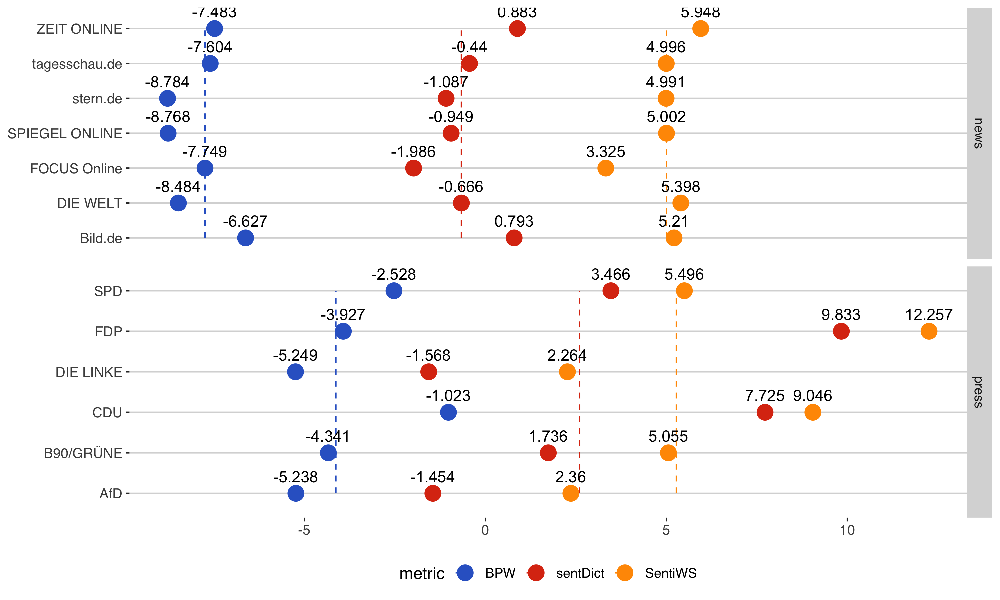
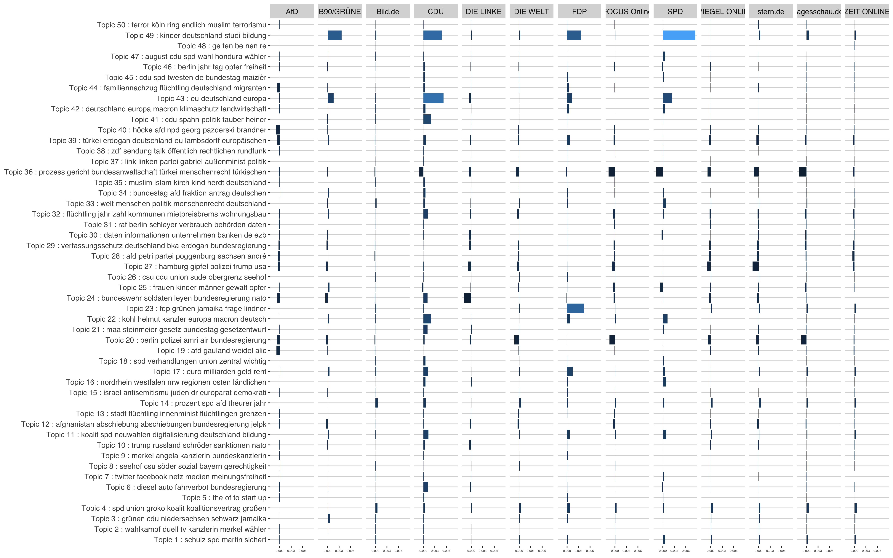
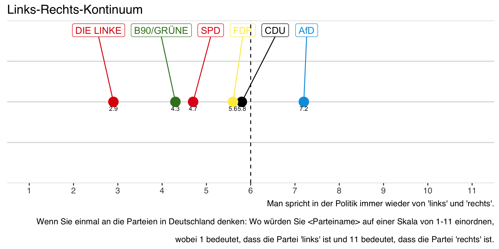
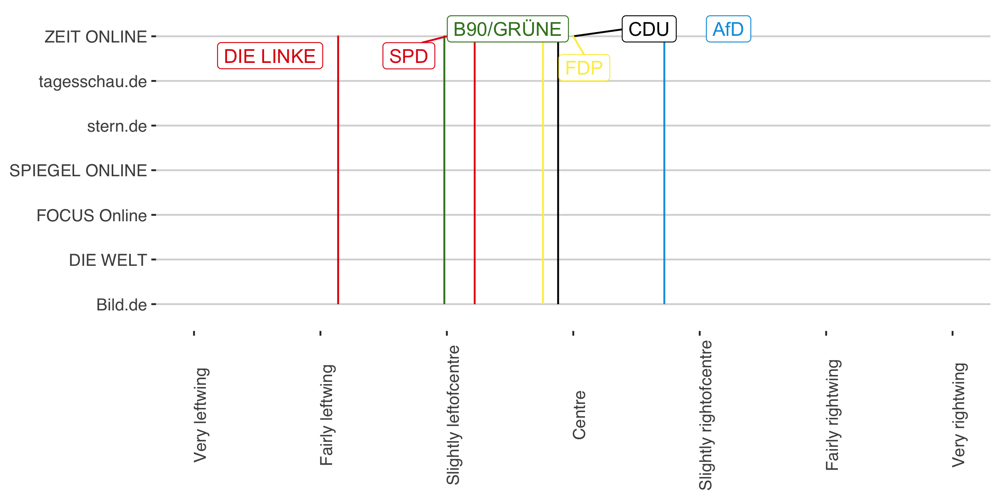
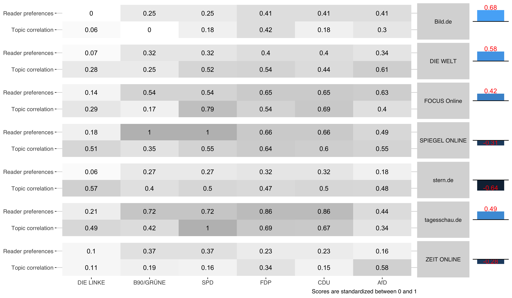

```{r setup, include=FALSE}
options(htmltools.dir.version = FALSE)

library(tidyverse)
library(viridis)
library(ggthemes)
library(patchwork)

rm(list = ls())
color1 <- "#D55E00"
color2 <- "#0072B2"
color3 <- "#CC79A7"
```

class: inverse, center, middle

# Einleitung

---
## Einleitung

**Kritik an Medien:** Verzerrte Berichterstattung und dadurch Einflussnahme auf gesellschaftliche / politische Ergebnisse

--

**Aber:** Was bedeutet unverzerrte in diesem Zusammenhang? Kann es objektive Berichterstattung geben?
  
  - Journalisten setzen Zahlen und Fakten in einen Kontext, sodass jeder Artikel durch seine subjektive Wahrnehmung beeinflusst wird.
  
  - Verläger müssen aus der Vielzahl an möglichen Themen auswählen, die sie in veröffentlichen.

--

**Welche Anreize beeinflussen die Auswahl der Verleger, bzw. die Faktendarstellung der Journalisten?**  

---

##Einleitung

**Welche Anreize beeinflussen die Auswahl der Verleger, bzw. die Faktendarstellung der Journalisten?**

Aus der ökonomischen Literatur:

**Angebotsseitig**:
  
- Persönliche Präferenzen/ politische Einstellung der Journalisten (Baron, 2006. *Journal of Public Economics*)
  / des Verlegers (Besley & Prat, 2006. *American Economic Review*) ?

**Nachfrageseitig**:
  
- Präferenzen der Leser (Gentzkow & Shapiro, 2006. *Journal of Political Economy*)
  
- Möglichst viele Leser erreichen, um mehr Werbetreibende anzulocken? (Anderson & Gabszewicz, 2006. *Handbook of the Economics of Art and Culture*)

---

## Einleitung

**Frage:** Gibt es einen erkennbaren Zusammenhang zwischen dem "Slant-index" und Faktoren auf der Nachfrageseite?

--

**Vorgehensweise:** 

1. Slant-index berechnen: Gewichtete Korrelation der Themen zwischen Pressemitteilungen der Parteien und der Nachrichtenartikel

  - 15.135 online Nachrichtenartikel 
  - 2.666 Pressemitteilungen der Bundestagsparteien

2. Slant-index vergleichen mit Daten zu...
  
  - ...Leserpräferenzen (Digital news report 2018)
  - ...aktuellen Umfragewerten der Parteien

---
class: inverse, center, middle

# Literatur

---

## Literatur

**Media Bias**

Verschiedene Forschungsdisziplinen (Ökonomie, Politik-, Kommunikationswissenschaften) untersuchen im Zusammenhang mit Media Bias (und auf Grundlage unterschiedlicher Annahmen) eine oder mehrere dieser Fragen zu beantworten:

1. Sind Medien verzerrt?
  
2. Welchen Einfluss hat die Verzerrung auf (gesellschaftliche, politische, ökonomische) Ergebnisse?
  
3. Was führt zu dieser Verzerrung?

---

## Literatur

Genrelle Hypothesen in der ökonomische Literatur:

1. Medien berichten unterschiedlich "verzerrt" (Groseclose and Milyo, 2005; Lott and Hassett, 2014)
  
2. Diese Verzerrung hat einen Einfluss auf politische/sozioökonomische Ergebnisse (DellaVigna and Kaplan, 2006; M. Gentzkow, 2006; M. A. Gentzkow and Shapiro, 2004; Snyder and Strömberg, 2010; Strömberg, 2004)
  
3. Die Verzerrung kann initiiert werden durch...

  1. die **Angebotsseite** (Baron, 2006; Besley and Prat, 2006) 
  2. die **Nachfrageseite** (M. Gentzkow and Shapiro, 2006; Mullainathan and Shleifer, 2005; Suen, 2004)

---

## Literatur

**Die Nachfrageseite**

- Medien reagieren direkt auf Pärferenzen der Leser (Gentzkow & Shapiro, 2010: Präferenzen machen 20% der Variation des "Slant" in der Stichprobe (US-Tageszeitungen) aus.)

- Medienmärkte sind Plattformmärkte, daher richten die Anbieter ihre Inhalte auf die Präferenzen der Leser aus, die für die Werbetreibenden den meisten Wert generieren (Anderson & Gabszewicz, 2006) 

Um diese Hyptothesen zu untersuchen...

**Wie kann der "Slant" eines Mediums berechnet werden?**

---

## Literatur

**Wie kann der "Slant" eines Mediums berechnet werden?**

**Sichtbarkeit (Visibility)**: Wie häufig werden Parteien genannt? (Eberl et al., 2017; Junqué de Fortuny et al., 2014; Oegema and Kleinnijenhuis, 2009)
  
**Tonalität**: In Zusammenhang mit welchem "Gefühl" werden Parteien / politische Akteuere besprochen? 

- Verschiedene Ansätze, bspw. manuell-codierte Daten (Dewenter et al., 2018; Eberl et al., 2017) computer-codierte Daten auf Grundlage von Sentiment-Wörterbüchern (Junqué de Fortuny et al., 2012)
  
---

## Literatur

**Wie kann der "Slant" eines Mediums berechnet werden?**

Inwiefern wird **die selbe Sprache** verwendet, die auch die Parteien/politische Aktuere verwenden?: 
  - Wie häufig werden die selben ThinkTanks zitiert? (Groseclose and Milyo, 2005; Lott and Hassett, 2014)
  - Wie häufig werden die selben Ausdrücke verwendet? (Gentzkow and Shapiro, 2004)

Inwiefern werden die **politischen Agenden** der Parteien übernommen?
  - Wie korrelieren die Themen aus den Pressemittelungen mit den Themen in den Medien? (Eberl et al., 2017)
  - Berichten Massenmedien während des Wahlkampfes über die Inhalte der Wahlprogramme? (Merz, 2017)
  
---
class: inverse, center, middle

# Slant Index

---

## Slant Index

**Annahme**: 

- Parteien möchten in den Medien in Zusammenhang mit den Themen besprochen werden, die sie kompetent erscheinen lassen (Brandenburg, 2005; Eberl et al., 2017)
- Sie instrumentalisieren ihre Pressemitteilungen, um ihre "eigenen" Themen auf die Medienagenda zu setzen (Kepplinger and Maurer, 2004) 
- Verleger können aus einm Universum an Themen wählen. Was beeinflusst ihre Wahl?

Je höher die Korrelation zwischen den Themen, die in den Nachrichten vorkommen und den Themen in den Pressemittelungen der Parteien, desto höher ist der Slant Index eines Mediums für eine Partei.

**Methode**: 

- Berechnung der Themen mit Hilfe eines Structural Topic Models
- Berechnung der Tonalität mit Hilfe eines Wörterbuch basierten Ansatzes

---
class: inverse, center, middle

# Hypothesen

---

## Hypothesen

1. Medieninhalte korrelieren mit Leserpräferenzen (Gentzkow & Shapiro (2010)) 

2. Medieninhalte korrelieren mit aktuellen Umfragewerten (Anderson und Gabszewicz, 2006)

--

**Endogenitätsproblem**

- umgekehrte Kausalität: Beziehung zwischen politischen Präferenzen der Leser und Medienberichterstattung
- omitted Variables bias: Medienberichterstattung reagiert auf die allgemeine politische Stimmung

---
class: inverse, center, middle

# Daten

---

### Pressemitteilungen (n=2666)

.pull-left[


]

.pull-right[

- Pressemitteilungen auf den öffentlich zugänglichen Webseiten der Parteien und Fraktionen

- Rechtliche Trennung zwischen den Pressemitteilungen von Parteien und deren Bundestagsfraktionen: Laut Parteigesetzt §25 (2) dürfen Fraktionen ihre Parteien nicht im Wahlkampf unterstützen

- Dennoch nehme ich an, dass auch die Pressemitteilungen der Fraktionen einen Einfluss auf die öffentliche Wahrnehmung haben (Kepplinger and Maurer, 2004).
]


---

## online Nachrichten (n=15.135)

.pull-left[


]

.pull-right[

- Alle öffentliche Nachrichten der Anbieter gescraped über die Webhose.io API 

- Um nur Nachrichten über nationale Politik zu verwenden, wurden die Artikel auf Grundlage ihrer URL gefiltert

- Beispiel: http://www.spiegel.de/politik/deutschland/christian-lindner-ukraine-kritisiert-fdp-chef-scharf-der-morgen-live-a-1161196.html

]

---

## online Nachrichten

Sichtbarkeit der Parteien

```{r include=FALSE}
load("../output/visibility.Rda")

radar <- vis %>%
  group_by(party, medium) %>%
  dplyr::summarize(vis = mean(visibility_p_s, na.rm = T)) %>%
  spread(key = party, value = vis)
```


```{r echo=FALSE, fig.height=5, fig.width=5, message=FALSE, warning=FALSE}
ggiraphExtra::ggRadar(radar, aes(color = medium),alpha = 0, interactive = T, rescale = F)
```

---

## online Nachrichten

Sichtbarkeit der Parteien - skaliert

```{r echo=FALSE, fig.height=5, fig.width=5, message=FALSE, warning=FALSE}
ggiraphExtra::ggRadar(radar, aes(color = medium),alpha = 0, interactive = T, rescale = T)
```

---
class: inverse, center, middle

# Methode

---

```{r include=FALSE}
library(stm)

# stm results
load("../output/models/finalmodel_50.RDa")
# sentiment results
load("../output/sentiment.Rda")
k <- stmOut$settings$dim$K
  
model_df <- model_df %>%
  dplyr::mutate(doc_index = as.numeric(rownames(.))) %>%
  left_join(., sent_df %>% select(-source, -type), by="doc_index")

rescale <- function(x,x_min,x_max,a,b){
  (x-x_min)/(x_max-x_min)*(b-a)+a
}
```

## Sentiment analysis 

To measure the tone (or sentiment) of an article a dictionary-based method is applied. To conduct such an analysis, a list of words (dictionary) associated with a given emotion, such as negativity is pre-defined. The document is then deconstructed into individual words and each word is assigned a sentiment value according to the dictionary, where the sum of all values results in the emotional score for the given document. 

- [SentimentWortschatz](http://wortschatz.uni-leipzig.de/de/download)
- [BPW]()
- [Combination of both]()

---

### Dictionary match

Sentiment score document $d$: $$SC_d=|\text{summe pos. wörter}_d - \text{summe neg. wörter}_d|$$

**A sample document**

```{r echo=FALSE}
doc <- sample(unique(model_df$doc_index),1)

model_df %>% 
  filter(doc_index == doc) %>% 
  select(title, text, source) %>%
  dplyr::mutate(text = paste(substr(text, 1, 500),"...")) %>%
  htmlTable::htmlTable(align="l")
```

---

#### 1. SentiWS

Document score:

```{r echo=FALSE}
SentiWS.token %>% filter(doc_index == doc) -> sample
sum(sample$senti_dummy, na.rm = T)
```

.pull-left[
Positive Wörter
```{r echo=FALSE}
sample %>% filter(senti_dummy > 0) -> sample_pos
htmlTable::htmlTable(paste(sample_pos$word, collapse = ", "))
```
]

.pull-right[
Negative Wörter
```{r echo=FALSE, message=FALSE, warning=FALSE}
sample %>% filter(senti_dummy < 0) %>% select(word) -> sample_neg
htmlTable::htmlTable(paste(sample_neg$word, collapse = ", "))
```
]

---

#### 2. BPW

Document score:

```{r echo=FALSE}
BPW.token %>% filter(doc_index == doc) -> sample
sum(sample$senti_dummy, na.rm = T)
```

.pull-left[
Positive Wörter
```{r echo=FALSE}
sample %>% filter(senti_dummy > 0) -> sample_pos
htmlTable::htmlTable(paste(sample_pos$word, collapse = ", "))
```
]

.pull-right[
Negative Wörter
```{r echo=FALSE, message=FALSE, warning=FALSE}
sample %>% filter(senti_dummy < 0) %>% select(word) -> sample_neg
htmlTable::htmlTable(paste(sample_neg$word, collapse = ", "))
```
]

---

#### 3. Combination of SentiWS & BPW


Document score: 

```{r echo=FALSE}
sentDict.token %>% filter(doc_index == doc) -> sample

sum(sample$senti_dummy, na.rm = T)
```

.pull-left[
Positive Wörter
```{r echo=FALSE}
sample %>% filter(senti_dummy > 0) -> sample_pos
htmlTable::htmlTable(paste(sample_pos$word, collapse = ", "))
```
]

.pull-right[
Negative Wörter
```{r echo=FALSE, message=FALSE, warning=FALSE}
sample %>% filter(senti_dummy < 0) %>% select(word) -> sample_neg
htmlTable::htmlTable(paste(sample_neg$word, collapse = ", "))
```
]

---

### Sentiment analyse 

```{r eval=FALSE, include=FALSE}
plot <- sent_df %>%
  group_by(source, type) %>%
  dplyr::summarise(
   SentiWS = mean(SentiWS_dummy, na.rm = T),
   BPW = mean(BPW_dummy, na.rm = T),
   sentDict = mean(sentDict_dummy, na.rm = T)
  ) %>%
  ungroup() %>%
  gather(metric, sent_value, SentiWS:sentDict) %>%
  group_by(type, metric) %>%
  mutate(
    sent_m = median(sent_value)
  ) %>% ungroup()

p<- ggplot(plot, aes(source, sent_value, label = round(sent_value,3))) +
  geom_point(aes(color = metric), size = 5) +
  geom_line(aes(source, sent_m, color = metric, group = metric), linetype=2) +
  geom_text(show.legend = F, color="black", size=4, vjust=-1) +
  coord_flip() +
  labs(x=NULL, y=NULL) +
  ggthemes::theme_hc() +
  ggthemes::scale_color_gdocs() +
  theme(legend.position = "bottom",
        axis.text = element_text(size=10)
        ) +
  facet_grid(type~., scales = "free_y") 

ggsave("img/sentiment.png", width = 10, height = 6, dpi = 300)
```



---

## Strucutral Topic Model

Das Structural Topic Model (STM, Roberts et. al., 2016) erlaubt es, Metadaten in den generativen Prozess zu integrieren. 

1. **Themen Verteilung**: 
  - Variablen, die die Wahrscheinlichkeit beeinflussen, ein Thema in einem Dokument vorkommt.

1. **Themen Inhalt**: 
  - Variablen, die die Wahrscheinlichkeit beeinflussen, dass ein Wort in einem Thema vorkommt.

--

#### Model-Annahmen:

  - **Themen Verteilung** hängt von der Quelle ab (Bild.de, FOCUS ONLINE, FDP, ...) 
  - **Themen Inhalt** hängt von der Art der Quelle ab (Pressemitteilung oder Nachrichtenartikel)
  - **Anzahl Themen** 50

---

## Posterior Wahrscheinlichkeiten

Der generative Prozess des STM generiert zwei posterior Wahrscheinlichkeiten:

1. **Word-topic Posterior:** $\Phi_c$ ist eine $K$ x $V$ Matrix (mit $K=$ Anzahl der Themen und $V=$ Vokabular), wobei der Eintrag $\phi_{k,v,c}$ als Wahrscheinlichkeit interpretiert werden kann, dass Term $v$ in Thema $k$ vorkommt, abhängig von $c$, also der Art der Quelle (Pressemitteilung oder Nachrichtenarikel) 

2. **Document-topic Posterior:** $\Theta$ ist eine $D$ x $K$ Matrix (mit $D=$ Anzahl der Dokumente und $K=$ Anzahl der Themen), wobei der Eintrag $\theta_{d,k}$ als Wahrscheinlichkeit interpretiert werden kann, dass das Dokument $d$ das Thema $k$ beinhaltet.

---

### Word-topic Posterior

 $\Phi_c$ kann helfen um zu verstehen, wodrüber das Thema handelt, indem wir uns die Wahrscheinlichsten Wörter in jeden Thema angucken...
 
.pull-left[
Thema 1

]

.pull-right[
Thema 2

]

---

### Topic labels

```{r echo=FALSE, message=FALSE, warning=FALSE}
sagelabs <- sageLabels(stmOut, 20)

newsLabels <- as.data.frame(sagelabs$cov.betas[[1]]$problabels) %>%  
  transmute(topic = as.numeric(rownames(.)),
            topic_name_news = paste(V1,V2,V3))

pressLabels <- as.data.frame(sagelabs$cov.betas[[2]]$problabels) %>% 
  transmute(topic = as.numeric(rownames(.)),
            topic_name_press = paste(V1,V2,V3))

topics.df <- left_join(newsLabels, pressLabels, by="topic") %>%
  mutate(label1 = paste(topic_name_news, topic_name_press))

for (i in seq(k)) {
  label <- paste(unique(unlist(strsplit(topics.df$label1[i], " "))), collapse = " ")
  topics.df$joint_label[i] <- paste("Topic",topics.df$topic[i],":", label)
}

topics.df %>% 
  select(joint_label, topic_name_news, topic_name_press) %>% 
  head(7) %>%
  knitr::kable(align="l", format = 'html', rnames = F)
```

---
class: middle

```{r include=FALSE}
theta <- as.data.frame(stmOut$theta) %>% # get all theta values for each document
  
  mutate(doc_index = as.numeric(rownames(.))) %>%
  # convert to long format
  gather(topic, theta, -doc_index) %>%
  mutate(topic = as.numeric(gsub("V","",topic))) %>%
  
  # join with topic df
  left_join(., topics.df, by="topic") %>%
  
  # join with model_df
  left_join(., model_df %>% 
              select(date,type,source,doc_index,title_text), by="doc_index") %>%  
  
    # join with sentiment df
  left_join(., sent_df %>% select(-source, -type), by="doc_index") %>%
  
  # delete documents that are published in Mai 2017
  mutate(
    year = lubridate::year(date),
    month = lubridate::month(date)
    ) %>%
  filter(month != 5)

topicmean <- theta %>%
  group_by(topic, joint_label) %>%
  summarise(frequency = mean(theta)) %>%
  ungroup() %>%
  arrange(desc(frequency)) %>%
  mutate(order = row_number())
```

### Document-topic Posterior

$\Theta$ gibt eine Themen Wahrscheinlichkeit für jedes Dokument $d$, bspw.: 

```{r echo=FALSE, fig.height=8, fig.width=12}
# select a random document
# doc <- sample(unique(theta$doc_index),1)

sample <- theta %>% filter(doc_index == doc) 
caption <- model_df %>% filter(doc_index == doc) %>% select(title, source)

sample %>%
  ggplot(aes(reorder(joint_label,desc(topic)), theta)) +
  geom_col(fill = color2) +
  coord_flip() +
  ylim(c(0,1)) +
  theme_hc() +
  labs(x = NULL, y = NULL, title = paste(caption$title,"(",caption$source,")"))

#ggsave("img/sample.png", height = 7, width = 8, dpi=300)
```

---

### Document-topic frequency - mean I

```{r include=FALSE}
topicmean <- theta %>%
  group_by(topic, joint_label) %>%
  summarise(frequency = mean(theta)) %>%
  ungroup() %>%
  arrange(desc(frequency)) %>%
  mutate(order = row_number())
```

```{r Plot expected frequency, echo=FALSE, fig.height=7, fig.width=10}
topicmean %>%
  filter(order < 25) %>%
  ggplot(aes(reorder(joint_label, -order),frequency)) +
  geom_col(show.legend = FALSE, fill=color3) +
  coord_flip() +
  theme_hc() +
  labs(x=NULL, y=NULL) +
  theme(axis.text = element_text(size=11))

#ggsave("img/topic_mean1.png", height = 6, width = 7, dpi=300)
```

---

### Document-topic frequency - mean II

```{r echo=FALSE, fig.height=7, fig.width=10}
topicmean %>%
  filter(order >= 25) %>%
  ggplot(aes(reorder(joint_label, -order),frequency)) +
  geom_col(show.legend = FALSE, fill=color3) +
  coord_flip() +
  theme_hc() +
  scale_y_continuous(limits = c(0,0.04)) +
  labs(x=NULL, y=NULL) +
  theme(axis.text = element_text(size=11))

#ggsave("img/topic_mean2.png", height = 6, width = 7, dpi=300)
```

---

## Weighted topic probability

In order to measure topic-specific tone, the sentiment values are combined with the results of the STM procedure. The output of the STM algorithm provides estimates of topic proportions $\theta_d = [\theta^1_{d},...,\theta^{50}_{d}]'$ for each document $d$. These topic proportions are combined with the tone of the corresponding paragraph ( [Jegadeesh and Wu (2017)](https://papers.ssrn.com/sol3/papers.cfm?abstract_id=2939937) ). 

The topic-specific tone is measured by calculating weighted topic probabilities ( $\text{WTP}$ )

$$\text{WTP}^k_d=\theta^{k}_{d}*\text{SC}_d*(\frac{1}{L_d})$$

where $\theta^k_{d}$ is the proportion of topic $k$ in document $d$ obtained from the STM procedure and $\text{SC}_d$ is the number of positive words minus the number of negative words (sentiment score) in $d$ and $L_d$ is the number of words in document $d$.

```{r include=FALSE}
theta <- theta %>% 
  mutate(SentiWS_theta = SentiWS_dummy*theta*(1/n),
         BPW_theta = BPW_dummy*theta*(1/n),
         sentDict_theta = sentDict_dummy*theta*(1/n)
         )
```

---

### Weighted topic probability

```{r include=FALSE}
corr.df.dates <- theta %>%
  group_by(topic, type, source, joint_label, month, year) %>%
  dplyr::summarise(
    theta = mean(theta, na.rm = T),
    BPW_theta = mean(BPW_theta, na.rm = T),
    BPW = mean(BPW_dummy, na.rm = T)
  ) %>%
  ungroup() 

plot <- corr.df.dates %>%
  mutate(
    date = as.Date(paste0(year,"/",month,"/1"))
    # theta = rescale(theta, min(theta), max(theta), -1,1),
    # BPW_theta = rescale(BPW_theta, min(BPW_theta), max(BPW_theta), -1,1),
    # BPW = rescale(BPW, min(BPW), max(BPW), -1,1)
  ) %>% gather(metric, val, theta:BPW) 


#New facet label names for metric variable
metric.labs <- c("SentScore", "WTP", "Topic Prob.")
names(metric.labs) <- c("BPW", "BPW_theta", "theta")

plot_topic <- function(t) {
  
  sample <- plot %>% filter(topic==t)
  
  p1 <- sample %>%
    filter(type == "news") %>%
    ggplot(aes(date, val, color=metric)) +
    geom_line() +
    geom_hline(aes(yintercept=0), linetype=2, size=0.5) +
    theme_hc() +
    labs(x=NULL, y=NULL, title = paste(sample$joint_label[1])) +
    ggthemes::scale_color_fivethirtyeight() +
    facet_grid(cols = vars(source), 
               rows = vars(metric), 
               labeller = labeller(metric = metric.labs),
               scales = "free")
  
  p2 <-sample %>%
    filter(type == "press") %>%
    ggplot(aes(date, val, color=metric)) +
    geom_line(show.legend = F) +
    geom_hline(aes(yintercept=0), linetype=2, size=0.5) +
    theme_hc() +
    labs(x=NULL, y=NULL) +
    ggthemes::scale_color_fivethirtyeight() +
    facet_grid(cols = vars(source), 
               rows = vars(metric), 
               labeller = labeller(metric = metric.labs),
               scales = "free")
  
  p1 + p2 + plot_layout(ncol=1)
}
```

```{r echo=FALSE, fig.align="center", fig.height=8, fig.width=12}
plot_topic(23)
```

---

### Weighted topic probability

```{r echo=FALSE, fig.align="center", fig.height=8, fig.width=12}
plot_topic(4)
```

---

### Weighted topic probability

```{r echo=FALSE, fig.align="center", fig.height=8, fig.width=12}
plot_topic(49)
```

---

### Weighted topic probability

```{r echo=FALSE, fig.align="center", fig.height=8, fig.width=12}
plot_topic(1)
```

---

### Weighted topic probability

```{r echo=FALSE, fig.align="center", fig.height=8, fig.width=12}
plot_topic(14)
```

---

### Weighted topic probability

```{r echo=FALSE, fig.align="center", fig.height=8, fig.width=12}
plot_topic(27)
```

---

### Weighted topic probability

```{r echo=FALSE, fig.align="center", fig.height=8, fig.width=12}
plot_topic(11)
```

---

### Weighted topic probability

```{r echo=FALSE, fig.align="center", fig.height=8, fig.width=12}
plot_topic(34)
```

---

### Weighted topic probability - mean 

```{r include=FALSE}
corr.df <- theta %>%
  group_by(topic, type, source, joint_label) %>%
  dplyr::summarise(
    SentiWS_theta = mean(SentiWS_theta, na.rm = T),
    BPW_theta = mean(BPW_theta, na.rm = T),
    sentDict_theta = mean(sentDict_theta, na.rm = T)
  ) %>%
  ungroup() 
```

```{r eval=FALSE, include=FALSE}
p<-corr.df %>%
  ggplot(aes(reorder(joint_label,topic),
             sentDict_theta, fill=sentDict_theta)) +
  geom_col(show.legend = F) +
  coord_flip() +
  theme_hc() +
  labs(x=NULL, y=NULL) +
  facet_grid(.~source) +
  theme(axis.text.x = element_text(size=4))

ggsave("img/wtp_df.png", width = 16, height = 10, dpi=300)
```



---

## Korrelation

On the basis of the weighted topic distributions, the bivariate Pearson correlation coefficients are calculated for each pair of media outlet and party. 

```{r include=FALSE}
library(corrr)

news <- c("DIE WELT","stern.de", "ZEIT ONLINE", "FOCUS Online", "Bild.de", "SPIEGEL ONLINE", "tagesschau.de" )
parties <- c("CDU", "SPD", "AfD", "B90/GRÜNE", "DIE LINKE", "FDP" )
```

```{r include=FALSE}
corr.df.sm <- corr.df %>%
  select(topic, source, BPW_theta) %>%
  spread(source, BPW_theta)

x <- as.matrix(corr.df.sm[,-1])

rs <- correlate(x)
```

```{r include=FALSE}
corr_plot <- rs %>%
  as_tibble() %>%
  dplyr::rename(source1 = rowname) %>%
  gather(key = source2, value = corr, -source1) %>% 
  mutate(
    type1 = ifelse(source1 %in% news, "news", "party"),
    type2 = ifelse(source2 %in% news, "news", "party")
  ) %>%
  transmute(
    medium = source1,
    party = source2,
    corr = corr) %>% mutate(
    party_order = ifelse(party == "DIE LINKE", 1, 0),
    party_order = ifelse(party == "B90/GRÜNE", 2, party_order),
    party_order = ifelse(party == "SPD", 3, party_order),
    party_order = ifelse(party == "FDP", 4, party_order),
    party_order = ifelse(party == "CDU", 5, party_order),
    party_order = ifelse(party == "AfD", 6, party_order)
    ) 
```

```{r echo=FALSE, fig.height=6, fig.width=6, fig.align="center"}
corr_plot %>%
  filter(medium %in% news) %>%
  filter(party %in% parties) %>%
  ggplot(aes(reorder(party, party_order), medium, 
                 label=round(corr, digits = 2),
                 fill=corr)) +
  geom_tile() +
  scale_fill_gradient(low = "white", high = "gray") +
  geom_text() +
  theme_hc() +
  labs(x = NULL, y = NULL) + 
  scale_x_discrete(expand = c(0, 0)) +
  scale_y_discrete(expand = c(0, 0)) +
  theme(legend.position = "none",
        axis.text.x = element_text(angle = 90))

#ggsave("img/corr_df.png", width=4, height = 4, dpi=300)
```

---

## Korrelation - Radarchart

```{r echo=FALSE, message=FALSE, warning=FALSE}
radar <- corr_plot %>%
  filter(medium %in% news) %>%
  filter(party %in% parties) %>%
  select(-party_order) %>%
  spread(key = party, value = corr) 

ggiraphExtra::ggRadar(radar, aes(color = medium),
                      rescale = F,
                      interactive = T,
                      alpha = 0) 
```

---

## Korrelation - Radarchart skaliert

```{r echo=FALSE, message=FALSE, warning=FALSE}
radar <- corr_plot %>%
  filter(medium %in% news) %>%
  filter(party %in% parties) %>%
  select(-party_order) %>%
  spread(key = party, value = corr) 

ggiraphExtra::ggRadar(radar, aes(color = medium),
                      rescale = T,
                      interactive = T,
                      alpha = 0) 
```

---

## Korrelation - Netzwerk plot 

Die Grafik zeigt einen Punkt für jede Variable, die räumliche Nähe der Variablen zueinander stellt die Gesamtgröße ihrer Korrelationen dar.

```{r echo=FALSE, fig.align="center"}
rs %>% 
  network_plot()
```

---
class: center, middle, inverse

# Hypothesen überprüfen

---
class: middle

## Hypothese 1

Medieninhalte werden auf die Präferenzen der Leser ausgerichtet

- Vergleich des Slant Indexes mit Leserpräferenzen auf Grundlage der Daten des [Reuters Institute Digital News Survey](http://www.digitalnewsreport.org/about-us-2018/)

---

## Reuters Digital news survey

```{r include=FALSE}
reutersDF1 <- readxl::read_excel("../data/reuters_clean.xlsx")
reutersDF2 <- readxl::read_excel("../data/reuters_clean.xlsx", sheet = "orientation")

keeps <- c("Bild.de", "Spiegel Online","Welt Online","Focus Online", "Stern.de","ZEIT Online","Tagesschau.de")
```

- Erhebungszeitraum: 19.-22. Januar 2018
- n= 2038 (Bevölkerung in Deutschland ab 18 Jahren)

.pull-left[

```{r Prepare dataframe, include=FALSE}
reutersDF.long <- reutersDF1 %>%
  select(medium:`Very rightwing`) %>%
  mutate(order = Centre...5) %>%
  gather(partisan, count, `Very leftwing`:`Very rightwing`) %>%
  mutate(partisan = ifelse(partisan == "Centre...5", "Centre", partisan)) %>%
  mutate(partisan.f = as.factor(partisan)) %>%
  mutate(
    partisan_scale = ifelse(partisan == "Very leftwing", -3,NA),
         partisan_scale = ifelse(partisan == "Fairly leftwing", -2, partisan_scale),
         partisan_scale = ifelse(partisan == "Slightly leftofcentre", -1,partisan_scale),
         partisan_scale = ifelse(partisan == "Centre", 0, partisan_scale),
         partisan_scale = ifelse(partisan == "Slightly rightofcentre", 1, partisan_scale),
         partisan_scale = ifelse(partisan == "Fairly rightwing",2, partisan_scale),
         partisan_scale = ifelse(partisan == "Very rightwing", 3, partisan_scale)
  ) 

reutersDF.long <- reutersDF.long %>%
  
  filter(!grepl("know",medium)) %>%
  filter(!grepl("None",medium)) %>%
  filter(medium %in% keeps) %>%
  
  # group by partisan 
  group_by(partisan.f) %>%
  mutate(count_sum_p = sum(count)) %>%
  ungroup() %>%
  
  # group by medium
  group_by(medium) %>%
  mutate(count_sum_m = sum(count)) %>%
  ungroup() %>%
  
  # calulate relative counts by partisan and medium
  mutate(
    # relative values by partisan
    count_relative_p = count/count_sum_p,
    # relative values by medium
    count_relative_m = count/count_sum_m,
    # relative values sample size
    count_relative = count/2038
    )
  
p <- reutersDF.long %>%
  select(medium, partisan, count_relative, partisan_scale) %>%
  ggplot(aes(reorder(partisan, partisan_scale), medium)) +
  geom_tile(aes(fill=count_relative), show.legend = F) +
  scale_fill_gradient(low = "white", high = "gray") +
  geom_text(aes(label=round(count_relative,3))) +
  labs(x=NULL, y=NULL, title = "Leserpräferenzen",
       caption = " Which of the following brands have you used to access news online 
       in the last week? Please select all that apply.") + 
  theme_hc() +
  theme(axis.text.x = element_text(angle=90))

ggsave("img/reuters1.png", p, width=7, height = 7, dpi=300)
```


]

.pull-right[
```{r eval=FALSE, include=FALSE}
p <- reutersDF2 %>%
  mutate(count_rel = 100*(count/2038),
    partisan_scale = ifelse(partisan == "Very left-wing", -3,NA),
         partisan_scale = ifelse(partisan == "Fairly left-wing", -2, partisan_scale),
         partisan_scale = ifelse(partisan == "Slightly left-of-centre", -1,partisan_scale),
         partisan_scale = ifelse(partisan == "Centre", 0, partisan_scale),
         partisan_scale = ifelse(partisan == "Slightly right-of-centre", 1, partisan_scale),
         partisan_scale = ifelse(partisan == "Fairly right-wing",2, partisan_scale),
         partisan_scale = ifelse(partisan == "Very right-wing", 3, partisan_scale)
  ) %>%
  ggplot(aes(reorder(partisan, partisan_scale), count_rel,
             label = paste(round(count_rel, digits = 1),"%")
            )) +
  geom_col(fill=color2) +
  geom_text(vjust = 1, color = "white", size =4) +
  labs(x = NULL, y = "%", title="Politische Orientierung", 
       caption = "Some people talk about 'left', 'right' and 'centre' to describe parties and politicians.\n(Generally socialist parties would be considered ‘left wing’ whilst conservative parties would be considered ‘right wing’).\nWith this in mind, where would you place yourself on the following scale?") +
  theme_hc() +
  theme(axis.text.x = element_text(angle = 90))

ggsave("img/reuters2.png", p, width=7, height = 5, dpi=300)

```


]

---

## Infratest Dimap


- Erhebungszeitraum: 2.-3. November 2015
- n= 1.003 (Bevölkerung in Deutschland ab 18 Jahren)

Ergebnisse:

```{r include=FALSE}
parties <- c("CDU", "SPD", "AfD", "B90/GRÜNE", "DIE LINKE", "FDP" )

dimap <- data.frame(
  "party" = parties,
  "value" = c(5.8, 4.7, 7.2, 4.3, 2.9, 5.6),
  "year" = 2015
)

cols = c("CDU"="black","SPD"="#e2001a","AfD"="#009ee0","B90/GRÜNE"="#3c8025","DIE LINKE"="#df0404","FDP"="#fdec4f")
```

```{r eval=FALSE, include=FALSE}
p <- ggplot(dimap, aes(value, year, color = party)) +
  geom_point(size=5) +
  ggrepel::geom_label_repel(aes(label=party), 
                            nudge_y = 2015) +
  geom_text(aes(label=value),size=2.5, color="black", vjust=2) +
  geom_vline(xintercept = 6, linetype=2) +
  scale_x_continuous(limits = c(1,11), breaks = seq(1,11)) +
  scale_color_manual(values = cols) +
  theme_hc() +
  labs(x=NULL, y = NULL, title="Links-Rechts-Kontinuum",
caption = "Man spricht in der Politik immer wieder von 'links' und 'rechts'.\n
       Wenn Sie einmal an die Parteien in Deutschland denken: Wo würden Sie <Parteiname> auf einer Skala von 1-11 einordnen,\n
       wobei 1 bedeutet, dass die Partei 'links' ist und 11 bedeutet, dass die Partei 'rechts' ist.") +
  theme(
    axis.text.y = element_blank(),
    axis.ticks.y = element_blank(),
    legend.position = "none"
  )

ggsave("img/dimap1.png",p, width=8, height = 4, dpi = 300)
```




---

## Reuters & Infratest dimap

1. Rescale the dimap values from the $[1,11]$ scale to a $[1,7]$ range as in the Reuters survey.


```{r Prepare and combine data sources, include=FALSE}
# Prepare dimap data
dimap$value_rescaled <- rescale(dimap$value,1,11,-3,3)
dimap$partisan_scale <- round(dimap$value_rescaled,0)

# prepare reuters data
reutersPlot <- reutersDF.long %>%
  filter(!grepl("know",medium)) %>%
  filter(!grepl("None",medium)) %>%
  filter(medium %in% keeps) %>%
  mutate(
    medium = ifelse(grepl("Welt",medium,ignore.case = T),"DIE WELT", medium),
    medium = ifelse(grepl("stern",medium,ignore.case = T),"stern.de", medium),
    medium = ifelse(grepl("Zeit",medium,ignore.case = T),"ZEIT ONLINE", medium),
    medium = ifelse(grepl("Focus",medium,ignore.case = T),"FOCUS Online", medium),
    medium = ifelse(grepl("Bild",medium,ignore.case = T),"Bild.de", medium),
    medium = ifelse(grepl("Spiegel",medium,ignore.case = T),"SPIEGEL ONLINE", medium),
    medium = ifelse(grepl("tagesschau",medium,ignore.case = T),"tagesschau.de", medium)
  ) 

plot <- left_join(reutersPlot, dimap, by="partisan_scale")

p_base <- ggplot(plot, aes(partisan_scale,medium)) +
  geom_text(aes(label= round((count_relative*100),2)), size=0) +  
  theme_hc() +
  scale_color_manual(values = cols) +
  labs(x=NULL, y = NULL) +
  theme(axis.text.x = element_text(angle = 90),
        legend.position = "none") 
```

```{r eval=FALSE, include=FALSE}
p <- p_base +
  geom_line(aes(value_rescaled, medium, group = party, color = party)) +
  ggrepel::geom_label_repel(data = plot %>% filter(medium == "ZEIT ONLINE"),
                            aes(label=party, color = party)) +
  scale_x_continuous(limits = c(-3,3),
                     breaks = seq(-3,3),
                     labels = unique(plot$partisan)
                     ) 


ggsave("img/dimap2.png",p, width=8, height = 4, dpi = 300)
```



---

## Reuters & Infratest dimap

2. ... combined with reader preferences

```{r echo=FALSE, fig.align="center", fig.height=6, fig.width=6, message=FALSE, warning=FALSE}
p_base +
  geom_tile(aes(fill = count_relative), show.legend = F) +
  scale_fill_gradient(low = "white", high = "gray") +
  geom_text(aes(label= round((count_relative*100),2)), size=3) +
  geom_line(aes(value_rescaled, medium, group = party, color = party)) +
  ggrepel::geom_label_repel(data = plot %>% filter(medium == "ZEIT ONLINE"),
                            aes(label=party, color = party), size=2) +
  scale_x_continuous( 
                     breaks = seq(-3,3),
                     labels = unique(plot$partisan)
                     ) 

#ggsave("img/dimap3.png",p, width=5, height = 5, dpi = 300)
```


---

## Hypothese 1

```{r include=FALSE}
corr.df.sm <- corr.df %>%
  select(topic, source, BPW_theta) %>%
  spread(source, BPW_theta)

x <- as.matrix(corr.df.sm[,-1])

rs <- correlate(x)

corr_plot <- rs %>%
  as_tibble() %>%
  dplyr::rename(source1 = rowname) %>%
  gather(key = source2, value = corr, -source1) %>% 
  mutate(
    type1 = ifelse(source1 %in% news, "news", "party"),
    type2 = ifelse(source2 %in% news, "news", "party")
  ) 

# prepare correlation data
corr_p <- corr_plot %>%
  filter(type1 == "news") %>%
  filter(type2 == "party") %>%
  transmute(
    medium = source1,
    party = source2,
    corr = corr) %>% mutate(
    party_order = ifelse(party == "DIE LINKE", 1, 0),
    party_order = ifelse(party == "B90/GRÜNE", 2, party_order),
    party_order = ifelse(party == "SPD", 3, party_order),
    party_order = ifelse(party == "FDP", 4, party_order),
    party_order = ifelse(party == "CDU", 5, party_order),
    party_order = ifelse(party == "AfD", 6, party_order)
    ) 

final_df <- left_join(plot, corr_p, by = c("medium","party")) %>%
  filter(!is.na(corr)) %>%
  select(medium, party,party_order, count_relative, corr) %>%
  mutate(
    count_rel_scaled = rescale(count_relative,x_min = min(count_relative),x_max = max(count_relative),0,1),
    corr_scaled = rescale(corr, x_min = min(corr), max(corr),0,1)
  )
```

```{r eval=FALSE, include=FALSE}
p1 <- final_df %>%
  select(-count_relative, - corr) %>%
  gather(metric, value, count_rel_scaled:corr_scaled) %>%
  ggplot(aes(reorder(party,party_order), metric)) +
  geom_tile(aes(fill=value), show.legend = F) +
  scale_fill_gradient(low = "white", high = "gray") +
  geom_text(aes(label=round(value, 2))) +
  #scale_fill_discrete(name = "", labels = c("Reader preferences", "Topic Correlation")) +
  labs(x=NULL, y=NULL, caption = "Scores are standardized between 0 and 1") +
  scale_y_discrete(labels=c("Topic correlation", "Reader preferences")) +
  theme(
    strip.text.y = element_text(angle = 0)
  ) +
  theme_hc() +
  facet_grid(rows = vars(medium)) 

p2 <- final_df %>%
  group_by(medium) %>%
  dplyr::summarise(correlation = cor(count_relative, corr)) %>%
  ggplot(aes(medium, correlation)) +
  geom_col(aes(fill=correlation), show.legend = F) +
  geom_text(aes(label=round(correlation,2)), vjust=-0.1, color="red") +
  geom_hline(aes(yintercept=0)) +
  theme_void() +
  labs(x=NULL, y="Correlation") +
  scale_y_continuous(limits = c(-1,1), position = "right") +
  facet_wrap(medium~., scales = "free_x", ncol = 1) +
  theme(strip.text = element_blank())

p1 + p2 + plot_layout(width = c(10,1))

ggsave("img/hypothese1.png", width = 12, height = 7, dpi=300)
```



---
class:middle

## Hypothese 2

Medieninhalte richten sich eher nach den aktuellen Umfragewerten (Anderson und Gabszewicz, 2006)

- Vergleich des Slant Indexes mit aktuellen Umfragewerten (Moving averager 7 führender Institute)

---

## Hypothese 2

```{r include=FALSE}
# load poll data
load("../output/polldats.Rda")

polls.plot <- df.small %>%
  filter(date > as.Date("2017-01-01")) %>%
  filter(date < as.Date("2018-06-30")) %>%
  mutate(year=lubridate::year(date),
         month = lubridate::month(date),
         date = as.Date(paste0(year,"/",month,"/1"))) %>%
  group_by(party,date) %>%
  dplyr::summarise(ma = mean(ma)) %>%
  ungroup() %>%
  mutate(
    party = ifelse(party == "CDU/CSU", "CDU", party),
    party = ifelse(party == "LINKE", "DIE LINKE", party),
    party = ifelse(party == "GRÜNE", "B90/GRÜNE", party)
  )

# prepare correlation dataframe
corr.df <- theta %>%
  mutate(year=lubridate::year(date),
         month = lubridate::month(date),
         date = as.Date(paste0(year,"/",month,"/1"))) %>% 
  group_by(topic, type, source, joint_label, date) %>%
  dplyr::summarise(
    SentiWS_theta = mean(SentiWS_theta, na.rm = T),
    BPW_theta = mean(BPW_theta, na.rm = T),
    sentDict_theta = mean(sentDict_theta, na.rm = T)
  ) %>%
  ungroup() 

# estimate correlations in each month
dates <- unique(corr.df$date)

rm(corr.df.time)
for (i in 1:length(dates)) {
  
  corr.df.sm <- corr.df %>%
    filter(date == dates[i]) %>%
    select(topic, source, BPW_theta) %>%
    spread(source, BPW_theta)
  
  x <- as.matrix(corr.df.sm[,-1])
  
  temp <- correlate(x) %>% 
    gather(party, corr, -rowname) %>%
    mutate(date = dates[i])
  
  if (!exists("corr.df.time")) {
    corr.df.time <- temp
  } else {
    corr.df.time <- bind_rows(corr.df.time, temp)
  }
  
}

hypo2 <- corr.df.time %>%
  filter(rowname %in% news) %>%
  filter(party %in% parties) %>%
  mutate(medium = rowname) %>% select(-rowname) %>%
  left_join(.,polls.plot, by=c("date","party") ) %>%
  mutate(
    cor_norm = rescale(corr, x_min = min(corr, na.rm = T), max(corr, na.rm = T), -1,1),
    ma_norm = rescale(ma, min(ma, na.rm = T), max(ma, na.rm = T), -1,1)
  ) 
```


```{r eval=FALSE, fig.height=8, fig.width=12, include=FALSE}
# merge dataframes
p1 <- ggplot(hypo2, 
       aes(date, cor_norm)) +
  geom_line(aes(color = medium, linetype = medium)) +
  geom_line(aes(date,ma_norm), color="red", show.legend = F) +
  geom_hline(yintercept = 0, size = 0.3, color = color1) +
  facet_wrap(~party) +
  theme_hc() +
  scale_color_viridis_d() +
  labs(y=NULL, x =NULL, title="Timeline") +
  scale_x_date(date_breaks = "2 month", date_labels = "%b/%y") +
  theme(legend.position = "bottom",
        legend.title = element_blank()) +
     guides(col = guide_legend(nrow = 1))

p2 <- hypo2 %>%
  group_by(party, medium) %>%
  dplyr::summarise(correlation = cor(corr, ma))%>%
  ggplot(aes(medium, correlation)) +
  geom_col(aes(fill=correlation), show.legend = F) +
  geom_text(aes(label=round(correlation,2)), vjust=-0.1, color="red", size=2) +
  geom_hline(aes(yintercept=0)) +
  theme_hc() +
  labs(x=NULL, title="Correlation", y=NULL) +
  scale_y_continuous(limits = c(-1,1), position = "right") +
  facet_wrap(.~party, ncol = 1) +
  theme(axis.text.x = element_text(angle = 90),
        axis.text.y = element_blank())

p1 + p2 + plot_layout(widths = c(5,1))

#ggsave("img/hypothese2.png", width = 12, height = 8, dpi=300)
```

