```{r setup, include=FALSE}
options(htmltools.dir.version = FALSE)

library(tidyverse)
library(plotly)
library(viridis)
library(ggthemes)

color1 <- "#778899"
color2 <- "#808080"
color3 <- "#000000"

normalize_data2 <- function(x) {
  # normalize data between -1,1
  if (is.numeric(x)) {
    y <- 2*((x - min(x, na.rm = T)) / (max(x, na.rm = T) - min(x, na.rm = T)))-1
    return(y)
  } else {
    return(x)
  }
  
}
```

class: inverse, center, middle

# Einleitung

---

## Einleitung

**Kritik an Medien:** Verzerrte Berichterstattung und dadurch Einflussnahme auf gesellschaftliche / politische Ergebnisse

--

**Aber:** Was bedeutet unverzerrte/objektive Berichterstattung?
  
  - Journalisten setzen Zahlen und Fakten in einen Kontext, sodass jeder Artikel durch seine subjektive Wahrnehmung beeinflusst wird.
  
  - Verläger müssen aus der Vielzahl an möglichen Themen auswählen, die sie in veröffentlichen.

--

**Welche Anreize beeinflussen die Auswahl der Verleger, bzw. die Faktendarstellung der Journalisten?**  

---

##Einleitung

**Welche Anreize beeinflussen die Auswahl der Verleger, bzw. die Faktendarstellung der Journalisten?**

Aus der ökonomischen Literatur:

**Angebotsseitig**:
  
- Persönliche Präferenzen/ politische Einstellung der Journalisten (Baron, 2006. *Journal of Public Economics*)
  / des Verlegers (Besley & Prat, 2006. *American Economic Review*) ?

Nachfrageseitig:
  
- Präferenzen der Leser (Gentzkow & Shapiro, 2006. *Journal of Political Economy*)
  
- Möglichst viele Leser erreichen, um mehr Werbetreibende anzulocken? (Anderson & Gabszewicz, 2006. *Handbook of the Economics of Art and Culture*)


---

## Einleitung

**Frage:** Gibt es einen erkennbaren Zusammenhang zwischen dem "Slant-index" und Faktoren auf der Nachfrageseite?

--

**Methode:** 

1. Slant-index berechnen: Korrelation der Themen zwischen Pressemitteilungen der Parteien und der Nachrichtenartikel

  - 15.135 online Nachrichtenartikel 
  - 2.666 Pressemitteilungen der Bundestagsparteien

2. Slant-index vergleichen mit Daten zu...
  
  - Leserpräferenzen (Digital news report 2018)
  - aktuellen Umfragewerten der Parteien (7 deutsche Umfrageinstitute)

---
class: inverse, center, middle

# Literatur

---

## Literatur

**Media Bias**

Verschiedene Forschungsdisziplinen (Ökonomie, Politik-, Kommunikationswissenschaften) untersuchen im Zusammenhang mit Media Bias (und auf Grundlage unterschiedlicher Annahmen) eine oder mehrere dieser Fragen zu beantworten:

1. Sind Medien verzerrt?
  
2. Welchen Einfluss hat die Verzerrung auf (gesellschaftliche, politische, ökonomische) Ergebnisse?
  
3. Was führt zu dieser Verzerrung?

---

## Literatur

Genrelle Hypothesen in der ökonomische Literatur:

1. Medien berichten unterschiedlich "verzerrt" (Groseclose and Milyo, 2005; Lott and Hassett, 2014)
  
2. Diese Verzerrung hat einen Einfluss auf politische/sozioökonomische Ergebnisse (DellaVigna and Kaplan, 2006; M. Gentzkow, 2006; M. A. Gentzkow and Shapiro, 2004; Snyder and Strömberg, 2010; Strömberg, 2004)
  
3. Die Verzerrung kann initiiert werden durch...

  1. die **Angebotsseite** (Baron, 2006; Besley and Prat, 2006) 
  2. die **Nachfrageseite** (M. Gentzkow and Shapiro, 2006; Mullainathan and Shleifer, 2005; Suen, 2004)

---

## Literatur

**Die Nachfrageseite**

- Medien reagieren direkt auf Pärferenzen der Leser (Gentzkow & Shapiro, 2010: Präferenzen machen 20% der Variation des "Slant" in der Stichprobe (US-Tageszeitungen) aus.)

- Medienmärkte sind Plattformmärkte, daher richten die Anbieter ihre Inhalte auf die Präferenzen der Leser aus, die für die Werbetreibenden den meisten Wert generieren (Anderson & Gabszewicz, 2006) 

Um diese Hyptothesen zu untersuchen...

**Wie kann der "Slant" eines Mediums berechnet werden?**

---

## Literatur

**Wie kann der "Slant" eines Mediums berechnet werden?**

**Sichtbarkeit (Visibility)**: Wie häufig werden Parteien genannt? (Eberl et al., 2017; Junqué de Fortuny et al., 2014; Oegema and Kleinnijenhuis, 2009)
  
**Tonalität**: In Zusammenhang mit welchem "Gefühl" werden Parteien / politische Akteuere besprochen? 

- Verschiedene Ansätze, bspw. manuell-codierte Daten (Dewenter et al., 2018; Eberl et al., 2017) computer-codierte Daten auf Grundlage von Sentiment-Wörterbüchern (Junqué de Fortuny et al., 2012)
  
---

## Literatur

**Wie kann der "Slant" eines Mediums berechnet werden?**

Inwiefern wird **die selbe Sprache** verwendet, die auch die Parteien/politische Aktuere verwenden?: 
  - Wie häufig werden die selben ThinkTanks zitiert? (Groseclose and Milyo, 2005; Lott and Hassett, 2014)
  - Wie häufig werdendie selben Ausdrücke verwendet? (Gentzkow and Shapiro, 2004)

Inwiefern werden die **politischen Agenden** der Parteien übernommen?
  - Wie korrelieren die Themen aus den Pressemittelungen mit den Themen in den Medien? (Eberl et al., 2017)
  
---
class: inverse, center, middle

# Slant Index

---

## Slant Index

Korrelation zwischen den Themen, die in den Nachrichten vorkommen und den Themen in den Pressemittelungen der Parteien. (Je höher die Korrelation, desto ähnlicher ist ein Medium einer Partei) 

**Methode**: Berechnung der Themen mit Hilfe eines Structural Topic Models

**Annahme**: 

- Parteien möchten in den Medien in Zusammenhang mit den Themen besprochen werden, die sie kompetent erscheinen lassen (Brandenburg, 2005; Eberl et al., 2017)
- Sie instrumentalisieren ihre Pressemitteilungen um ihre "eigenen" Themen auf die Medienagenda zu setzen (Kepplinger and Maurer, 2004)
- Verleger können aus diesem Universum an Themen wählen und setzen so die Agenda für ihr Medium


---
class: inverse, center, middle

# Hypothesen

---

## Hypothesen

1. Medieninhalte werden auf die Präferenzen der Leser ausgerichtet (Gentzkow & Shapiro (2010)) 

2. Medieninhalte werden auf die Präferenzen der Leser ausgerichtet, die für die Werbetreibenden den meisten Wert generieren (Anderson und Gabszewicz, 2006)

---

### Digital news survey

```{r include=FALSE}
reutersDF1 <- readxl::read_excel("../data/reuters_clean.xlsx")
reutersDF2 <- readxl::read_excel("../data/reuters_clean.xlsx", sheet = "orientation")

keeps <- c("Bild.de", "Spiegel Online","Welt Online","Focus Online", "Stern.de","ZEIT Online","Tagesschau.de")

reutersDF.long <- reutersDF1 %>%
  select(medium:`Very rightwing`) %>%
  mutate(order = Centre) %>%

  gather(partisan, count, `Very leftwing`:`Very rightwing`) %>%
  mutate(partisan.f = as.factor(partisan)) %>%
  mutate(
    partisan_scale = ifelse(partisan == "Very leftwing", -3,NA),
         partisan_scale = ifelse(partisan == "Fairly leftwing", -2, partisan_scale),
         partisan_scale = ifelse(partisan == "Slightly leftofcentre", -1,partisan_scale),
         partisan_scale = ifelse(partisan == "Centre", 0, partisan_scale),
         partisan_scale = ifelse(partisan == "Slightly rightofcentre", 1, partisan_scale),
         partisan_scale = ifelse(partisan == "Fairly rightwing",2, partisan_scale),
         partisan_scale = ifelse(partisan == "Very rightwing", 3, partisan_scale)
  ) 

reutersDF.long <- reutersDF.long %>%
  
  # group by partisan 
  group_by(partisan.f) %>%
  mutate(count_sum_p = sum(count)) %>%
  ungroup() %>%
  
  # group by medium
  group_by(medium) %>%
  mutate(count_sum_m = sum(count)) %>%
  ungroup() %>%
  
  # calulate relative counts by partisan and medium
  mutate(count_relative_p = count/count_sum_p,
         count_relative_m = count/count_sum_m,
         
         order_relative_p = order/count_sum_p,
         order_relative_m = order/count_sum_m
         )
```

.pull-left[

Studie des [Reuters Institute Digital News Survey](http://www.digitalnewsreport.org/about-us-2018/) zum Nutzungsverhalten von digitalen Medien

Feldstudie (online Umfrage) in Deutschland: 
  
- Erhebungszeitraum: 19. - 22.Januar 2018 
- Stichprobengröße: 2038 Erwachsene (18+), die mindestens 1x im Monat Nachrichten konsumieren.
]

.pull-right[
Wie ist Ihre politische Orientierung?
```{r fig.height=5, fig.width=10, message=FALSE, warning=FALSE, include=FALSE}
reutersDF2 %>%
  mutate(count_rel = 100*(count/2038),
    partisan_scale = ifelse(partisan == "Very left-wing", -3,NA),
         partisan_scale = ifelse(partisan == "Fairly left-wing", -2, partisan_scale),
         partisan_scale = ifelse(partisan == "Slightly left-of-centre", -1,partisan_scale),
         partisan_scale = ifelse(partisan == "Centre", 0, partisan_scale),
         partisan_scale = ifelse(partisan == "Slightly right-of-centre", 1, partisan_scale),
         partisan_scale = ifelse(partisan == "Fairly right-wing",2, partisan_scale),
         partisan_scale = ifelse(partisan == "Very right-wing", 3, partisan_scale)
  ) %>%
  ggplot(aes(reorder(partisan, partisan_scale), count_rel,
             label = paste(round(count_rel, digits = 1),"%")
            )) +
  geom_col(fill=color1) +
  labs(x = NULL, y = "%") +
  theme_hc() +
  theme(axis.text.x = element_text(angle = 90))

ggsave("img/reuters2.png", width=6, height = 3, dpi=300)
```

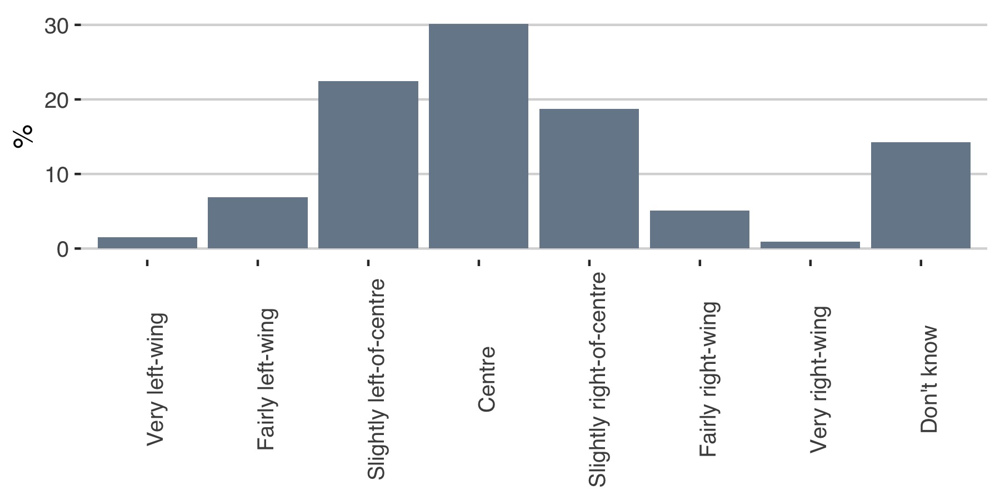

Welche Websiten besuchen Sie, um Nachrichten zu konsumieren? 

```{r fig.height=5, fig.width=10, include=FALSE}
reutersDF.long %>%
  filter(!grepl("know",medium)) %>%
  filter(medium %in% keeps) %>%
  group_by(medium) %>%
  summarise(count = sum(count)) %>%
  ungroup() %>%
  mutate(count_rel = 100*(count/2038)) %>%
  ggplot(aes(reorder(medium,desc(count_rel)), count_rel, 
             label = paste(round(count_rel,2), "%"))) +
  geom_col(fill=color1) +
  theme_hc() +
  labs(x = NULL, y = "%") +
  theme(axis.text.x = element_text(angle = 90))

ggsave("img/reuters3.png", width=6, height = 3, dpi=300)
```
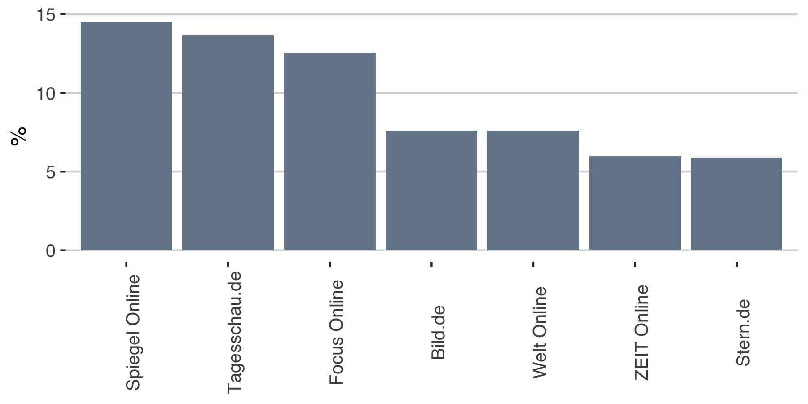
]


---

.pull-left[
Politische Orientierung der Leser

```{r message=FALSE, warning=FALSE, include=FALSE}
p<-reutersDF.long %>%
  filter(!grepl("know",medium)) %>%
  filter(!grepl("None",medium)) %>%
  filter(medium %in% keeps) %>%
  mutate(
    label = count_relative_m,
    label_color = ifelse(label > abs(0.7), "black", "white")
  ) %>%
  ggplot(aes(reorder(partisan.f, partisan_scale),
             medium, 
             fill = count_relative_m)) +
  geom_tile() +
  scale_fill_gradient2(high='darkblue', mid='white') +
  geom_text(aes(label=round(label, digits = 2),  colour = label_color), size = 3) +
  theme_hc() +
  labs(x = NULL, y = NULL) + 
  scale_x_discrete(expand = c(0, 0)) +
  scale_y_discrete(expand = c(0, 0)) +
  theme(legend.position = "none",
       axis.text.x = element_text(angle = 90))

ggsave("img/corrplot_news_media.png", width = 4, height = 4, dpi = 300)
```

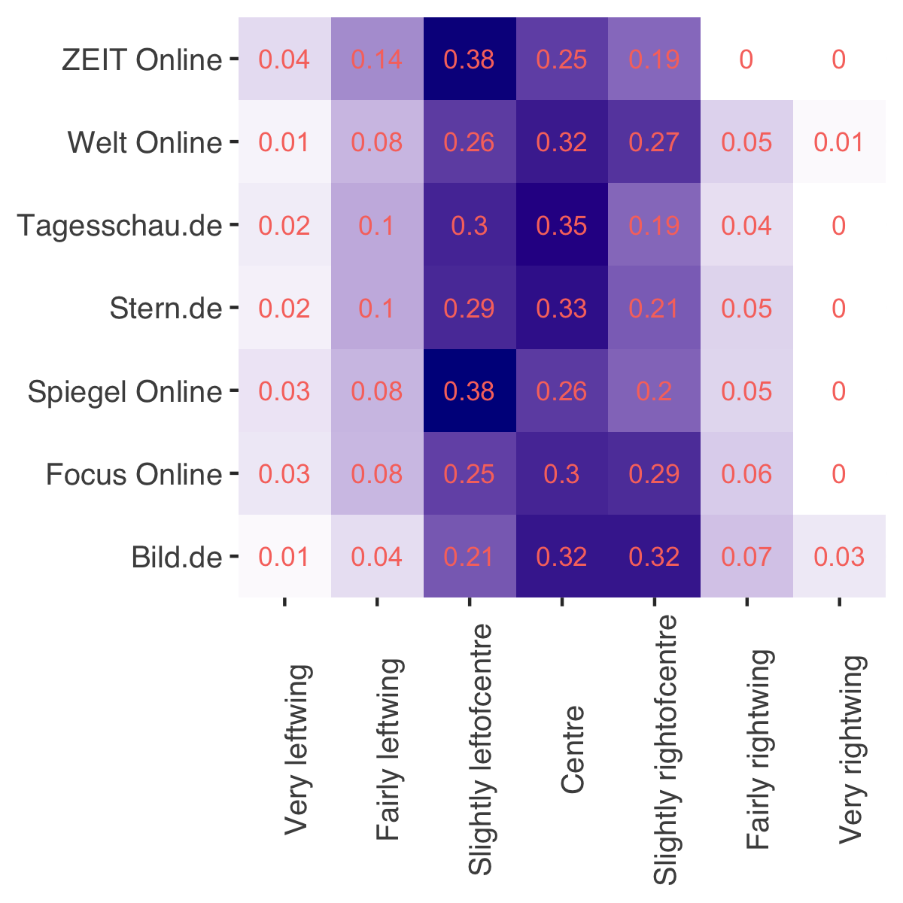

]

.pull-right[
Politisches Spektrum
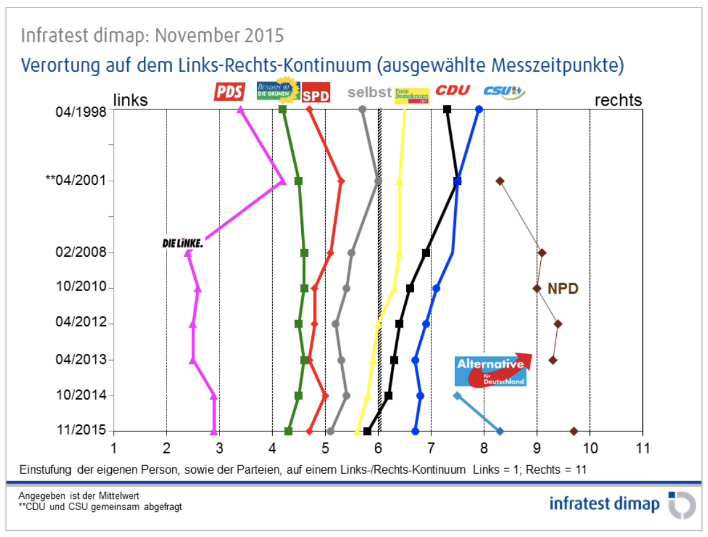

]

**Hypothese 1**

Medieninhalte werden auf die Präferenzen der Leser ausgerichtet (Gentzkow & Shapiro (2010)) 
  
  - ZEIT Online, Spiegel Online eher links verzerrt (SPD, B90/Die Grünen)
  - Bild.de, Welt Online, Focus Online eher Mitte-rechts (FDP, CDU/CSU)
  - Stern.de und Tagesschau.de eher Mitte-links (CDU, SPD)

---

```{r include=FALSE}
load("../output/polldats.Rda")
```


```{r echo=FALSE, fig.height=5, fig.width=10, message=FALSE, warning=FALSE}
df.small %>%
  filter(date > as.Date("2017-01-01")) %>%
  filter(date < as.Date("2018-06-30")) -> df.plot

p <- ggplot(df.plot) +
  geom_point(aes(date, pollvalue, 
                         text = paste("institute:", institute),
                         color = party),
             alpha = 0.6, size = 0.8) +
  geom_line(aes(date, ma, color = party), size = 1) +
  geom_vline(xintercept = as.Date("2017-09-24"), linetype=2) +
  
  geom_vline(xintercept = as.Date("2017-06-01"), linetype=2) +
  geom_vline(xintercept = as.Date("2018-03-01"), linetype=2) +
  scale_color_manual(values = c("#009ee0", "#32302e","#ffed00","#46962b","#ec008c", "#E3000F")) +
  theme_hc() +
  
  labs(x=NULL,y=NULL,color=NULL)

ggplotly(p)
```


**Hypothese 2**
  
Medieninhalte werden auf die Präferenzen der Leser ausgerichtet, die für die Werbetreibenden den meisten Wert generieren (Anderson und Gabszewicz, 2006)

  - Medien berichtet ähnlich, weil sie auf der anderen Marktseite um die selben Werbetreibenden konkurrieren / Sie richten sich eher nach den aktuellen Umfragewerten

---
class: inverse, center, middle

# Daten

---

### Pressemitteilungen (n=2666)

.pull-left[

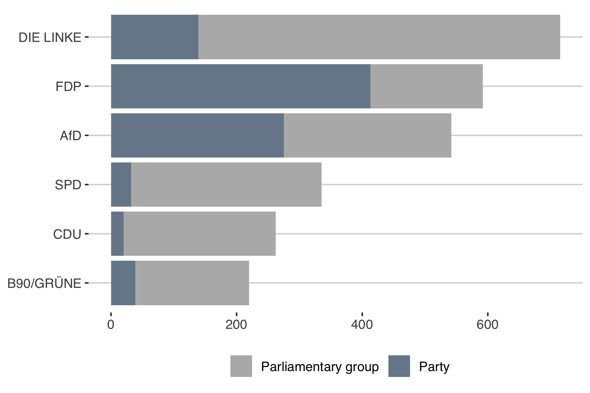

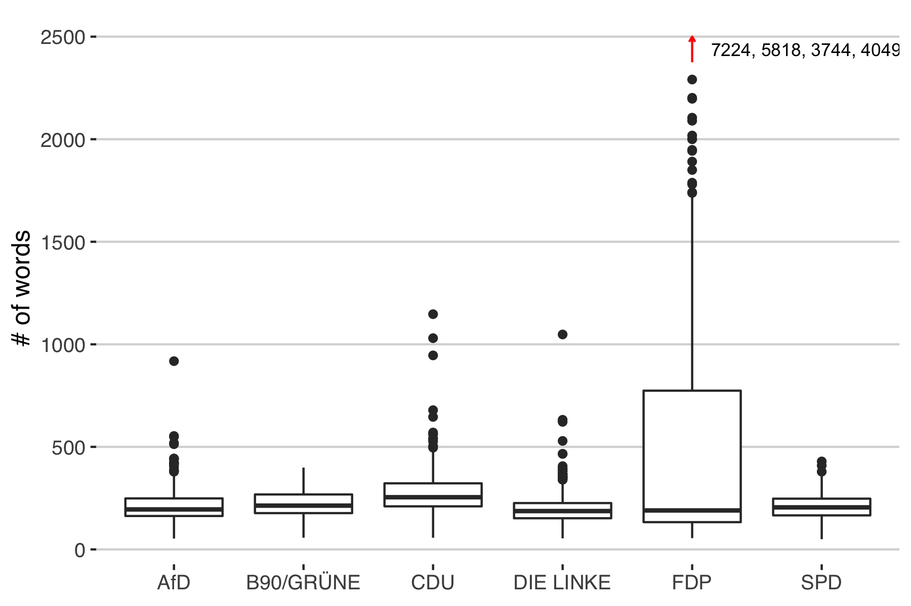
]

.pull-right[

- Pressemitteilungen auf den öffentlich zugänglichen Webseiten der Parteien und Fraktionen

- Rechtliche Trennung zwischen den Pressemitteilungen von Parteien und deren Bundestagsfraktionen: Laut Parteigesetzt §25 (2) dürfen Fraktionen ihre Parteien nicht im Wahlkampf unterstützen

- Dennoch nehme ich an, dass auch die Pressemitteilungen der Fraktionen einen Einfluss auf die öffentliche Wahrnehmung haben (Kepplinger and Maurer, 2004).
]


---

## online Nachrichten

.pull-left[
```{r message=FALSE, warning=FALSE, include=FALSE}
# source: https://www.ivw.eu/
visits <- read_delim("../data/agof/download_201801.csv", ";", escape_double = FALSE, locale = locale(encoding = "ISO-8859-1"),  trim_ws = TRUE)
# source: http://www.ard.de/home/die-ard/fakten/ard-mediendaten/ARD_Reichweitendaten/409224/index.html
tagesschau <- data_frame(medium = "tagesschau.de",
                         visits = 283200000,
                         insample = "Yes")

media <- c("Bild.de", "SPIEGEL ONLINE", "FOCUS ONLINE", "WELT", "ZEIT ONLINE", "stern.de")

visits %>%
  dplyr::transmute(
    medium = Angebote,
    visits = str_replace(`Visits gesamt`, "\\.", ""),
    visits = str_replace(visits, "\\.", ""),
    visits = as.numeric(visits),
    insample = ifelse(medium %in% media, "Yes", "No")
  ) %>%
  rbind(tagesschau) -> visits.df

p<-visits.df %>%
  dplyr::arrange(desc(visits)) %>%
  top_n(30, visits) %>%
  ggplot(aes(reorder(medium, visits), visits/1000000, fill = insample)) +
  geom_col(show.legend = F) +
  theme_hc() +
  coord_flip() +
  theme(legend.position = "right") +
  labs(x = NULL, y= NULL, title="Visits in Millionen (Jan 2018)",
       caption = "Data source: AGOF daily digital facts\nINFOnline (tagesschau.de)")

ggsave("img/visits.png", height = 6, width = 6, dpi = 300)
```
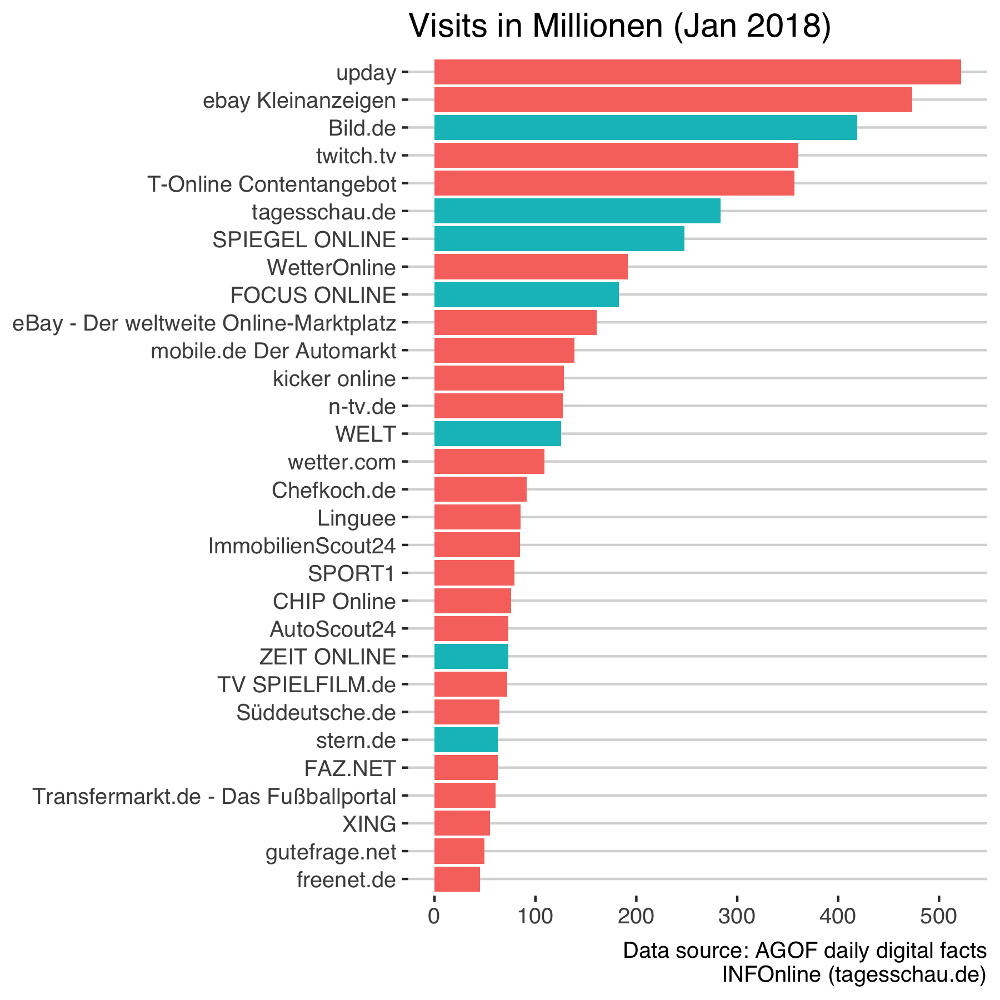
]

.pull-right[

```{r include=FALSE}
reutersDF1 %>%
  gather(key = "orientation", value = "count", -medium) %>%
  group_by(medium) %>%
  summarise(count = sum(count)) %>%
  mutate(insample = ifelse(medium %in% keeps, "Yes", "No")) -> reutersDF1.grouped

p<-reutersDF1.grouped %>%
  ggplot(aes(reorder(medium,count),count,
             fill = insample
             )) +
  geom_col(show.legend = F) +
  coord_flip() +
  theme_hc() +
  labs(x = NULL, y = NULL,
       title="Welche Websiten besuchen Sie,\num Nachrichten zu konsumieren?",
       caption = "Source: Hans-Bredow-Institut")

ggsave("img/reuters1.png", height = 6, width = 6, dpi = 300)
```
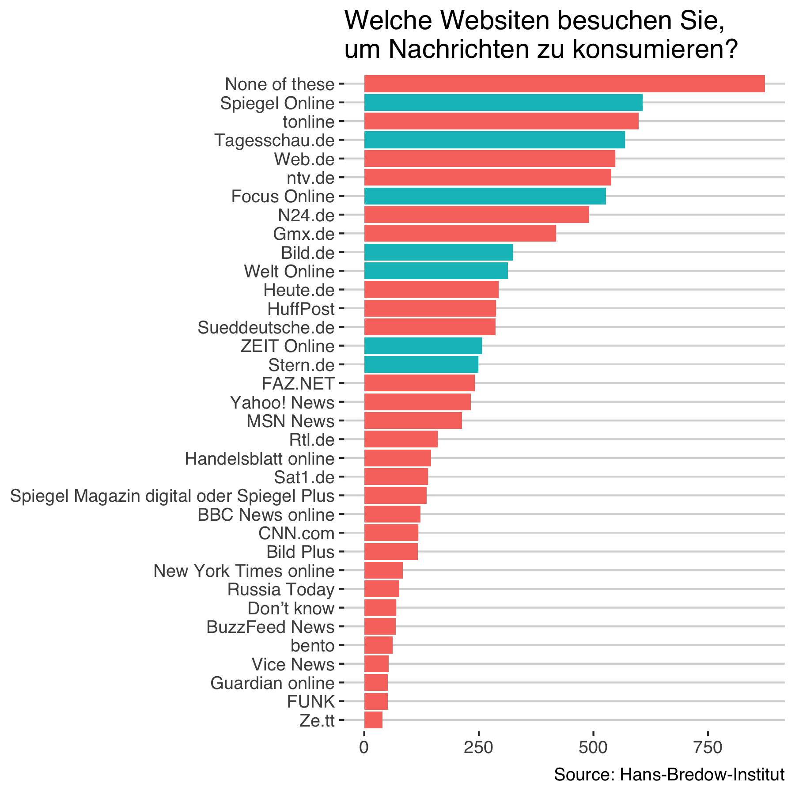
]

---

## online Nachrichten (n=15.135)

.pull-left[

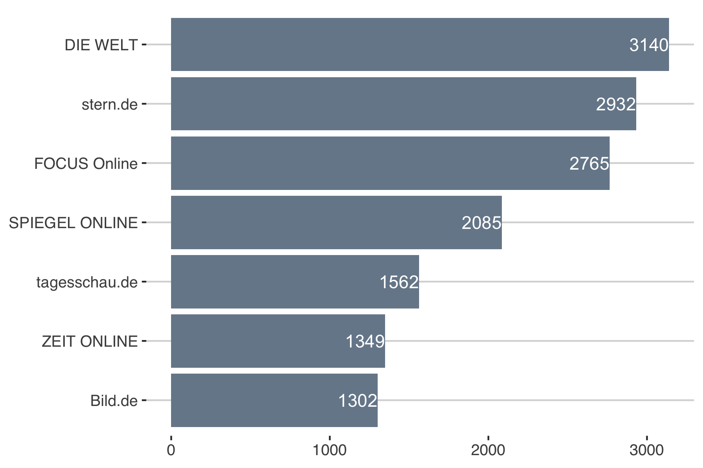

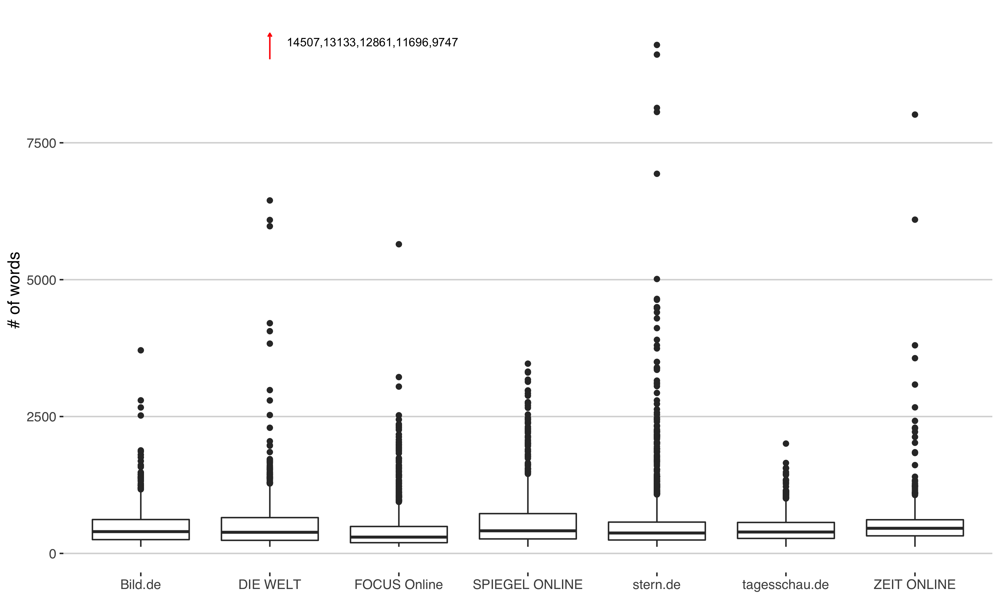
]

.pull-right[

- Alle öffentliche Nachrichten der Anbieter gescraped über die Webhose.io API 

- Um nur Nachrichten über nationale Politik zu verwenden, wurden die Artikel auf Grundlage ihrer URL gefiltert

- Beispiel: http://www.spiegel.de/politik/deutschland/christian-lindner-ukraine-kritisiert-fdp-chef-scharf-der-morgen-live-a-1161196.html

]

---

## online Nachrichten

Sichtbarkeit der Parteien

```{r include=FALSE}
load("../output/visibility.Rda")

radar <- vis %>%
  group_by(party, medium) %>%
  dplyr::summarize(vis = mean(visibility_p_s, na.rm = T)) %>%
  spread(key = party, value = vis)
```


```{r echo=FALSE, fig.height=5, fig.width=5, message=FALSE, warning=FALSE}
ggiraphExtra::ggRadar(radar, aes(color = medium),alpha = 0, interactive = T, rescale = F)
```

---

## online Nachrichten

Sichtbarkeit der Parteien - skaliert

```{r echo=FALSE, fig.height=5, fig.width=5, message=FALSE, warning=FALSE}
ggiraphExtra::ggRadar(radar, aes(color = medium),alpha = 0, interactive = T, rescale = T)
```

---
class: inverse, center, middle

# Text as Data

---

## Text as Data

- Eine einfache Beobachtung in deiner Text-Datenbank ist ein **Dokument**
  
  - Jeder Nachrichtenartikel und jede Pressemitteilung ist dein Dokument

- Die Kovariablen jedes Dokumentes heißen **Metadata**

  - Die Quelle des Dokuments (welche Nachrichtenseiten oder Partei hat das Dokument veröffentlich?)
  - Der Typ der Quelle (Nachrichtenartikel oder Pressemitteilung?)
  - Das Datum der Veröffentlichung
  
---

## Text as Data

- Die Summe aller Dokumente im Datensatz ist der **Korpus** (17.801 Dokumente)

- Alle im Korupus enthaltenen, einzigartigen Wörter ergeben zusammen das **Vokabular** 

  - Nach Pre-processing ("Stop-words" entfernen, Stemming, etc.): 74.343 Wörter

- Jedes Dokument wird als Vektor des Vokabulars dargestellt - die sog. **Dokument-Term-Matrix**

--

**Structural Topic Model**: Wie hoch die Wahrscheinlichkeit, dass ein Thema in einem Dokument behandelt wird?

---
class: inverse, center, middle

# Topic Models

---

## Topic Model (LDA)


<small>Credits: Christine Doig</small>

---

## Die Intuition hinter LDA


<small>Credits: Blei (2012)</small>

---

## LDA als graphisches Modell


$N =$ Sammlung von Wörtern innerhalb eines Dokuments (Vokabular)

$D =$ Sammlung von Dokumenten innerhalb eines Korpus

--

**Annahmen**: Prior-Verteilungen $\alpha, \eta$ / Anzahl an Themen $K$

--

**beobachtbar**: Wort in einem Dokument $w_{d,n}$


**fix** (Mischungs**komponenten**): Anzahl der Themen $K$ / Vokabular $N$

--

**nicht beobachtbar** (Mischungs**verhältnis**): Themenanteile pro Dokument $\theta_d$ / Wort-Themenverteilung $\beta_k$)

---

## Strucutral Topic Model

Das Structural Topic Model (STM, Roberts et. al., 2016) erlaubt es, Metadaten in den generativen Prozess zu integrieren. 

1. **Themen Verteilung**: 
  - Variablen, die die Wahrscheinlichkeit beeinflussen, ein Thema in einem Dokument vorkommt.

1. **Themen Inhalt**: 
  - Variablen, die die Wahrscheinlichkeit beeinflussen, dass ein Wort in einem Thema vorkommt.

--

#### Model-Annahmen:

  - **Themen Verteilung** hängt von der Quelle ab (Bild.de, FOCUS ONLINE, FDP, ...) 
  - **Themen Inhalt** hängt von der Art der Quelle ab (Pressemitteilung oder Nachrichtenartikel)
  - **Anzahl Themen** 50

---

## Posterior Wahrscheinlichkeiten

```{r message=FALSE, warning=FALSE, include=FALSE}
library(stm)
library(tidyverse)
library(ggthemes)
library(xtable)
library(patchwork)

color <- "#b7b7b7"
color1 <- "#778899"
color2 <- "#808080"
color3 <- "#000000"

load("../output/models/finalmodel_50.RDa")
k <- stmOut$settings$dim$K
  
model_df <- model_df %>%
  dplyr::mutate(doc_index = as.numeric(rownames(.)),
         source = ifelse(source == "welt.de", "DIE WELT", source),
         source = ifelse(source == "zeit.de", "ZEIT ONLINE", source),
         source = ifelse(source == "focus.de", "FOCUS Online", source),
         source = ifelse(source == "bild.de", "Bild.de", source),
         source = ifelse(source == "spiegel.de", "SPIEGEL ONLINE", source),
         
         source = ifelse(source == "union", "Union", source),
         source = ifelse(source == "spd", "SPD", source),
         source = ifelse(source == "afd", "AfD", source),
         source = ifelse(source == "gruene", "Grüne", source),
         source = ifelse(source == "linke", "Linke", source),
         source = ifelse(source == "fdp", "FDP", source)
         )
```

Der generative Prozess des STM generiert zwei posterior Wahrscheinlichkeiten:

1. **Word-topic Posterior:** $\Phi_c$ ist eine $K$ x $V$ Matrix (mit $K=$ Anzahl der Themen und $V=$ Vokabular), wobei der Eintrag $\phi_{k,v,c}$ als Wahrscheinlichkeit interpretiert werden kann, dass Term $v$ in Thema $k$ vorkommt, abhängig von $c$, also der Art der Quelle (Pressemitteilung oder Nachrichtenarikel) 

2. **Document-topic Posterior:** $\Theta$ ist eine $D$ x $K$ Matrix (mit $D=$ Anzahl der Dokumente und $K=$ Anzahl der Themen), wobei der Eintrag $\theta_{d,k}$ als Wahrscheinlichkeit interpretiert werden kann, dass das Dokument $d$ das Thema $k$ beinhaltet.

---

### Word-topic Posterior

 $\Phi_c$ kann helfen um zu verstehen, wodrüber das Thema handelt, indem wir uns die Wahrscheinlichsten Wörter in jeden Thema angucken...
 
.pull-left[
Thema 1
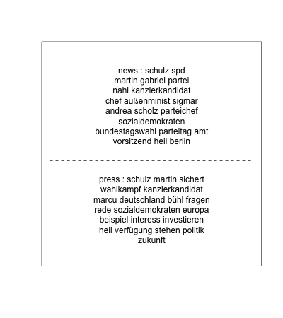
]

.pull-right[
Thema 2
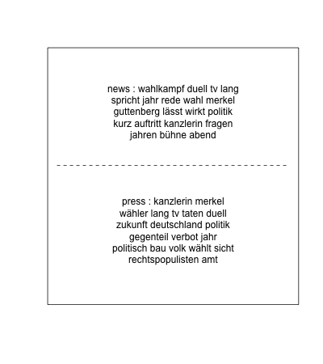
]

---

```{r echo=FALSE, message=FALSE, warning=FALSE}
sagelabs <- sageLabels(stmOut, 20)

newsLabels <- as.data.frame(sagelabs$cov.betas[[1]]$problabels) %>%  
  transmute(topic = as.numeric(rownames(.)),
            topic_name_news = paste(V1,V2,V3))

pressLabels <- as.data.frame(sagelabs$cov.betas[[2]]$problabels) %>% 
  transmute(topic = as.numeric(rownames(.)),
            topic_name_press = paste(V1,V2,V3))

topics.df <- left_join(newsLabels, pressLabels, by="topic") %>%
  mutate(label1 = paste(topic_name_news, topic_name_press))

for (i in seq(k)) {
  label <- paste(unique(unlist(strsplit(topics.df$label1[i], " "))), collapse = " ")
  topics.df$joint_label[i] <- paste("Topic",topics.df$topic[i],":", label)
}

topics.df %>% 
  select(joint_label, topic_name_news, topic_name_press) %>% 
  head(8) %>%
  knitr::kable(align="l", format = 'html', rnames = F)
```

---
class: middle

```{r include=FALSE}
theta <- as.data.frame(stmOut$theta) %>% # get all theta values for each document
  
  mutate(doc_index = as.numeric(rownames(.))) %>%
  # convert to long format
  gather(topic, theta, -doc_index) %>%
  mutate(topic = as.numeric(gsub("V","",topic))) %>%
  
  # join with topic df
  left_join(., topics.df, by="topic") %>%
  
  # join with model_df
  left_join(., model_df %>% 
              select(date,type,source,doc_index,title_text), by="doc_index") %>%  
  
  # delete documents that are published in Mai 2017
  mutate(
    year = lubridate::year(date),
    month = lubridate::month(date)
    ) %>%
  filter(month != 5)

topicmean <- theta %>%
  group_by(topic, joint_label) %>%
  summarise(frequency = mean(theta)) %>%
  ungroup() %>%
  arrange(desc(frequency)) %>%
  mutate(order = row_number())
```

### Document-topic Posterior

$\Theta$ gibt eine Themen Wahrscheinlichkeit für jedes Dokument $d$, bspw.: 

```{r echo=FALSE, fig.height=7, fig.width=12}
# select a random document
doc <- sample(unique(theta$doc_index),1)

sample <- theta %>% filter(doc_index == doc) 
caption <- model_df %>% filter(doc_index == doc) %>% select(title, source)

sample %>%
  ggplot(aes(reorder(joint_label,desc(topic)), theta)) +
  geom_col(fill = color1) +
  coord_flip() +
  ylim(c(0,1)) +
  theme_hc() +
  labs(x = NULL, y = NULL, title = paste(caption$title,"(",caption$source,")"))
```

---
class: middle

Für jede Dokumentenquelle $s$ existiert eine Matrix $\Theta_s$, die die Themenwahrscheinlichkeit für jedes Dokument dieser Quelle angibt:

$$\Theta_s = \begin{bmatrix}  \theta_{1} & ... & \theta_{d} \\ . & . & . \\ . & . & . \\ \theta_{k} & . & . \\ \end{bmatrix}$$

Nimmt man den Mittelwert jeder Zeile dieser Matrix, so erhält man einen $k$ x $1$ Vektor, der die durchschnittliche Wahrscheinlichkeit eines Themas für eine Quelle angibt.

$$\bar{ \theta_{s} }= \begin{bmatrix} \bar{\theta_{1}} \\ . \\ . \\ \bar{\theta_{k}} \\ \end{bmatrix}$$

---

### Document-topic Posterior (Durchschnitt)

```{r include=FALSE}
topicmean_news <- theta %>%
  filter(type == "news") %>%
  group_by(topic,joint_label,source) %>%
  summarise(frequency = mean(theta, na.rm = T)) %>% 
  ungroup()

topicmean_press <- theta %>%
  filter(type == "press") %>%
  group_by(topic,joint_label, source) %>%
  summarise(frequency = mean(theta)) %>% 
  ungroup()
```

```{r fig.align="center", include=FALSE}
p1 <- topicmean_press %>%
  ggplot(aes(reorder(joint_label,desc(topic)),
             frequency, fill=frequency)) +
  geom_col(show.legend = FALSE) +
  coord_flip() +
    theme_hc() +
  facet_grid(~source) +
  scale_fill_gradient2(limits=c(0,0.25), low="white", mid="blue", high="red") +
    scale_y_continuous(limits = c(0,0.25), breaks = c(0,0.1,0.2)) +
  labs(x=NULL, y=NULL) 

p2 <- topicmean_news %>%
  ggplot(aes(reorder(joint_label,desc(topic)),
             frequency, fill=frequency)) +
  geom_col(show.legend = F) +
  coord_flip() +
  theme_hc() +
  facet_grid(~source) +
  scale_fill_gradient2(limits=c(0,0.25), low="white", mid="blue", high="red") +
  scale_y_continuous(limits = c(0,0.25), breaks = c(0,0.1,0.2)) +
  labs(x=NULL, y=NULL) +
  theme(axis.text.y = element_blank())

p1 + p2

ggsave("img/topic_proportion.png", width = 14, height = 7, dpi=300)
```

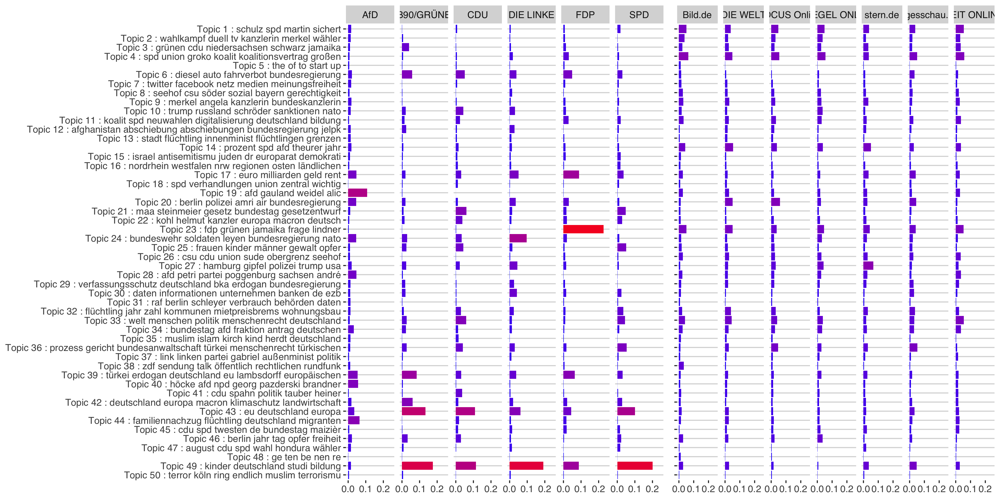

---
class: inverse, center, middle

# Topic Correlation

```{r include=FALSE}
library(corrr)
parties <- c("CDU", "SPD", "AfD", "B90/GRÜNE", "DIE LINKE", "FDP" )
news <- c("DIE WELT","stern.de", "ZEIT ONLINE", "FOCUS Online", "Bild.de", "SPIEGEL ONLINE", "tagesschau.de" )
```

```{r include=FALSE}
# calculate topic mean by source and month
topicmean_monthly <- theta %>%
  group_by(topic,source, month, year) %>%
  dplyr::summarise(topicmean = mean(theta)) %>%
  ungroup() %>%
  spread(source, topicmean) 

media <- unique(model_df %>% filter(type == "news") %>% select(source))
parties <- unique(model_df %>% filter(type == "press") %>% select(source))
  
rm(corrDF)
for (i in parties$source) {
  
  tempdf <- topicmean_monthly %>%
    group_by(month, year) %>%
    do(data.frame(Cor=t(cor(.[,media$source], .[,i])))) %>%
    gather(medium, cor, 3:9) %>%
    mutate(party = i,
           medium = gsub("Cor.","",medium)) %>%
    ungroup()
  
  if (exists("corrDF")){
    corrDF <- rbind(corrDF,tempdf)
  } else {
    corrDF <- tempdf
  }
  
}

agenda <- corrDF %>% 
  mutate(date = as.Date(paste0(year,"/",month,"/1")),
         cor_norm = normalize_data2(cor)
         ) %>%
  dplyr::mutate(medium = ifelse(medium == "DIE.WELT", "DIE WELT", medium),
                medium = ifelse(medium ==  "ZEIT.ONLINE", "ZEIT ONLINE", medium),
                medium = ifelse(medium == "FOCUS.Online", "FOCUS Online", medium),
                medium = ifelse(medium == "SPIEGEL.ONLINE", "SPIEGEL ONLINE", medium)
  )
```

---

## Korrelation - Matrix

```{r echo=FALSE, message=FALSE, warning=FALSE}
corr.df <- bind_rows(topicmean_news, topicmean_press) %>% 
  select(-joint_label) %>% spread(source, frequency)

x <- as.matrix(corr.df[,-1])
rs <- correlate(x)

rs[1:7,1:7] %>% 
  mutate_if(is.numeric, round, digits = 2) %>%
  htmlTable::htmlTable()
```

---

## Korrelation - Matrix plot

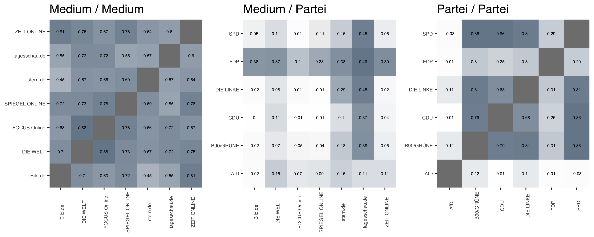

---

## Korrelation - Radarcharts

```{r echo=FALSE, message=FALSE, warning=FALSE}
radar <- agenda %>%
   group_by(party, medium) %>%
  dplyr::summarize(cor = mean(cor, na.rm = T)) %>%
  spread(key = party, value = cor) 

ggiraphExtra::ggRadar(radar, aes(color = medium),
                      rescale = F,
                      interactive = T,
                      alpha = 0) 
```

---

## Korrelation - Radarcharts (Skaliert)

```{r echo=FALSE}
ggiraphExtra::ggRadar(radar, 
                      aes(color = medium),
                      rescale = T,
                      interactive = T,
                      alpha = 0) 
```

---

## Korrelation - Netzwerk plot 

Die Grafik zeigt einen Punkt für jede Variable, die räumliche Nähe der Variablen zueinander stellt die Gesamtgröße ihrer Korrelationen dar.

```{r echo=FALSE, fig.height=6, fig.width=12}
rs %>% 
  network_plot(min_cor = .1)
```

---
class: center, middle, inverse

#Hypothesen überprüfen

---

## Hypothese 1

.pull-left[

```{r include=FALSE}
reutersDF.long %>%
  filter(!grepl("know",medium)) %>%
  filter(!grepl("None",medium)) %>%
  filter(medium %in% keeps) %>%
  mutate(
    medium = ifelse(medium == "Welt Online", "DIE WELT", medium),
    count_relative_m = normalize_data2(count_relative_m),    
    label = count_relative_m,
    label_color = ifelse(label > abs(0.7), "black", "white")
  ) %>%
  ggplot(aes(reorder(partisan.f, partisan_scale),
             medium, 
             fill = count_relative_m)) +
  geom_tile() +
  scale_fill_gradient2(low='darkblue', mid='white', high='darkred') +
  geom_text(aes(label=round(label, digits = 2), colour = label_color), size = 3) +
  theme_hc() +
  labs(x = NULL, y = NULL, title = "Leserpräferenzen") + 
  scale_x_discrete(expand = c(0, 0)) +
  scale_y_discrete(expand = c(0, 0)) +
  theme(legend.position = "none",
       axis.text.x = element_text(angle = 90))

ggsave("img/reuters4_rescaled.png", width = 4, height = 4, dpi=300)
```

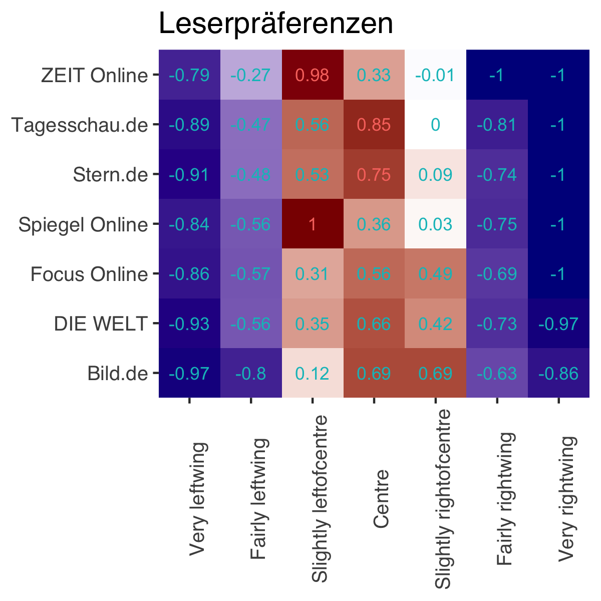
]

.pull-right[
```{r include=FALSE}
plot <- rs %>%
  as_tibble() %>%
  dplyr::rename(source1 = rowname) %>%
  gather(key = source2, value = corr, -source1) %>%
  mutate(
    type1 = ifelse(source1 %in% news, "news", "party"),
    type2 = ifelse(source2 %in% news, "news", "party")
  ) 

plot %>%
  filter(type1 == "news") %>%
  filter(type2 == "party") %>%
  mutate(
    order = ifelse(source2=="DIE LINKE",1,NA),
    order = ifelse(source2=="B90/GRÜNE",2,order),
    order = ifelse(source2=="SPD",3,order),
    order = ifelse(source2=="FDP",4,order),
    order = ifelse(source2=="CDU",5,order),
    order = ifelse(source2=="AfD",6,order),
    corr = normalize_data2(corr),
    label_color = ifelse(corr > abs(0.7), "black", "white")
  ) %>%
  ggplot(aes(reorder(source2, order), source1, 
                 label=round(corr, digits = 2),
                 fill=corr)) +
  geom_tile() +
  scale_fill_gradient2(low='darkblue', mid='white', high='darkred') +
  geom_text(aes(label=round(corr, digits = 2), colour = label_color), size = 3) +
  theme_hc() +
  labs(x = NULL, y = NULL, title="Topic Correlation") + 
  scale_x_discrete(expand = c(0, 0)) +
  scale_y_discrete(expand = c(0, 0)) +
  theme(legend.position = "none",
       axis.text.x = element_text(angle = 90))

ggsave("img/corrplot_news_media_rescaled.png", width = 4, height = 4, dpi = 300)
```

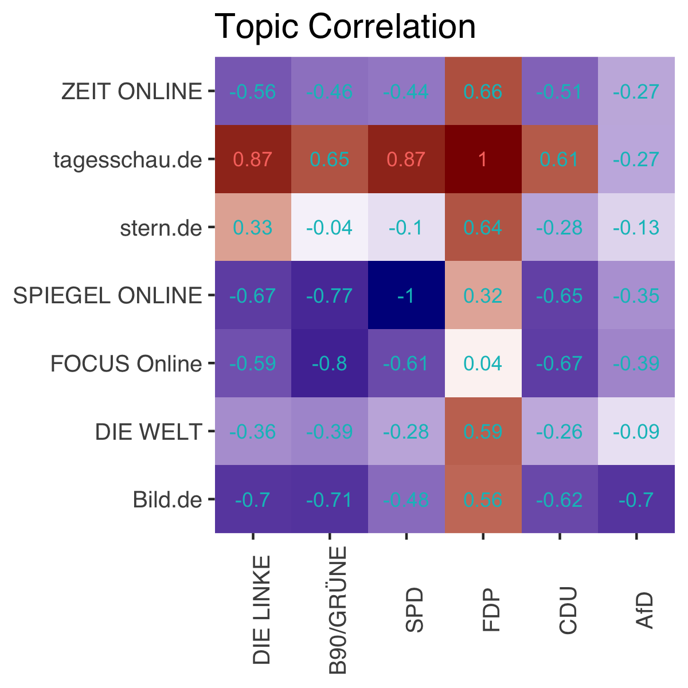
]

---

## Hypothese 2

```{r include=FALSE}
hypo2 <- df.plot %>%
  filter(date > as.Date("2017-06-01")) %>%
  filter(date < as.Date("2018-03-01")) %>%
  mutate(
    month = lubridate::month(date),
    year = lubridate::year(date),
    date = as.Date(paste0(year,"/",month,"/1")),
    party = ifelse(party=="GRÜNE","B90/GRÜNE",party),
    party = ifelse(party=="LINKE","DIE LINKE",party),
    party = ifelse(party=="CDU/CSU","CDU",party)
  ) %>%
  group_by(party,date) %>%
  dplyr::summarise(ma = mean(ma)) %>%
  ungroup() %>%
  group_by(party) %>%
  mutate(ma_norm=normalize_data2(ma)) %>%
  ungroup() %>%
  left_join(.,agenda, by=c("party","date"))


ggplot(hypo2, aes(date, cor_norm, color = medium, linetype = medium)) +
  geom_line() +
  geom_line(aes(date,ma_norm), color="red", show.legend = F) +
  geom_hline(yintercept = 0, size = 0.3, color = color1) +
  facet_wrap(~party) +
  theme_hc() +
  scale_color_viridis_d() +
  labs(y=NULL, x =NULL) +
  scale_x_date(date_breaks = "2 month", date_labels = "%b/%y") +
  theme(legend.position = "bottom",
        legend.title = element_blank()) +
     guides(col = guide_legend(nrow = 1))

ggsave("img/hypothese2.png", width = 8, height = 5, dpi=300)
```

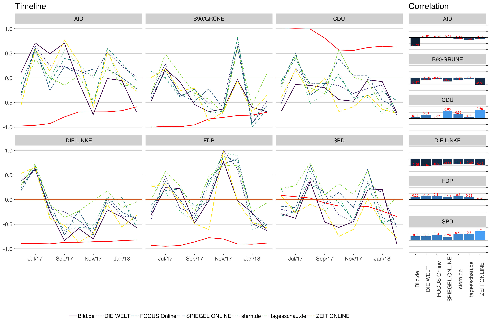


---
class: center, middle, inverse

#Conclusion

---

## Conclusion

- Keine direkten Anzeichen dafür, dass sich die "Slant"-Variation der untersuchten online Medien mit Hilfe der entsprechenden Leserpräferenzen erklären lassen. 

- Am stärksten unterscheidet sich der "Slant" von Tagesschau.de im Vergleich zu den anderen Medien

- Slant-Index und Umfragewerte lassen für einige Parteien einen Zusammenhang erkennen. Kausaler Zusammenhang?

**Idee für weitere Studien:**

- Anwendung der Methode weitere Datensätze, anderen Zeitraum

- Unterschied erkennbar für Artikel "hinter der Paywall" ? 